# ReaUI Builder — User Guide, Version 1.0.70

[Русская версия](ReaUI_Builder_Manual_ru.md)

<details>
<summary>Contents</summary>

- [ReaUI Builder](#manual-reaui-builder)
  - [01. Overview](#manual-01-overview)
    - [Absolute positioning](#manual-absolute-positioning)
    - [Widget contracts](#manual-widget-contracts)
  - [02. Quick start](#manual-02-quick-start)
  - [03. Workspace](#manual-03-workspace)
    - [3.1 · Top toolbar and menus](#manual-3-1-top-toolbar-and-menus)
    - [3.2 · Widget panel](#manual-3-2-widget-panel)
    - [3.3 · Left palette](#manual-3-3-left-palette)
    - [3.4 · Canvas area](#manual-3-4-canvas-area)
    - [3.5 · Right sidebar](#manual-3-5-right-sidebar)
    - [3.6 · Status bar](#manual-3-6-status-bar)
  - [04. Core concepts](#manual-04-core-concepts)
    - [4.1 · Widgets and drawings](#manual-4-1-widgets-and-drawings)
    - [4.2 · Families and variants](#manual-4-2-families-and-variants)
    - [4.3 · Coordinates and snapping](#manual-4-3-coordinates-and-snapping)
    - [4.4 · Sizing contracts](#manual-4-4-sizing-contracts)
    - [4.5 · Labels](#manual-4-5-labels)
    - [4.6 · Containers and nesting](#manual-4-6-containers-and-nesting)
    - [4.7 · Overlap prevention](#manual-4-7-overlap-prevention)
    - [4.8 · Object names](#manual-4-8-object-names)
  - [05. Working with objects](#manual-05-working-with-objects)
    - [5.1 · Placing widgets](#manual-5-1-placing-widgets)
    - [5.2 · Selecting objects](#manual-5-2-selecting-objects)
    - [5.3 · Moving and resizing](#manual-5-3-moving-and-resizing)
    - [5.4 · Copying, duplicating, and deleting](#manual-5-4-copying-duplicating-and-deleting)
    - [5.5 · Undo history](#manual-5-5-undo-history)
    - [5.6 · Batch editing](#manual-5-6-batch-editing)
    - [5.7 · Editor groups](#manual-5-7-editor-groups)
  - [06. Widget catalog](#manual-06-widget-catalog)
    - [Catalog notes](#manual-catalog-notes)
  - [07. Containers](#manual-07-containers)
    - [7.1 · Panel](#manual-7-1-panel)
    - [7.2 · Group](#manual-7-2-group)
    - [7.3 · StyleRegion](#manual-7-3-styleregion)
    - [7.4 · CollapsingHeader and TreeNode](#manual-7-4-collapsingheader-and-treenode)
    - [7.5 · TabBar](#manual-7-5-tabbar)
    - [7.6 · Table](#manual-7-6-table)
  - [08. Inspector reference](#manual-08-inspector-reference)
  - [09. Flags](#manual-09-flags)
    - [Numeric flags](#manual-numeric-flags)
    - [Text input flags](#manual-text-input-flags)
    - [Color flags](#manual-color-flags)
  - [10. Drawing primitives](#manual-10-drawing-primitives)
    - [Fill and stroke](#manual-fill-stroke-and-linked-colors)
  - [11. Canvas and project settings](#manual-11-canvas-and-project-settings)
    - [Window title](#manual-window-title)
    - [Size](#manual-size)
    - [Background](#manual-background)
    - [Color picker](#manual-color-picker)
    - [Grid](#manual-grid)
    - [Audit grid](#manual-audit-grid)
    - [Zoom and pan](#manual-zoom-and-pan)
  - [12. Themes](#manual-12-themes)
    - [Custom themes](#manual-custom-themes)
  - [13. Preview mode](#manual-13-preview-mode)
  - [14. Exporting](#manual-14-exporting)
    - [Export preflight](#manual-export-preflight)
    - [Generated file structure](#manual-generated-file-structure)
    - [Positioning in code](#manual-positioning-in-code)
    - [What is included](#manual-what-is-included)
  - [15. Saving and loading](#manual-15-saving-and-loading)
    - [Autosave and recovery](#manual-autosave-and-recovery)
  - [16. Keyboard and mouse reference](#manual-16-keyboard-and-mouse-reference)
  - [17. Release limitations](#manual-17-release-limitations)
  - [Appendix A · Widget contracts](#manual-appendix-a-widget-contracts)
  - [Appendix B · Inspector matrix](#manual-appendix-b-inspector-matrix)
  - [Appendix C · Reading the generated file](#manual-appendix-c-generated-file-structure)

</details>

<a name="manual-reaui-builder"></a>

# ReaUI Builder

A visual layout editor for ReaImGui interfaces.

Design a window on the canvas and export ReaImGui Lua code for its widgets, drawings, and styles. Builder uses logical layout coordinates; zoom changes the view without changing the exported coordinates. Preview approximates the appearance of the running interface.

This guide covers version **1.0.70**. It describes the current features and workflow; obsolete workarounds are omitted.

---

<a name="manual-01-overview"></a>

## 01. Overview

ReaUI Builder runs from a local HTML file. No installation, server, or build process is required. Styles, icons, widget contracts, and code generation logic are included in the file. The editor uses locally available fonts. Editing layouts and generating code work offline.

This guide shortens ReaUI Builder to **Builder** after this point.

Use Builder to design the **interface layout** for your script. Set widget positions, sizes, labels, and basic properties, then export the window structure as Lua code.

Builder does not generate DSP, project logic, or event handling. In the exported code, `-- TODO` comments mark where to add your own logic for interactive widgets.

- **Output:** Lua code for ReaImGui 0.10 or later
- **Widgets:** 48 placeable types in 41 families, plus the automatically managed TabItem and TableCell types
- **Drawing primitives:** 7 — rectangle, circle, polygon, line, text, triangle, and arc
- **Project format:** versioned JSON

Builder is based on two principles.

<a name="manual-absolute-positioning"></a>

### Absolute positioning

ImGui normally lays out widgets in sequence. Builder uses absolute positioning: it sets `WindowPadding` and `ItemSpacing` to zero and explicitly positions the cursor before each widget.

This preserves the intended layout coordinates. Native font metrics and control heights can still differ from the browser approximation; inspect the exported interface in REAPER before finishing a layout.

<a name="manual-widget-contracts"></a>

### Widget contracts

Each widget type has a **contract**: a set of rules that defines its default size, resizing constraints, how its width is applied, and where its label appears.

The canvas, inspector, and code generator share the contract definitions, with additional rules for specific types. A Checkbox has fixed dimensions; a Slider has fixed height and an external label; ColorPicker height is derived. The sections below explain differences between the editing box and exported sizing.

---

<a name="manual-02-quick-start"></a>

## 02. Quick start

Open the HTML file in a modern browser. Builder runs locally through `file://`; editing layouts and generating code do not require a network connection. To run the exported Lua script, use REAPER with ReaImGui 0.10 or later installed.

1. Open the **Canvas** tab in the right sidebar and set the window size. The default is **550 × 400 px**.
2. Choose a widget from a category in the top toolbar: **Buttons & Toggles, Display, Fields, Sliders & Drags, Selection, Color,** or **Layout**. The **Group, Style, Table, Header, Tree,** and **Tabs** containers are also available as permanent shortcuts in the left palette.
3. Click the canvas to place the widget. Its top-left corner is positioned at the click location, adjusted for grid snapping.
4. Use the **Selection** inspector to set the widget's label, value range, flags, position, and size.
5. Click **Export**, resolve any errors in the preflight panel, and click **download .lua**. Alternatively, use **copy** and save the code in a `.lua` file. Load the file through REAPER’s Actions window and run it.

> **Workspace at startup.** The tool palette is on the left. The canvas, window layout, and rulers occupy the center. On the right are the **Canvas / Elements / Info** tabs and the **Selection** inspector. The status bar runs along the bottom.

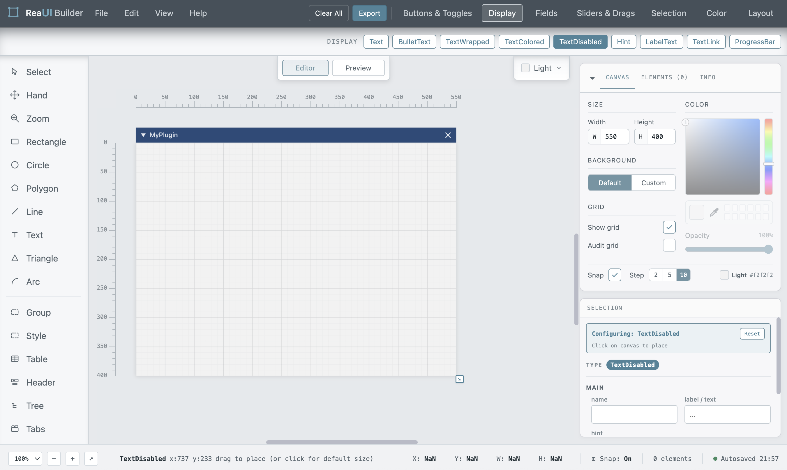

> **Save the editable project.** Choose **File → Save Project** (`Cmd/Ctrl + S`) and keep the JSON file with your script. Browser recovery drafts are available through **File → Restore projects…**; they do not replace a project file.

---

<a name="manual-03-workspace"></a>

## 03. Workspace

In **Editor** mode, a gray name tag appears above each widget.

The **Table** name (`⊞ <name>`) and lock icon appear on an editor tab **above** the table box. Click this tab to select or drag the table. It does not appear in Preview or the export.

**Panel** shows a pale `☐ Panel` mark in its top-left corner. This editor aid reserves no space. Clicking within the top 24 px of the box selects the Panel, even over a child widget.

The top strip of **TabBar** is the actual tab row—the same one REAPER draws. Click it to select the TabBar.

> **Layout in Editor mode.** Name tags and container strips help you edit the layout structure. They are editor aids and are not included in the exported interface.

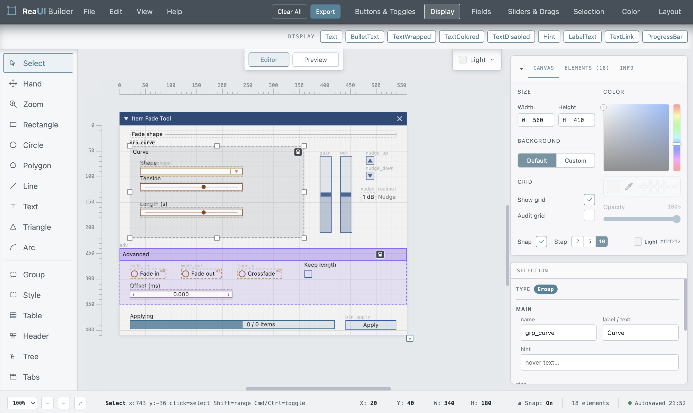

<a name="manual-3-1-top-toolbar-and-menus"></a>

### 3.1 · Top toolbar and menus

The top toolbar contains four menus, global commands, and widget categories.

| Menu | Commands |
| --- | --- |
| **File** | New Project · Save Project · Save As… · Restore projects… · Load Project |
| **Edit** | Undo · Redo · Copy · Paste · Delete · Duplicate · Group selection · Ungroup selection · Select All · Deselect All · Clear All |
| **View** | Dark mode · Grid · Snap to grid · Reference grid in export · Hide widget names · Hide draw objects names · Widget footprints · Panels · Zoom to fit · Actual size (100%) |
| **Help** | User Manual ↗ · Keyboard Shortcuts · Report a Bug… · About |

**Undo** and **Redo** are unavailable when there are no actions to undo or redo.

**Reference grid in export** adds a magenta measurement grid with 50 px spacing. Unlike the regular editor grid, it is included in the export. The same setting appears as **Audit grid** on the Canvas tab.

**Snap to grid** toggles grid snapping. Enabled options in the **View** menu are marked with a checkmark.

**Hide widget names** and **Hide draw objects names** independently hide editor name tags. They do not hide the visible text of the interface. **Panels** can show or hide Canvas, Elements, Info, Selection, and Tools. Restore hidden panels through this menu. Panel visibility is remembered in this browser, separately from the project.

**Clear All** removes every element from the canvas after you confirm the action.

**Export** opens a window containing the generated code.

**User Manual ↗** opens this guide in a new browser tab.

> **Report a Bug…** opens a dialog for sending a report by email. It shows the last 50 logged actions together with the build number and current window size, assembled into a read-only report you can review before sending. Add a description of what happened, optionally check **Include my layout** to attach the whole project, then click the email address to copy it and paste the report into your mail client. No data leaves the browser until you send it yourself.

The seven widget categories appear on the right side of the toolbar. Click a category to show its widgets. Click it again to close the panel.

<a name="manual-3-2-widget-panel"></a>

### 3.2 · Widget panel

The widget panel contains the full set of widgets, organized into seven categories.

To add a widget, open its category, select the widget, and click the canvas.

If a category is wider than the panel, use the mouse wheel to scroll it horizontally.

The **Display** category is open at startup. Click its button again to close it. When no category is open, the panel is empty; this is expected behavior.

<a name="manual-3-3-left-palette"></a>

### 3.3 · Left palette

The left palette provides permanent access to:

- The **Select**, **Hand**, and **Zoom** tools.
- Seven drawing tools.
- Shortcuts for six containers: Group, StyleRegion, Table, CollapsingHeader, TreeNode, and TabBar.

**Select** is the default tool. Builder returns to it automatically after you place an object.

Use **Hand** to pan the workspace. Hold `Space` before dragging for temporary Hand, then release it to return to your previous tool. Space does not start a second gesture while an object is already being moved, resized, or drawn.

With **Zoom**, click to zoom in around the clicked point; `Alt/Option + click` zooms out. `Esc` returns to Select.

Drawing tools are single-use by default: after you create a shape, Builder switches back to **Select**.

To draw several rectangles, circles, lines, triangles, or arcs, hold `Shift` while selecting the tool, then release it before drawing. The tool stays active until you choose another tool or press `Esc`. The status bar shows `[sticky]`. Polygon, Text, and widget placement return to Select after completion.

<a name="manual-3-4-canvas-area"></a>

### 3.4 · Canvas area

The center of the workspace shows the script window layout: the **MyPlugin** title, the interface area, and the surrounding workspace.

The layout area matches the exported content size. The title bar represents ImGui's native title bar, whose height is added in the exported code:

`OUTER_H = H + title bar height`

The canvas area also includes these controls and indicators:

- **Editor / Preview** — the display mode switch above the center of the canvas. See §13.
- **Theme** — the theme selector above the canvas on the right. See §12.
- **Rulers** — along the top and left edges, showing layout coordinates at the current zoom level.
- **Resize handle ⇲** — at the bottom-right corner of the layout. Drag it to resize the canvas. This is equivalent to changing `W` and `H` on the **Canvas** tab.
- **Preview banner** — appears in Preview mode when the layout contains widgets that Builder can only approximate.

<a name="manual-3-5-right-sidebar"></a>

### 3.5 · Right sidebar

The right sidebar has two parts: the **Canvas / Elements / Info** tabs and the **Selection** inspector. Use the header arrow to collapse or expand the upper panel; its tab headings stay in place. Selecting an object collapses Canvas to make room for Selection. Clicking a tab opens it again. The arrow below Elements expands the list by reducing Selection’s height. View → Panels controls which panels are visible.

<a name="manual-info"></a>

#### Info

When a widget is selected, or its placement tool is active, the **Info** tab shows an approximation of its ImGui appearance and a brief description of its purpose.

Choosing a widget from the widget panel or left palette opens **Info** automatically. The tab stays open after placement, updating to show the newly created object.

Info shows a preview and description for one selected widget or drawing, or for an active placement tool. With no single-object or tool context, it shows the project summary.

<a name="manual-elements"></a>

#### Elements

The **Elements** tab lists drawings, widgets, containers, and editor groups in a tree. Child widgets are indented beneath their containers.

- Click an object row to select that object. For a member of an editor group, this selects the individual member and shows its own properties.
- Click a group heading to select the whole group. **Select group** in Selection also returns from an individual member to the group.
- `Cmd/Ctrl + click` adds or removes individual rows; `Shift + click` selects a range of rows.
- With the list focused, `↑/↓` selects adjacent rows and `Home/End` selects the first or last row. Hold Shift to extend the selection. These keys navigate the list without moving objects.
- Press `Enter` to give the canvas focus while keeping the selection. Arrow keys then move the selected objects.

Drag rows to change stacking order: **higher in the list means closer to the front**. Reordering is limited to siblings with the same parent and the same layer. Drawings remain below widgets; a group moves as a block. Table’s structural cells cannot be reordered this way. Reordering supports Undo.

Right-click a row for object commands, including Rename, Copy, Cut, Delete, Group/Ungroup, and **Color → Select color / Surprise me**. A member row targets the member; a group heading targets the group.

<a name="manual-canvas"></a>

#### Canvas

The **Canvas** tab contains layout settings: window size, background mode, grid visibility, and grid spacing.

It also provides a background color picker with an eyedropper, recent swatches, and opacity control. The color value on the bottom line updates as you choose a color. In **Custom** mode, you can enter it directly. In **Default** mode, this line shows the name of the theme that supplies the canvas background.

To edit the window title, click the title on the canvas itself. See §11.

<a name="manual-selection"></a>

#### Selection

The **Selection** inspector uses the selected widget's contract to show only the properties supported by that type.

The available fields therefore change with the selection. Simple widgets have only a few basic properties; widgets with ranges, formatting, or additional flags have more extensive controls.

Inspector fields are organized into sections: **Main** for labels, names, values, and ranges; **Structure** for tabs and tables; **Appearance** for colors, rounding, and thickness; and **Advanced** for formats and flags. Geometry fields follow the property sections. For drawings, Primitive order precedes Size, and Position is the last property block before Delete. Empty sections are hidden.

Selecting multiple objects switches the inspector to batch editing. See §5.6.

Section 8 describes all inspector properties. Appendix B lists the properties available for each widget type.

<a name="manual-3-6-status-bar"></a>

### 3.6 · Status bar

The status bar shows:

- The current zoom level and a button to fit the layout in the view.
- The active tool and a usage hint.
- The cursor coordinates.
- The current selection's `X`, `Y`, `W`, and `H`.
- Whether grid snapping is enabled.
- The element count.

This area also displays status messages.

When Builder rejects a placement, it briefly shows the reason in the status bar instead of opening a dialog. For example:

`blocked: overlaps existing widget`

or

`blocked: container too large for target`

---

<a name="manual-04-core-concepts"></a>

## 04. Core concepts

<a name="manual-4-1-widgets-and-drawings"></a>

### 4.1 · Widgets and drawings

Canvas objects fall into two categories: **widgets** and **drawings**. They differ in interactivity, nesting, overlap rules, drawing order, and export behavior.

|  | Widgets | Drawings |
| --- | --- | --- |
| **Definition** | ImGui controls and display elements: buttons, sliders, tables, text, and other widgets | Geometry in the window's draw list |
| **Interactivity** | Native controls can be interactive; display widgets are visual only | Non-interactive; used for decoration |
| **Export** | `ImGui_Button`, `ImGui_SliderDouble`, … | `DrawList_AddRect`, `AddCircle`, … |
| **Overlap** | Prevented by placement checks; see §4.7 for exceptions | Allowed; stacking order applies |
| **Nesting** | Supported inside containers | Not supported |
| **Drawing order** | Above drawings | Below all widgets |

Use drawings for visual elements without a dedicated ImGui widget, such as a meter housing, a section border, a scale arc, or a logo.

Use widgets for controls and display elements provided by ImGui.

<a name="manual-4-2-families-and-variants"></a>

### 4.2 · Families and variants

Builder's palette is organized by **family**, while the exported code uses specific **widget types**.

A family groups variants of the same control. For example:

- `Slider` → `SliderInt` / `SliderDouble` — default: Double
- `Drag` → `DragInt` / `DragDouble` — default: Double
- `Input` → `InputInt` / `InputDouble` — default: Double
- `VSlider` → `VSliderInt` / `VSliderDouble` — default: Double
- `DragRange` → `DragIntRange2` / `DragFloatRange2` — default: Double
- `ColorEdit` → `ColorEdit3` / `ColorEdit4` — default: RGB
- `ColorPicker` → `ColorPicker3` / `ColorPicker4` — default: RGB

For families with multiple variants, a **variant** row appears at the top of the inspector.

Choose the variant before placement, while the placement tool is active. After placement, the row shows the current variant but cannot be edited. To use another variant, delete the widget and place it again.

Keep the palette's family name distinct from the concrete type used in code. For example, **Slider** is the family name in Builder, while **SliderDouble** identifies a specific widget type in the generated code.

Some palette labels are shorter than the contract names used in this guide: **Hint** = HelpMarker, **RadioButton** = RadioButtonEx, **TextLink** = TextLinkOpenURL, **Multiline** = InputTextMultiline, **Style** = StyleRegion, **Header** = CollapsingHeader, **Tree** = TreeNode, and **Tabs** = TabBar.

<a name="manual-4-3-coordinates-and-snapping"></a>

### 4.3 · Coordinates and snapping

Each nested object's `x` and `y` coordinates are stored **relative to its parent**.

For example, a button near the top-left corner of a panel may store the coordinates `(4, 28)`, even though the panel's position puts the button at `(24, 278)` in the overall layout.

Moving the panel also moves the button. The button's own coordinates, `(4, 28)`, remain unchanged.

The inspector displays **absolute layout coordinates**. Builder converts them to the stored parent-relative coordinates automatically. The exporter reproduces this placement using absolute positions where suitable and a local origin inside runtime containers such as table cells.

<a name="manual-grid-snapping"></a>

#### Grid snapping

When snapping is enabled, coordinates are rounded to the selected grid interval.

Set the interval on the **Canvas** tab:

- 2 px
- 5 px
- 10 px — default

Snapping applies when placing, moving, and resizing objects.

Choose **View → Snap to grid** to turn snapping off. Its current state appears in the status bar.

> **Note: Grid spacing and major grid lines.** The selected interval controls snapping and the spacing of the thin grid lines. Thick lines always appear at 50 px intervals as a visual reference; objects do not snap to them independently. At low zoom levels, Builder may display a coarser grid, but snapping still uses the interval selected on the **Canvas** tab.

<a name="manual-4-4-sizing-contracts"></a>

### 4.4 · Sizing contracts

ImGui does not allow independent width and height settings for every widget type. Builder applies the same constraints on the canvas so the layout can be reproduced correctly in code.

There are four height modes:

| Mode | Behavior |
| --- | --- |
| `explicit-size` | The contract has an explicit layout box. Button, Panel, and similar controls pass dimensions to ImGui; some types use a derived height or a row-count conversion instead. |
| `native-fixed` | ImGui determines the height, usually one frame height, approximately 20 px. Most input widgets use this mode. |
| `native-content` | Content, such as text, determines the height. |
| `native-line` | Height matches a single separator line. |

For a widget with fixed height, only horizontal resize handles remain where width is editable, and **H** is read-only. Checkbox, ArrowButton, SmallButton, and RadioButtonEx have no resize handles; SmallButton and RadioButtonEx widths follow their labels. ColorPicker has horizontal handles only, with height derived from width and flags.

The inspector displays `↑ height fixed by ImGui` or `↑ size fixed by ImGui`, depending on the widget. You can still change the width where the widget contract allows it.

**ColorPicker.** A new picker is 200 px wide with **NoSidePrev** enabled; Builder reserves 246 px of height. H is read-only and changes with width and flags. Enabling the side preview adds 60 px to the reserved width while keeping the picker width unchanged. The export passes the picker width, not the full reserved width, to `SetNextItemWidth`.

**ListBox.** The exporter converts H to a visible-row count: `max(2, round(H / 18))`. H is not passed as a pixel height. TextWrapped also uses a layout box in Builder, while ImGui determines the height of its text.

The contracts use four width modes:

- `explicit-size` — width is passed directly to the widget call.
- `next-item-width` — `SetNextItemWidth` is called before the widget.
- `content-or-widget-box` — the canvas box reserves space for the content; ImGui determines the actual size.
- `widget-box-preview` — the stored box reserves space in Builder; Checkbox and RadioButtonEx use native sizing in the exported interface.

<a name="manual-4-5-labels"></a>

### 4.5 · Labels

By default, ImGui renders a widget's label beside the control as part of the same call. With absolute positioning, this can place text outside the area reserved in Builder.

Builder primarily uses the two label placement methods below. Display widgets draw their text as content; LabelText places its label to the right of its value.

<a name="manual-inline-labels"></a>

#### Inline labels

Used by **Button, SmallButton, Selectable, RadioButtonEx,** and native container headers or tabs. **Group** has a separately drawn visible label; **StyleRegion** has no visible exported header.

The text is passed directly to the ImGui call and rendered as part of the widget.

<a name="manual-external-labels"></a>

#### External labels

Used by sliders, input fields, Combo, Checkbox, color controls, and some other widgets.

The widget itself receives a hidden ID, for example:

`"##Slider_4"`

The visible label is drawn separately through the draw list, above the widget's top edge. Builder shows it in the same position on the canvas.

An external label needs **12 px** of additional vertical space. This space is outside the widget's own bounds.

Leave room for this label as well as the control body. Footprint checks include the above-label area, so the available gap can be smaller than the distance between the two control boxes suggests.

<a name="manual-4-6-containers-and-nesting"></a>

### 4.6 · Containers and nesting

Builder supports seven container types:

- Panel
- Group
- StyleRegion
- CollapsingHeader
- TreeNode
- TabBar
- Table

Builder also uses **TabItem** and **TableCell**. These are created automatically and cannot be placed manually.

Nesting is determined by the positions of objects on the canvas.

Placing a widget inside a container's content area makes it a child of that container. Moving it outside returns it to the layout's top level or makes it a child of another suitable container.

There is no separate command for adding an object to a container. Moving a container can also capture eligible widgets fully enclosed by its content area. Click the lock badge to unlock the container for its next move: its existing children are left in place and capture is skipped. Hold **U before starting to drag a container** to leave its current children in place and skip capture during that move.

Do not confuse container nesting with **Edit → Group selection**: editor grouping is a selection and movement aid and does not create a parent container. See §5.7.

**Group, StyleRegion, CollapsingHeader, TreeNode,** and **TabBar** reserve a **24 px** strip at the top for a header or editor controls. Child coordinates include this space. Editor-only parts of the strip are not exported; ImGui draws native headers and tabs.

**Panel** uses its entire box; the `☐ Panel` mark reserves no space. The **Table** editor tab sits above the box and does not reduce the table’s content area. Table reserves only an 18 px column-header strip when **header row** is enabled. Automatically created TabItem and TableCell objects reserve no additional strip.

Resizing a container adjusts child positions toward its content area. Table cells and tab pages follow their parent’s size. Keep enough room for the contents: repositioning children does not reduce their dimensions, and the resize checks differ between canvas handles and inspector fields.

Containers can be nested. For example:

`TabBar → TabItem → Panel → Button`

The corresponding ImGui calls are nested in the same order in the exported code.

The inspector's **parent** row shows the selected widget's parent hierarchy.

<a name="manual-4-7-overlap-prevention"></a>

### 4.7 · Overlap prevention

Builder uses widget **footprints** to check placement and movement. A footprint can extend beyond the inspector’s W/H box: it includes external labels, LabelText’s right-hand label, natural text width, and the extra reservation used by ColorPicker. SmallButton and RadioButtonEx follow the width of their text instead of stretching or squeezing it to a stored width.

Choose **View → Widget footprints** to inspect this reserved space. A position that looks empty beside a small control may still belong to its label or native control area.

Inside a TabBar, overlap checks follow the active tab path. Widgets on inactive sibling tabs do not block placing, moving, resizing, drag previews, or paste validation at the same coordinates in the visible tab. Widgets on the same active tab still collide, and visible content from separate overlapping TabBars remains an obstacle.

- Placing a new widget in occupied space is rejected with a status message.
- Moving a widget may use a nearby free grid position.
- A move or resize that cannot satisfy the applicable layout checks is rejected or restored.
- Copying a selection seeks a shared displacement, preserving the relative positions of its members rather than spreading them independently.

Checks vary with the operation and nesting context; they are not a native ImGui collision test. Drawings may overlap freely. Use Preview and inspect the exported interface to verify tight layouts.

<a name="manual-4-8-object-names"></a>

### 4.8 · Object names

Every new object receives an automatically numbered name:

`Button_2`<br> `Slider_4`<br> `Panel_6`

The name appears on the **Elements** tab and is used to generate Lua code.

For example, `Slider_4` produces:

- The position entry `pos.SLIDER_4`.
- The state field `state.Slider_4_val`.
- The ImGui ID `"##Slider_4"`.

You can rename objects.

Use Latin letters, digits, and underscores (`_`). Other characters are replaced with `_` during export. The visible label is independent of this code identifier.

Use unique names wherever possible. If two names become identical after normalization, the preflight panel shows a warning. The exporter resolves duplicates consistently by adding suffixes such as `_2` and `_3`, keeping ImGui IDs unique.

---

<a name="manual-05-working-with-objects"></a>

## 05. Working with objects

<a name="manual-5-1-placing-widgets"></a>

### 5.1 · Placing widgets

Select a widget, then place it on the canvas using either method below.

**Click** to create a widget at the default size defined by its contract.

Movement of less than **5 screen pixels** counts as a click, even near a grid boundary.

**Click and drag** beyond that threshold to set the size during placement. On each axis, a drag extent of at least **10 layout px**, after snapping, replaces the default dimension. Smaller extents use the default. Fixed or derived dimensions follow the widget’s sizing rules.

For example, you can draw a Button at 200 × 70 px. Dragging a Slider can set its width to 300 px, but its height remains fixed.

After placement, Builder returns to **Select** and keeps the new widget selected, ready for editing in the inspector.

<a name="manual-settings-before-placement"></a>

#### Settings before placement

While a placement tool is active, Selection shows the properties supported by that type. Set its variant, label, range, format, flags, value components, hint, bullet, or other available properties before placing it. Applicable placement settings are copied into the new widget; object names are assigned automatically.

For example, choose Slider → Double, set min/max to 0/100 and a format of `%.1f`, then click to create it with those settings. You can continue editing them after placement.

**Reset** restores the placement settings to their defaults. Click the active tool again to cancel it.

<a name="manual-placing-widgets-from-the-context-menu"></a>

#### Placing widgets from the context menu

You can also add widgets without opening the widget panel.

Right-click the canvas to open a context menu listing all widget types by category.

The widget you choose is placed at the right-click location.

This is useful when you already know the widget type you need and want to place it directly.

<a name="manual-5-2-selecting-objects"></a>

### 5.2 · Selecting objects

| Action | Result |
| --- | --- |
| **Click** | Select one object |
| **Shift + click** | Add objects that intersect the rectangular area between the anchor object and the clicked object |
| **Cmd/Ctrl + click** | Add an object to the selection or remove it |
| **Drag on empty canvas** | Draw a selection marquee |
| **Shift + marquee** | Add objects to the current selection |
| **Cmd/Ctrl + marquee** | Toggle the selection state of objects within the marquee |
| **Click an Elements row** | Select the corresponding object on the canvas |
| **Cmd/Ctrl + A** | Select all objects |
| **Esc** | Clear the selection or cancel the active tool |

Holding `Shift` temporarily activates **Select** while a drawing or widget placement tool is active, except during polygon creation.

This lets you change the selection without canceling the current tool.

A multiple selection has a dashed bounding box with resize handles, subject to the selected objects’ sizing rules.

For drawings, clicking tests the visible geometry: empty corners, the unfilled interior of an outline, and the gap of an arc pass the click to objects underneath. Thin strokes have a small screen-space click tolerance. Visible text accepts clicks; editor name tags do not enlarge the shape’s hit area. The selection outline follows the drawing’s shape. Marquee selection still uses object bounds. Select a fully invisible drawing through Elements.

An individual group member selected through Elements stays individually selected when you click or drag that selected shape on the canvas, including where other drawings overlap it. Clicking a different, unselected member selects its whole group. Several members selected through Elements move together in exactly that selection.

<a name="manual-5-3-moving-and-resizing"></a>

### 5.3 · Moving and resizing

Drag a selected object to move it.

Drag a selection handle to resize it.

Both operations use grid snapping when enabled.

The widget's contract determines which resize handles are available:

- Eight handles when both width and height can be changed freely.
- Two side handles when height is fixed but width is adjustable.
- No handles when ImGui determines the entire size.

For precise placement, use the inspector's **position** and **size** fields.

These fields use absolute layout coordinates and follow **Snap to grid**. Turn snapping off to enter coordinates in 1 px increments. Values are parsed as integers. The workspace extends beyond the exported frame; drawings can be moved into the surrounding space, including negative coordinates. Pan with Hand to reach them. Moving an object outside the artboard does not enlarge the exported window.

With the canvas focused, arrow keys move the selection by one grid interval, or by 1 px when snapping is off. Hold `Shift` to move it ten times as far. In Elements, press Enter first to transfer focus to the canvas.

Hold **Shift while resizing drawings** to preserve proportions. A corner handle keeps the opposite corner fixed; a side handle keeps the opposite side and changes the other axis symmetrically. This also works for a selection containing only drawings. Widgets retain their own sizing contracts.

Resizing a drawing Text object also scales its font size, using the smaller of the width/height scale factors, with a minimum of 6 px. Letters are not stretched independently on each axis. Undo restores both the box and the font size.

<a name="manual-5-4-copying-duplicating-and-deleting"></a>

### 5.4 · Copying, duplicating, and deleting

<a name="manual-copy-paste"></a>

#### Copy / Paste

`Cmd/Ctrl + C` and `Cmd/Ctrl + V`

Copying a container includes its subtree. Pasting assigns fresh object and editor-group IDs, preserves copied nesting, and keeps relative positions—including line endpoints and polygon vertices. Builder starts with an offset and looks for a shared valid displacement when needed.

You can copy between projects or Builder tabs, including after closing the source tab. Keyboard shortcuts and menu commands use the same clipboard format. A local copy is also retained for reopening the same Builder file. Browser clipboard access can be restricted; if a menu command cannot access it, use the keyboard shortcut and follow the status message.

An existing parent can be reused only within the same source project. Pasting into another project does not attach objects to unrelated containers just because their IDs happen to match.

<a name="manual-duplicate"></a>

#### Duplicate

`Cmd/Ctrl + D`

Creates and places a copy in one step, equivalent to Copy followed by Paste.

<a name="manual-alt-drag"></a>

#### Alt + drag

Hold `Alt` as you start dragging to move a copy while leaving the original in place.

This also works with multiple selected objects.

<a name="manual-delete"></a>

#### Delete

`Del` or `Backspace`

Deleting a container with user content opens a choice:

| Choice | Result |
| --- | --- |
| Cancel | Keep the container and its contents. |
| Keep inner widgets | Remove the container and preserve its user content at its layout positions; internal tab/cell wrappers are removed as needed. |
| Delete with children | Remove the container and its content subtree. |

An empty container or ordinary object can be deleted directly. Use **Undo** to restore the deletion.

<a name="manual-5-5-undo-history"></a>

### 5.5 · Undo history

Builder stores **50 history steps**.

Successive edits to the same property within **600 ms** are combined into one step. For example, several quick changes to `max` do not create a separate history entry for every intermediate value.

**Undo** restores both the objects and the selection that was active at that step.

Loading a project clears the history. You cannot undo changes made before the load.

<a name="manual-5-6-batch-editing"></a>

### 5.6 · Batch editing

When multiple objects are selected, the inspector shows their total count and a breakdown by type. It offers only properties shared by **all** selected objects. For example, a button and a checkbox share label, tooltip, and bullet properties.

If selected objects have different values for a property, its field shows **Mixed**. No object's value changes until you enter a new value.

The `ΔX / ΔY` fields move the entire selection by the specified offset, subject to workspace-boundary and overlap checks. The workspace extends beyond the exported layout, so a move can leave a widget outside the export frame. If both a container and its child are selected, the child moves with the container once.

Each batch edit is a single history step. One **Undo** restores the original values for every object in the selection.

---

<a name="manual-5-7-editor-groups"></a>

### 5.7 · Editor groups

Select two or more objects and choose **Edit → Group selection** (`Cmd/Ctrl + G`). A group can contain drawings and widgets. Name it in Selection or through Rename on its Elements heading. `Cmd/Ctrl + Shift + G` ungroups the selection.

Editor groups make selection and movement convenient. They are saved in the project, copied with their members, and included in Undo/Redo. They do **not** add `BeginGroup` to Lua, change container parents, or allow a drawing to move above the widget layer. Use the **Group widget** in the Layout category when you need an exported ImGui group.

Click the group heading to work on the whole group. Click a member row in Elements to edit just that member; **Select group** returns to the whole group. Grouping a selection that includes existing groups combines their full membership.

Right-click within a multiple selection, including a gap inside its bounding box, to open commands for that selection. **Color → Select color** applies a chosen color; **Surprise me** chooses a color. The result depends on the selected object type; widget colors use the appropriate control style slots, including tab colors.

> **Color ▸ Select color, in detail.** On a widget, this recolors its buttons, fields, headers, and similar surfaces. **On a container** (Group, Panel, TabBar, CollapsingHeader, TreeNode, Tab, Table, StyleRegion), it recolors the container **and everything inside it**. Hovered and pressed states are derived automatically — slightly lighter on a dark color, slightly darker on a light one. Marks that must stay legible (check marks, slider handles, progress fill, the active tab) keep the theme's own color when it reads clearly against the chosen color, and otherwise switch to a strong shade of the chosen color. **Editor shows only the frame in the chosen color; Preview shows the full result as REAPER draws it**, including recolored contents. On ColorEdit, ColorPicker, ColorButton, and TextColored, Select color also sets the widget's color value; on TreeNode it also sets the header text color.

---

<a name="manual-06-widget-catalog"></a>

## 06. Widget catalog

This catalog lists the **41 widget families** in the toolbar categories. For base dimensions and sizing modes, see [Appendix A](#manual-appendix-a-widget-contracts).

**Buttons & Toggles**

| Family | Purpose |
| --- | --- |
| `Button` | A button that triggers an action when clicked. *Use for commands such as render, apply, reset, or running a script step.* |
| `SmallButton` | A button with reduced padding and the same behavior as Button. *Use for secondary actions or compact layouts.* |
| `Checkbox` | A Boolean control with a checkmark and an external label above it. *Use for on/off settings such as enable, mute, loop, or bypass.* |
| `RadioButtonEx` | A radio button that belongs to a mutually exclusive group; only one option in the group is active. *Use to choose a mode from a short, fixed list.* |
| `ArrowButton` | A square button with an arrow. *Use for steppers, counters, and expand/collapse controls.* |

**Display**

| Family | Purpose |
| --- | --- |
| `Text` | A static, single-line label. *Use for field headings and short status messages.* |
| `BulletText` | A line of text preceded by a bullet. *Use for simple lists.* |
| `TextWrapped` | Text that wraps to the available width. *Use for longer descriptions and help text.* |
| `TextColored` | Text in a specified color. *Use for warnings, status messages, and category labels.* |
| `TextDisabled` | Text in the disabled style. *Use for hints, placeholders, and labels for unavailable options.* |
| `LabelText` | A read-only value on the left and its label on the right. *Use for named values such as tempo or status.* |
| `TextLinkOpenURL` | An underlined link that opens a URL in the browser. *Use for documentation, website, and support links.* |
| `ProgressBar` | A horizontal progress indicator from 0 to 100%. *Use to show progress during rendering, scanning, or other lengthy operations.* |

**Sliders & Drags**

| Family | Purpose |
| --- | --- |
| `Slider` | A horizontal track and thumb for a single numeric value. *Use for bounded continuous parameters such as gain, mix, or threshold.* |
| `VSlider` | A vertical slider for a single numeric value. *Use for faders and level controls.* |
| `SliderAngle` | A slider for entering an angle in degrees. *Use for rotation, panning, and phase.* |
| `Drag` | A numeric field adjusted by dragging horizontally. *Use for fine adjustments and values without fixed bounds.* |
| `DragRange` | Two linked Drag fields that define a lower and upper bound. *Use for ranges such as low/high cutoff or interval start and end.* |
| `SliderN` | Multiple sliders forming one multicomponent value. *Use for vectors or color channels edited together.* |
| `DragN` | Multiple Drag fields forming one multicomponent value. *Use for coordinates and vectors such as X/Y/Z.* |

**Fields**

| Family | Purpose |
| --- | --- |
| `Input` | A numeric input field with step buttons. *Use to enter exact integer or decimal values.* |
| `InputText` | A single-line text input. *Use for names, paths, and other short text.* |
| `InputTextWithHint` | A single-line input with placeholder text displayed while the field is empty. *Use to provide a brief example or explain the expected input.* |
| `InputTextMultiline` | A multiline text input. *Use for notes, descriptions, or pasted blocks of text.* |
| `InputN` | Multiple numeric input fields in one widget. *Use to enter exact multicomponent values.* |

**Selection**

| Family | Purpose |
| --- | --- |
| `Combo` | A drop-down list that displays the selected item. *Use to choose one value from a long list when space is limited.* |
| `ListBox` | A scrollable list with several visible rows. *Use when the available options should remain visible.* |
| `Selectable` | A selectable, full-width row. *Use for lists, menus, and selectable items.* |

**Color**

| Family | Purpose |
| --- | --- |
| `ColorEdit` | A compact color editor with channel fields and a swatch. *Use for editing color directly in the layout.* |
| `ColorPicker` | A full color picker with a saturation area and hue bar. *Use for choosing colors visually.* |
| `ColorButton` | A button displaying a single color swatch. *Use as a color indicator or to open a color editor.* |

**Layout**

| Family | Purpose |
| --- | --- |
| `SeparatorText` | A separator line with a label near the left edge. *Use to title a section.* |
| `Separator` | A horizontal separator line. *Use to divide layout sections.* |
| `HelpMarker` | A “(?)” marker with a tooltip on hover. *Use to explain a nearby control without expanding the layout.* |
| `Panel` | A bordered, scrollable region containing other widgets. *Use for sidebars, settings blocks, and widget groups.* |
| `Group` | A borderless exported group with an optional visible label. *Use when several widgets should form one ImGui group.* |
| `StyleRegion` | An invisible region with style overrides for colors, rounding, alignment, and fonts. *Use to style a group of widgets independently of the rest of the layout.* |
| `CollapsingHeader` | A full-width header that collapses its contents. *Use for optional or advanced settings.* |
| `TreeNode` | An expandable node with indented children. *Use for hierarchies such as folders, tracks, or nested settings.* |
| `TabBar` | A tab strip that switches between content pages. *Use to organize a panel into pages such as Main / FX / MIDI.* |
| `Table` | A grid of rows and columns containing other widgets. *Use for aligned layouts, matrices, and row-based data.* |

<a name="manual-catalog-notes"></a>

### Catalog notes

**Slider, Drag, and Input.** Slider has a track and range bounds; Drag adjusts values by horizontal dragging; Input supports direct numeric entry. Their inspector fields differ: Slider exposes bounds and flags, Drag adds speed, and scalar Input exposes step settings. SliderAngle and N-suffix families have their own field sets; see Appendix B.

**Families with an N suffix** (SliderN, DragN, InputN) export a `reaper.new_array` with the number of elements specified in **array size**, controlled through a single call. Standard families instead use **value components**, from 1 to 4, to generate calls such as `SliderDouble2` or `DragInt3` with separate scalar state fields.

**HelpMarker.** Exports a disabled `(?)` symbol. The tooltip text comes from **tooltip**, not from the label.

**Combo and ListBox.** The export includes five placeholder items: `item_0…item_4` and `Item 1…Item 5`, respectively. Item lists cannot be edited in this release; replace them in the generated code.

**TextColored.** The initial color defaults to black. Preview and Lua use the chosen text color; Editor uses neutral selection/diagnostic styling rather than treating the text color as a frame color.

**RadioButtonEx.** Buttons with the same **group** value share a state field. Each button has its own **radio value**. This makes the options mutually exclusive in the exported interface.

---

<a name="manual-07-containers"></a>

## 07. Containers

See [§4.6](#manual-4-6-containers-and-nesting) for position-based nesting, the content areas used by each container type, child adjustment during resizing, and the choice of retaining or deleting content when a filled container is removed. The sections below describe the differences between container types.

<a name="manual-7-1-panel"></a>

### 7.1 · Panel

Panel is an ImGui child window: a bordered region that can scroll when needed. Use it for sidebars, settings blocks, and groups of widgets with a visible boundary.

- **border.** Shows a border; enabled by default. When disabled, the region has no visible border but still clips and scrolls its contents.
- **h-scroll.** Enables a horizontal scrollbar. Without it, content wider than the panel is clipped.

```lua
reaper.ImGui_BeginChild(ctx, "##Panel_6", 220, 140, reaper.ImGui_ChildFlags_Borders(), 0)
  -- Child widgets; set SetCursorScreenPos for each one
reaper.ImGui_EndChild(ctx)
```

A manually assigned Panel color is used as its child-window background; otherwise, a non-Default theme supplies the background color. Builder pushes the color before `BeginChild` and pops it immediately after that call, before emitting the panel contents. This sets the panel background while allowing nested panels to apply their own color. There is no separate background-color field in the Panel inspector.

<a name="manual-7-2-group"></a>

### 7.2 · Group

Group has no border or background. It exports `BeginGroup` / `EndGroup`, with a visible label drawn above its child area when the label is nonempty. ImGui treats the enclosed widgets as a group.

Use this container when you need an exported group; use **Edit → Group selection** for an editor-only group. Use Panel if the block needs a border, clipping, or scrolling.

Preview currently represents Group with a hatched placeholder; this fill is an editing aid and is not exported.

<a name="manual-7-3-styleregion"></a>

### 7.3 · StyleRegion

StyleRegion applies style overrides to its child widgets without affecting the rest of the layout. Use it to style a region with shared overrides. For a quick color change to selected objects, the object context menu also provides Color commands — on a container this recolors everything inside it (see §5.7).

> The StyleRegion inspector provides a checkbox for each override. An unchecked property is inherited unchanged. For example, a region can override only the button color while inheriting every other style setting.

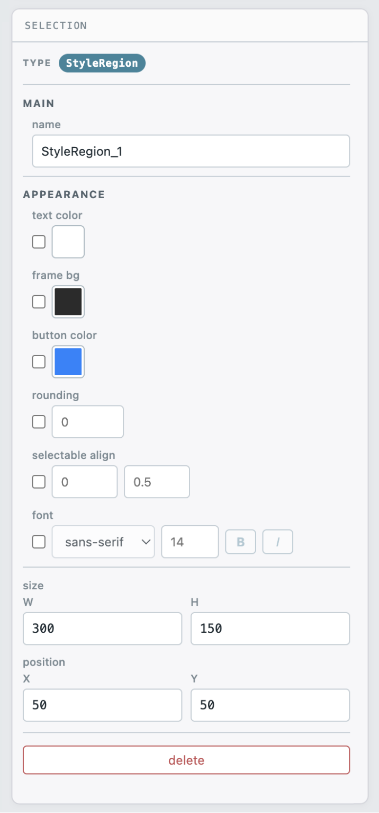

| Override | Export |
| --- | --- |
| text color | `PushStyleColor(Col_Text)` |
| frame bg | `PushStyleColor(Col_FrameBg)` |
| button color | `PushStyleColor(Col_Button)` |
| rounding | `PushStyleVar(StyleVar_FrameRounding)` |
| selectable align | `PushStyleVar(StyleVar_SelectableTextAlign, x, y)`, with both values from 0 to 1 |
| font | `CreateFont(family, flags)` at startup, followed by `PushFont(ctx, font, size)` around the child widgets |

The **font** override offers five generic families — sans-serif, serif, monospace, cursive, and fantasy — plus independent Bold and Italic toggles and a size from 6 to 72 px. Builder creates each unique family and style combination with one `CreateFont` call and attaches the font to the context before the first frame. It calls `PushFont` after applying the style overrides and the matching `PopFont` before removing them. The font therefore applies only to widgets inside the StyleRegion.

> **Note.** In Preview, StyleRegion applies supported color, rounding, and font overrides to its children. Its text-color override also reaches external labels and draw-list Text, Separator, SeparatorText, LabelText, and BulletText: Builder resolves their colors when generating Lua. An `Aa` marker in the editor header indicates a font override.

<a name="manual-7-4-collapsingheader-and-treenode"></a>

### 7.4 · CollapsingHeader and TreeNode

Both containers can collapse their contents in the running interface. CollapsingHeader uses a full-width bar; TreeNode uses an indented node with an arrow. Both export with `TreeNodeFlags_DefaultOpen`, so they start expanded.

TreeNode has a **hdr color** setting. **default** chooses black or white text for contrast with the canvas; **custom** uses the selected color. The exporter applies this color to the node label in both modes.

Both containers are always shown expanded in Builder.

**bullet instead of arrow** replaces the disclosure arrow with a bullet using ReaImGui’s `TreeNodeFlags_Bullet`. The node can still expand and collapse; this does not turn it into a leaf. It is a native tree/header flag, distinct from the decorative prefix bullet offered on some leaf widgets.

<a name="manual-7-5-tabbar"></a>

### 7.5 · TabBar

> Select the **Tabs** container header to access its **tabs** list. Edit names in the rows, use × to delete a page and its contents, or add a new page. The × control cannot remove the last remaining page.

A new TabBar starts with two tabs. Click a tab on the canvas to switch pages. Only the active page's contents are displayed, handled, and considered by widget overlap checks. Widgets placed on a page belong to its TabItem.

In the export, `BeginTabItem` / `EndTabItem` pairs are nested inside `BeginTabBar` / `EndTabBar`, with each page's widgets inside the corresponding tab item.

The tab bar is enclosed in a transparent child region using its layout width and height, with zero padding and no scrolling. This bounds the native tab underline to the Tabs area instead of extending it to the right edge of the parent window. Content is clipped to the region. The selected, ordinary, and hovered tab colors follow the active theme; a manual Tabs color is also exported.

<a name="manual-7-6-table"></a>

### 7.6 · Table

> The Table inspector provides row and column counts, a label and width mode for each column, individual row heights, a header-row checkbox, four table flags, and an overall sizing policy.

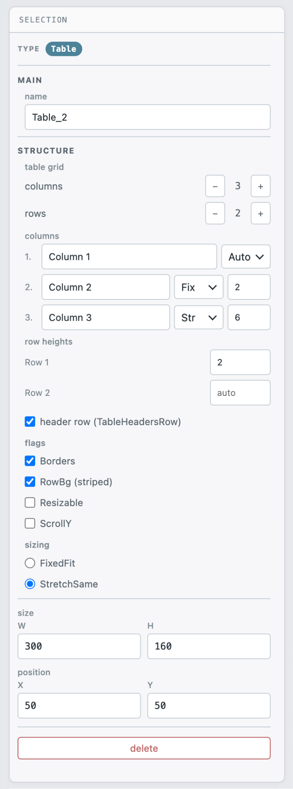

Table is a grid of cells, each a container. Row and column counts range from 1 to 16; a new table starts with 3 × 3 cells. When shrinking removes populated cells, the confirmation offers **OK** to delete their contents or **Cancel** to keep those widgets at the top level. Cancel keeps the contents; it does not cancel the table resize.

| Setting | Description |
| --- | --- |
| columns / rows | From 1 to 16 per axis. Growing creates cells; shrinking removes cells and asks how to handle their contents. |
| Column width | Three modes are available. **Auto** sets no width flag. **Fix** sets `WidthFixed` with a width in pixels. **Str** sets `WidthStretch` with a weighting factor. |
| Row height | Requests a row height in pixels. Unspecified rows share remaining space. Oversized requests are reduced to fit the body; if every row is set, the last receives any remainder. The resolved height is a minimum for `TableNextRow`. |
| header row | Adds a `TableHeadersRow` call and reserves an 18 px strip for column labels on the canvas. |
| Borders | Cell borders. |
| RowBg | Alternating row backgrounds. |
| Resizable | Allows users to resize columns in the running interface. |
| ScrollY | Enables vertical scrolling. The table height is passed to ImGui only when ScrollY is enabled. |
| sizing | Sizing policy for columns set to **Auto**: `SizingFixedFit` or `SizingStretchSame`. |

When **header row** is enabled, Builder subtracts the 18 px column-header strip from the table height before resolving row heights. The Table editor tab is outside the box and is not part of this calculation. Cells are emitted row by row. Children keep their local placement within the cell; the exporter rebases their positions on the cell’s actual runtime cursor origin and obtains the current draw list. Labels and other draw-list content therefore use the table’s current clipping and scrolling context. This preserves designed offsets while allowing the native table to scroll and its columns to resize; it is not automatic flow layout.

> **Note.** Placement in a cell keeps the drop position where possible, clamps it to the cell’s interior with a 4 px inset, and reduces overflowing dimensions if needed. It does not center the widget. If the widget’s center misses the cells but its box intersects the table, placement moves it beyond the nearest table edge.

---

<a name="manual-08-inspector-reference"></a>

## 08. Inspector reference

> The inspector shows the widget type, variant selector, name, label, contract-specific properties, position and size, and a delete button.

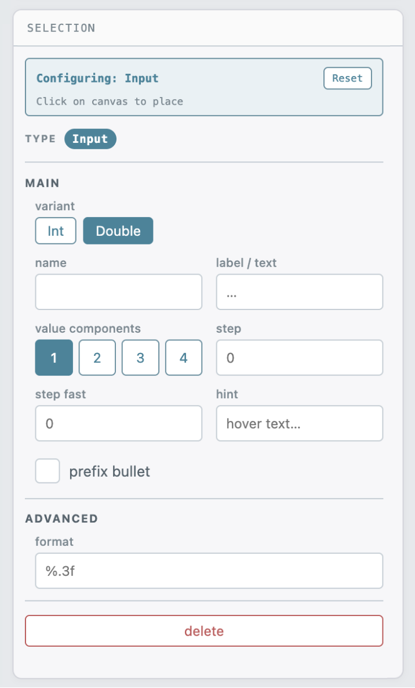

**Identification**

| Field | Description |
| --- | --- |
| variant | The selected type within a family: Int / Double or RGB / RGBA. Choose it before placement; for an existing widget, this field is read-only. |
| name | Object identifier. Determines Lua variable names and the ImGui ID. Use a unique name containing only `[A-Za-z0-9_]`. |
| parent | The widget's container hierarchy. Read-only. |
| label / text | Visible text. For Text-family widgets, this is the content itself; for other widgets, it is the label above or inside the control. |
| hint | InputTextWithHint only. The field is labeled **placeholder**; its text appears when the input is empty. |
| value | LabelText only. The read-only value displayed on the left; the label appears on the right. |
| url | TextLinkOpenURL only. The URL opened by the exported link. An empty URL exports `https://example.com`. |

**Numeric properties**

| Field | Description |
| --- | --- |
| value components | From 1 to 4. Generates a multicomponent call such as `SliderDouble3`, with a separate state field for each component. |
| array size | N-suffix families only. The size of the `reaper.new_array`, from 2 to 64. |
| min / max | Range bounds. Empty fields use the defaults for the widget type. |
| speed | Drag families only. The change in value per pixel of mouse movement. |
| step / step fast | Scalar InputInt/InputDouble. Explicit step sizes for the step controls. InputInt with 2–4 components omits these arguments in export. |
| format | A printf-style format, such as `%.2f` or `%d dB`. Also controls how the value appears in the widget. |
| format min / max | DragRange only. Separate formats for the lower and upper bounds, such as `Min: %d` and `Max: %d`. |
| numeric flags | Clamp, Log, NoInput, Wrap. See [§9](#manual-09-flags). |

Empty numeric fields use the type’s defaults; clearing a field removes its explicit override. Slider/Drag integer ranges default to 0–100 and double ranges to 0–1. Drag speed defaults to **1**, including when a custom format is present. Enter explicit values when your control needs a different range, step, speed, or format.

**Appearance and behavior**

| Field | Description |
| --- | --- |
| tooltip | The field is labeled **hint**. It adds `SetItemTooltip` for supported widgets. Text, Separator, SeparatorText, LabelText, BulletText, TextWrapped, StyleRegion, Table, and TableCell do not offer it. Panel, Group, CollapsingHeader, TreeNode, TabBar, and TabItem export the hint for the container’s native item. |
| bullet | **prefix bullet** draws a decorative dot to the left of supported leaf widgets. **bullet instead of arrow** on TreeNode and CollapsingHeader sets the native tree flag. See the bullet guide below. |
| color | Initial color for TextColored, ColorEdit3/4, ColorPicker3/4, and ColorButton. Available for a single object and applicable batch selections. |
| alpha | From 0 to 255, for RGBA variants, ColorButton, and TextColored. For ColorEdit4 and ColorPicker4, the exporter uses this alpha only when the object also has an explicit color. |
| text tone | TextWrapped only: Auto, Dark, or Light. Auto follows the resolved theme/style text color; explicit tones help control contrast. |
| direction | ArrowButton only. Arrow direction: Left, Right, Up, or Down. |
| overlay | ProgressBar only. Text over the bar. An empty field exports an empty overlay string, so no automatic percentage is requested. |
| indeterminate | ProgressBar only. Displays an animation instead of a progress value. |
| group / radio value | RadioButtonEx only. The shared state variable and this button's value. |
| hdr color | TreeNode only. The node label color: default or custom. |
| border / h-scroll | Panel only. Border and horizontal scrolling. |
| EEL2 callback | Text input widgets only. See below. |

**Bullet guide**

Prefix bullet is a Builder decoration, not a universal widget option in ReaImGui. On supported leaf widgets, it is drawn in Editor, Preview, and Lua at **8 px to the left** of the widget’s start. It uses the resolved theme/StyleRegion color and does not move the control or its label. Leave room to its left: a parent’s clip boundary can cut the dot off.

| Use case | Control |
| --- | --- |
| A dot before a supported leaf control | **prefix bullet**; the exact type list is in Appendix B. |
| A bullet in place of a tree/header disclosure arrow | **bullet instead of arrow** on TreeNode or CollapsingHeader; expansion still works. |
| An ordinary line of bulleted text | **BulletText** widget. |
| Panel, Group, StyleRegion, TabBar, TabItem, Table, TableCell | No bullet control. Old stored bullet values on these types are ignored. |

ColorButton, Selectable, TextWrapped, Text, Separator, SeparatorText, LabelText, and BulletText do not offer an additional prefix bullet. BulletText already supplies its own marker.

**Geometry**

The **position** (X, Y) and **size** (W, H) fields use integer layout pixels and follow Snap to grid. Fixed dimensions are read-only. ColorPicker’s H is calculated from its picker width and flags.

Drawings also have a **primitive order** row with back, backward, forward, and front buttons. These change the order within the drawing layer only; drawings always remain below widgets.

**EEL2 callbacks**

> The text input inspector shows basic flags first, followed by callback events and an EEL2 code field.

Select a placed text input and enter EEL2 code in **EEL2 callback**. If no callback event is selected, entering the first nonempty callback automatically enables **OnEdit**. Choose the required events in the flags section; OnTab and OnUp/Down are available only for single-line inputs. The generated script compiles and attaches the callback at startup. The hint below the field warns when code has no selected event. Callback flags without nonempty callback code are an export-preflight error; supply code or turn those events off.

---

<a name="manual-09-flags"></a>

## 09. Flags

<a name="manual-numeric-flags"></a>

### Numeric flags

These flags apply to Slider, VSlider, Drag, DragRange, SliderN, and DragN. The export combines them using bitwise OR.

**Wrap** is exported for Drag controls only. The SliderN inspector also allows it to be toggled, but the exporter removes it from SliderN calls.

| Option | ImGui flag | Effect |
| --- | --- | --- |
| Clamp | `SliderFlags_AlwaysClamp` | Clamps manually entered values to the range as well as values set by dragging. |
| Log | `SliderFlags_Logarithmic` | Uses a logarithmic response. Useful for frequency and volume controls. |
| NoInput | `SliderFlags_NoInput` | Disables direct value entry through Ctrl + click. |
| Wrap | `SliderFlags_WrapAround` | Drag families only. Wraps the value when it passes a range boundary. |

<a name="manual-text-input-flags"></a>

### Text input flags

| Section | Button | ImGui flag | Applies to |
| --- | --- | --- | --- |
| basic | `ReadOnly` | `InputTextFlags_ReadOnly` | `InputText`, `InputTextWithHint`, `InputTextMultiline` |
| basic | `Pass` | `InputTextFlags_Password` | `InputText`, `InputTextWithHint` |
| basic | `Dec` | `InputTextFlags_CharsDecimal` | `InputText`, `InputTextWithHint` |
| basic | `Hex` | `InputTextFlags_CharsHexadecimal` | `InputText`, `InputTextWithHint` |
| basic | `Enter` | `InputTextFlags_EnterReturnsTrue` | `InputText`, `InputTextWithHint`, `InputTextMultiline` |
| basic | `Tab` | `InputTextFlags_AllowTabInput` | `InputTextMultiline` |
| basic | `Ctrl+Enter` | `InputTextFlags_CtrlEnterForNewLine` | `InputTextMultiline` |
| callback | `OnEdit` | `InputTextFlags_CallbackEdit` | `InputText`, `InputTextWithHint`, `InputTextMultiline` |
| callback | `Always` | `InputTextFlags_CallbackAlways` | `InputText`, `InputTextWithHint`, `InputTextMultiline` |
| callback | `CharFilter` | `InputTextFlags_CallbackCharFilter` | `InputText`, `InputTextWithHint`, `InputTextMultiline` |
| callback | `OnTab` | `InputTextFlags_CallbackCompletion` | `InputText`, `InputTextWithHint` |
| callback | `OnUp/Down` | `InputTextFlags_CallbackHistory` | `InputText`, `InputTextWithHint` |

<a name="manual-color-flags"></a>

### Color flags

> The color flags inspector places independent toggles at the top, followed by four single-choice groups: display, data type, input, and picker style. Alpha-channel options appear last.

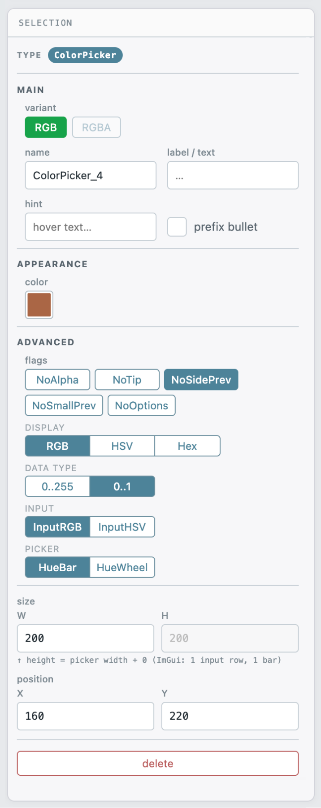

> **Note.** Display, data type, input, and picker options appear as segmented single-choice controls. Selecting an option clears the other flags in that group; clicking the active option clears it.

| Section | Button | ImGui flag | Applies to |
| --- | --- | --- | --- |
| basic | `NoAlpha` | `ColorEditFlags_NoAlpha` | `ColorEdit3`, `ColorEdit4`, `ColorPicker3`, `ColorPicker4`, `ColorButton` |
| basic | `NoPicker` | `ColorEditFlags_NoPicker` | `ColorEdit3`, `ColorEdit4` |
| basic | `NoInputs` | `ColorEditFlags_NoInputs` | `ColorEdit3`, `ColorEdit4` |
| basic | `NoTip` | `ColorEditFlags_NoTooltip` | `ColorEdit3`, `ColorEdit4`, `ColorPicker3`, `ColorPicker4`, `ColorButton` |
| basic | `NoLabel` | `ColorEditFlags_NoLabel` | `ColorEdit3`, `ColorEdit4` |
| basic | `NoSidePrev` | `ColorEditFlags_NoSidePreview` | `ColorPicker3`, `ColorPicker4` |
| basic | `NoSmallPrev` | `ColorEditFlags_NoSmallPreview` | `ColorEdit3`, `ColorEdit4`, `ColorPicker3`, `ColorPicker4` |
| basic | `NoOptions` | `ColorEditFlags_NoOptions` | `ColorEdit3`, `ColorEdit4`, `ColorPicker3`, `ColorPicker4` |
| basic | `NoDragDrop` | `ColorEditFlags_NoDragDrop` | `ColorEdit3`, `ColorEdit4`, `ColorButton` |
| basic | `NoBorder` | `ColorEditFlags_NoBorder` | `ColorButton` |
| display | `RGB` | `ColorEditFlags_DisplayRGB` | `ColorEdit3`, `ColorEdit4`, `ColorPicker3`, `ColorPicker4` |
| display | `HSV` | `ColorEditFlags_DisplayHSV` | `ColorEdit3`, `ColorEdit4`, `ColorPicker3`, `ColorPicker4` |
| display | `Hex` | `ColorEditFlags_DisplayHex` | `ColorEdit3`, `ColorEdit4`, `ColorPicker3`, `ColorPicker4` |
| data type | `0..255` | `ColorEditFlags_Uint8` | `ColorEdit3`, `ColorEdit4`, `ColorPicker3`, `ColorPicker4` |
| data type | `0..1` | `ColorEditFlags_Float` | `ColorEdit3`, `ColorEdit4`, `ColorPicker3`, `ColorPicker4` |
| input | `InputRGB` | `ColorEditFlags_InputRGB` | `ColorEdit3`, `ColorEdit4`, `ColorPicker3`, `ColorPicker4` |
| input | `InputHSV` | `ColorEditFlags_InputHSV` | `ColorEdit3`, `ColorEdit4`, `ColorPicker3`, `ColorPicker4` |
| picker | `HueBar` | `ColorEditFlags_PickerHueBar` | `ColorEdit3`, `ColorEdit4`, `ColorPicker3`, `ColorPicker4` |
| picker | `HueWheel` | `ColorEditFlags_PickerHueWheel` | `ColorEdit3`, `ColorEdit4`, `ColorPicker3`, `ColorPicker4` |
| alpha | `AlphaBar` | `ColorEditFlags_AlphaBar` | `ColorEdit4`, `ColorPicker4` |
| alpha | `HalfPrev` | `ColorEditFlags_AlphaPreviewHalf` | `ColorEdit4`, `ColorPicker4`, `ColorButton` |
| alpha | `NoBg` | `ColorEditFlags_AlphaNoBg` | `ColorEdit4`, `ColorPicker4`, `ColorButton` |
| alpha | `Opaque` | `ColorEditFlags_AlphaOpaque` | `ColorEdit4`, `ColorPicker4`, `ColorButton` |

---

<a name="manual-10-drawing-primitives"></a>

## 10. Drawing primitives

> Drawings on the canvas include rectangles, circles, triangles, lines, text, and arcs. All primitives export as draw list calls and appear below the widget layer.

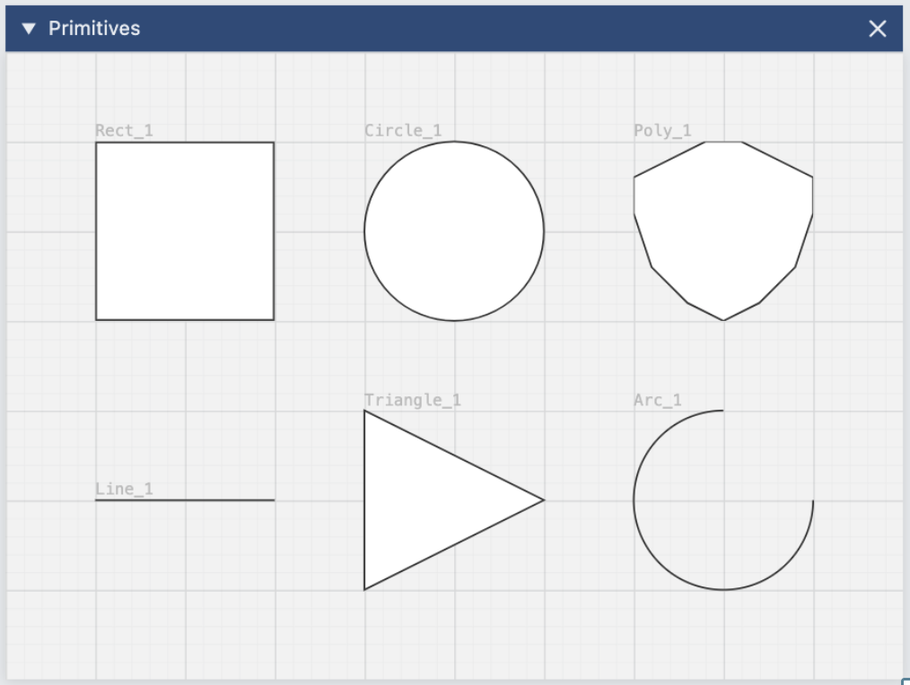

To draw a shape, select its tool from the palette and drag on the canvas. For a polygon, click to place each vertex instead. Close it by clicking the first point again, double-clicking, or pressing `Enter`. Press `Esc` to cancel an unfinished polygon.

| Primitive | Properties | Export |
| --- | --- | --- |
| Rectangle | fill, stroke, rounding, thickness, opacity | `AddRectFilled` and `AddRect` |
| Circle | fill, stroke, thickness, opacity | `AddCircle(Filled)`; `AddEllipse(Filled)` when W ≠ H |
| Triangle | fill, stroke, thickness, orient (four directions) | `AddTriangle(Filled)` |
| Line | stroke, thickness | `AddLine` |
| Polygon | fill, stroke, thickness, list of points | `PathFillConvex` for convex polygons; triangulation with `AddTriangleFilled` for concave polygons |
| Arc | `ring`: stroke, thickness, start and end angles; `pie`: the same properties plus fill | `PathArcTo` and `PathStroke`; `pie` also uses `PathFillConvex` |
| Text | text, color, size, horizontal and vertical alignment | `AddTextEx` with explicit font size; text measurement for alignment |

> The arc inspector uses angles in degrees following ImGui conventions: 0° points right, and angles increase clockwise. A 270° sweep starting at 135° gives a conventional rotary knob scale.

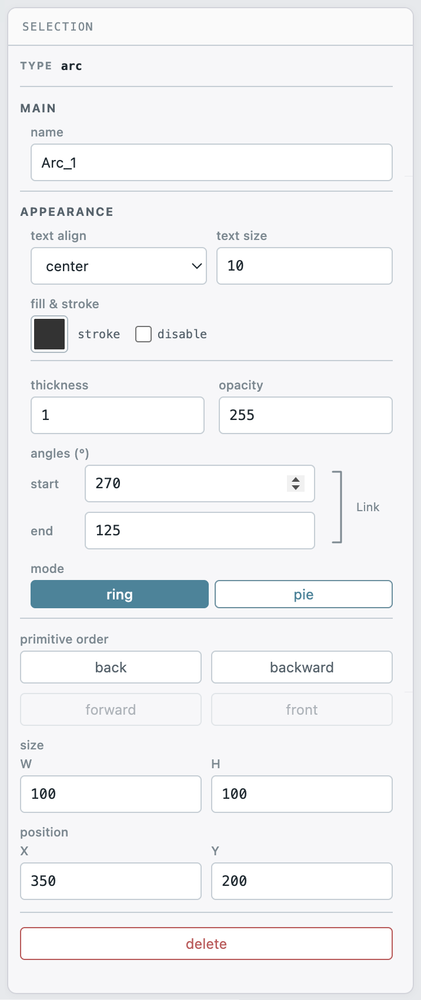

Exported drawings are clipped to the layout. A drawing is included if any part of it intersects the layout: for example, a rectangle extending past an edge is exported, and ImGui clips the portion outside. Widgets follow a stricter rule: a widget must be entirely inside the frame to be exported.

**Drawing text size and color.** The **text size** value is exported explicitly. Resizing the object scales the font as described in §5.3. New drawing text follows the project’s resolved text color automatically; choosing a color in the picker fixes a manual color. The canvas and Lua use the same choice. Text is not squeezed to fit an arbitrary width.

**Linked arc angles.** Enable **Link angles** to preserve the sweep: changing Start by an amount changes End by the same amount, and vice versa. The arc updates during input. This setting is saved and also works in batch editing of arcs. It links angles, not fill and stroke colors.

<a name="manual-fill-stroke-and-linked-colors"></a>

### Fill and stroke

Each available fill/stroke row has its own **disable** checkbox. Select it to turn that component off without losing its color. The controls are independent: a shape may have a fill, an outline, both, or neither.

Stroke can also be disabled for Line and ring-mode Arc. A fully disabled or transparent drawing remains in the project; select it through Elements. Fill and stroke colors are edited independently; version 1.0.70 has no color-link control.

If an opacity field is left empty, leaving the field restores its previous value. This also applies to batch editing.

ImGui fills convex paths directly. Builder triangulates a non-convex polygon for export using multiple `AddTriangleFilled` calls; its outline remains a single closed path.

---

<a name="manual-11-canvas-and-project-settings"></a>

## 11. Canvas and project settings

<a name="manual-window-title"></a>

### Window title

The title used when the layout opens in REAPER appears in the blue header above the canvas. Click it to edit. Press `Enter` to apply the title or `Esc` to cancel.

The title is used in the generated script (`CreateContext` and `ImGui_Begin`), saved in the project file, and used as the download filename: *Track Tools* → `Track_Tools.lua`. Apostrophes are escaped so they do not break the script.

<a name="manual-size"></a>

### Size

The Canvas tab's W and H fields set the window's content size. They are exported as `W, H`. Press `Enter` or leave the field to apply a change. Dragging the ⇲ handle has the same effect.

<a name="manual-background"></a>

### Background

- **Default.** The canvas follows the active theme, while the export retains ImGui's native window background. If the selected theme is not Default, Builder also applies its background color to the canvas child window through `PushStyleColor`.
- **Custom.** Choose a color and opacity in the Canvas picker. Opacity blends the color toward white; the export writes the resulting opaque color as `Col_WindowBg`. It does not make the REAPER window transparent.

<a name="manual-color-picker"></a>

### Color picker

Color swatches for drawings, supported widget colors, StyleRegion overrides, batch editing, and the theme editor open Builder’s popover picker. It normally opens to the right and upward; near a window edge it moves left or downward. The Canvas tab has its own embedded background picker.

The popover has a saturation/brightness square, hue bar, **HEX** field, and recent swatches. The screen eyedropper appears only if the browser supports it. The HEX field is focused on opening and accepts `#RRGGBB` and `#RGB`. Color changes apply live. `Enter` closes the picker; `Esc` closes it and restores focus without reverting changes. Undo grouping follows the edited field’s history behavior.

Recent swatches are shared across all color fields and retained until the page is reloaded.

<a name="manual-grid"></a>

### Grid

**Show grid** controls the fine grid. Its visibility is stored separately for Editor and Preview modes. **Step** sets the spacing to 2, 5, or 10 px and also controls the snapping interval.

<a name="manual-audit-grid"></a>

### Audit grid

*View → Reference grid in export* enables a magenta measurement grid with 50 px spacing. Unlike the regular grid, the audit grid is exported: the generated code draws the same grid in the REAPER window. Use it to compare coordinates between Builder and REAPER. Disable it before releasing your script.

<a name="manual-zoom-and-pan"></a>

### Zoom and pan

Zoom ranges from **50% to 250%**. Choose a preset in the status bar, use `Cmd/Ctrl` + mouse wheel to zoom around the pointer, or click ⤢ to fit the layout in the view. The Zoom tool provides click to enlarge and Alt/Option + click to reduce. Pan with Hand or hold Space before dragging. The surrounding workspace expands to accommodate drawings moved beyond it. Zoom and pan affect the view only; object coordinates do not change.

---

<a name="manual-12-themes"></a>

## 12. Themes

> The theme selector lists built-in and custom themes, with **+ Add** and **Edit** controls below. The active theme is saved with the project.

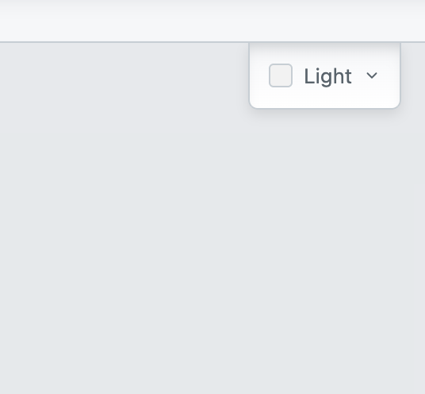 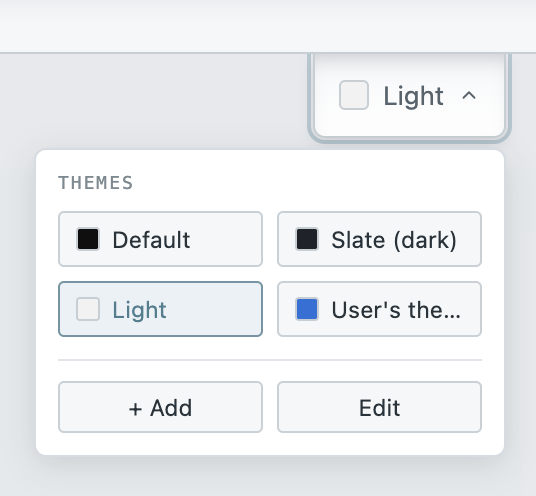

A theme defines fifteen color values: thirteen ImGui style colors, a child-window background, and a color for labels drawn through the draw list. Three themes are included: **Default** (no theme color overrides), **Slate (dark)**, and **Light**.

Themes affect both Preview mode and the export. For a theme other than Default, the export applies its colors with `PushStyleColor` immediately after opening the canvas child window and removes them before closing it.

> With Slate selected, Preview approximates how the layout will appear in REAPER using that palette.

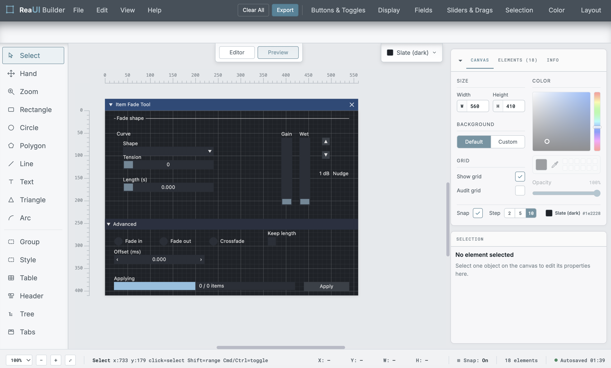

<a name="manual-custom-themes"></a>

### Custom themes

> In the New Theme dialog, four colors define the palette. The swatch strip shows the derived color slots.

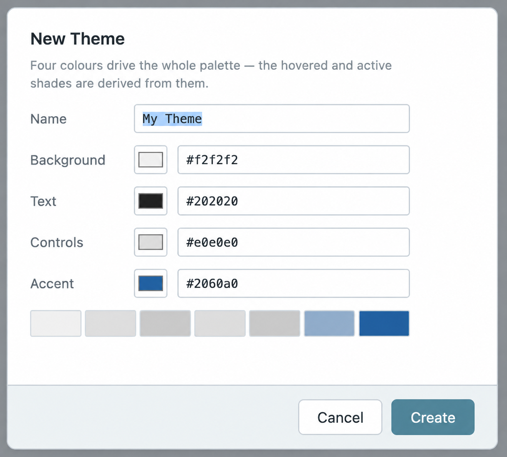

To create a theme, choose colors for the background, text, controls, and accent. The remaining eleven slots are calculated automatically. Hovered and active states are derived from the control color: lighter on dark backgrounds and darker on light backgrounds. Header colors blend the background and accent. The accent is also used for checkmarks and the active slider grab.

- Custom themes are stored in the browser's localStorage and are available only in that browser on that computer.
- The active custom theme’s definition is included in the project file. Loading that project makes the theme available for the current session; it does not automatically save it to the browser’s permanent theme library.
- **Edit** opens custom theme management. Use the pencil button to edit a theme, or delete a theme you no longer need. Built-in themes cannot be edited or deleted.

---

<a name="manual-13-preview-mode"></a>

## 13. Preview mode

> Preview hides name tags, container editor strips, and selection controls. It approximates the widgets' ImGui appearance using the active theme.

Use the Editor / Preview switch above the canvas. Preview prevents direct canvas dragging, resizing, and placement, but it does not lock the project: inspector edits and editing commands remain active. Widgets are drawn as visual approximations; clicking them selects them rather than operating the exported control. Switch tabs in Editor mode.

Some widgets appear as labeled, hatched placeholders: **Group**, **Table**, and **ColorPicker3/4**. **TextWrapped** renders wrapped text, including long strings without spaces, with its text tone and applicable style/font settings. A banner appears at the bottom when the canvas contains these widgets.

**Preview limitations:**

- ColorEdit and other native controls may not reflect every flag or interaction. Preview approximates the layout; it does not run ReaImGui or execute Lua.
- StyleRegion’s text-color override applies to external labels in both Preview and export. Other properties may be represented schematically.
- ProgressBar uses a fixed fill of about 45% and does not show the exported animation. Numeric controls also display representative values.
- The **overlay** text appears on the canvas in both Editor and Preview.

---

<a name="manual-14-exporting"></a>

## 14. Exporting

<a name="manual-export-preflight"></a>

### Export preflight

The preflight panel at the top of the *Export* window runs whenever you open the window. It reports findings at three levels.

- **Error.** Preflight has found a condition that blocks export, such as invalid IDs, parent relationships, geometry, widget types, invalid supported numeric fields, or callback events without code. The *copy* and *download* buttons remain disabled until these errors are resolved. Preflight validates project data; it does not execute Lua or validate every native argument. See §17 for the remaining numeric format and range limits.
- **Warning.** Export remains available, but a setting or omission needs attention. Examples include objects outside the layout, children of omitted containers, clipped drawings, colliding names, duplicate radio values, an empty TabBar, or missing table cells.
- **Information.** A single summary line reports how many elements have no visible label.

The panel header reports how many objects will be **omitted** and how many will be exported out of the total. Review this summary to identify omissions that would not be apparent from the code alone.

Click a finding to select the corresponding object on the canvas.

> The Export window's ReaImGui tab contains the generated script: context creation, position and state tables, a drawing function, and a defer loop. Click **copy** to copy the code to the clipboard.

<a name="manual-generated-file-structure"></a>

### Generated file structure

The generated code follows a consistent structure:

1. **Header comments.** Canvas dimensions and positioning rules.
2. **Context and dimensions.** The `CreateContext` call and `W, H` and `OUTER_H` values. `OUTER_H` adds the title bar height so the content area matches the layout dimensions.
3. **Position table.** Widget X/Y coordinates and widths are listed in `local pos = { … }` near the top. The exporter also embeds coordinates and sizes directly in many draw-list and widget calls. For consistent layout changes, edit the Builder project and export again.
4. **State table.** `local state = { radioGroups = {} }` holds interactive values, a separate namespace for shared radio groups, and `reaper.new_array` arrays for N-suffix families. Keeping values in tables avoids a top-level local variable for every widget.
5. **Fonts and EEL2 callbacks.** Created and attached once, before the loop, if a StyleRegion or input field uses them.
6. **The `draw()` function.** Sets the layout style, opens the window and canvas child, obtains the current child’s draw list and coordinate origin, applies the theme, draws primitives, and emits widgets in tree order. Nested child windows and table cells establish their own drawing context where needed.
7. **The `defer` loop.**

<a name="manual-positioning-in-code"></a>

### Positioning in code

A typical leaf widget uses a position-table entry:

```lua
reaper.ImGui_SetCursorScreenPos(ctx,
  ox + pos.SLIDER_2.x, oy + pos.SLIDER_2.y)
reaper.ImGui_SetNextItemWidth(ctx, pos.SLIDER_2.w)
```

The origin and draw list must belong to the active drawing region. The root canvas obtains them after opening its child window; nested regions and table cells use their current runtime context. This keeps widget bodies, external labels, and draw-list content aligned while respecting clipping and scrolling.

Coordinates and dimensions also occur directly in drawing and widget calls. Editing a position-table entry alone is not a complete layout edit; update the project and export again when possible.

Zero layout padding and spacing are intentional. If you add ordinary flow-layout widgets in Lua, choose suitable spacing or continue setting positions explicitly.

<a name="manual-what-is-included"></a>

### What is included

- A widget is exported only if its full footprint lies inside the layout bounds. A widget extending past an edge is omitted.
- A drawing is exported if it intersects the layout area.
- The audit grid is exported when enabled.

---

<a name="manual-15-saving-and-loading"></a>

## 15. Saving and loading

The **JSON project** preserves the editable layout. Lua is an output format and cannot be imported back into Builder.

| Command | Behavior |
| --- | --- |
| **Save Project** · `Cmd/Ctrl + S` | Saves to the selected project file. The first save asks for a location where direct file access is available. |
| **Save As…** · `Cmd/Ctrl + Shift + S` | Chooses a new project filename/location. |
| **Load Project** | Opens a JSON project. With supported direct file access, later Save writes back to that file during the current session. |
| **New Project** | Starts an empty 550 × 400 layout, retaining current title, background, theme, grid, and snapping settings. |
| **Restore projects…** | Opens the list of recoverable drafts from closed sessions. |

Direct writing uses the browser’s file-access support and permissions. After a file is chosen, repeated Save reuses it in the current session, although the browser may still ask for write permission. The browser controls the appearance and wording of these system prompts.

If direct file access is unavailable, Builder downloads a JSON copy. It cannot overwrite the original file through that fallback or confirm that a download completed. Use the status message to distinguish a direct save from a downloaded copy.

Canceling Save As or encountering a write error keeps the open project and its recovery data. Changes made while a save is in progress remain unsaved if they were not part of the written snapshot.

Before New, Load, or Restore replaces a dirty project, Builder offers **Save / Discard / Cancel**. A canceled or failed load does not replace the current layout. Incoming project data is validated before replacement; invalid IDs, references, or other malformed data are rejected. Older project data is normalized into the current structure on a successful load. Loading clears Undo history.

Project files include the objects and their nesting, editor groups and names, layer order, linked arc angles, widget settings, title, dimensions, background, active theme and its custom definition, audit grid, snapping, and grid step. Zoom, undo history, Editor/Preview mode, ordinary-grid visibility, and panel visibility are not portable project settings.

<a name="manual-autosave-and-recovery"></a>

### Autosave and recovery

Builder keeps recovery drafts in this browser’s storage. Use **File → Restore projects…** to inspect and restore drafts from closed sessions. Projects still open in another active tab are excluded from the list.

A successful direct save clears the completed draft. If the project changes while the save is in progress, the newer edits remain in a draft. The download fallback retains recovery data because the browser does not tell Builder whether the download was completed or canceled. After restoring a draft, save it as a project file.

When leaving with unsaved changes, the browser may show its standard leave-page confirmation. Its availability and text depend on the browser. This is separate from Builder’s Save/Discard/Cancel dialog.

Recovery drafts and custom themes are stored by the browser and can be lost when site data is cleared. Storage behavior for local files also varies between browsers. Keep a JSON project as your durable, portable copy.

---

<a name="manual-16-keyboard-and-mouse-reference"></a>

## 16. Keyboard and mouse reference

Use Cmd on macOS and Ctrl on Windows/Linux unless an action names another modifier.

| Action | Result |
| --- | --- |
| `Cmd/Ctrl + S` | Save Project |
| `Cmd/Ctrl + Shift + S` | Save As |
| `Cmd/Ctrl + C` / `V` | Copy / paste selected objects and included container subtrees |
| `Cmd/Ctrl + D` | Duplicate |
| `Cmd/Ctrl + G` | Group selection in the editor |
| `Cmd/Ctrl + Shift + G` | Ungroup selection |
| `Cmd/Ctrl + Z` | Undo |
| `Cmd/Ctrl + Shift + Z` or `Cmd/Ctrl + Y` | Redo |
| `Cmd/Ctrl + A` | Select all objects |
| `Del` / `Backspace` | Delete; filled containers offer content choices |
| Arrow keys with canvas focused | Move by one grid step, or 1 px with snapping off |
| `Shift + arrow keys` with canvas focused | Move by ten increments |
| `↑/↓`, `Home/End` in Elements | Navigate rows; Shift extends the row selection |
| `Enter` in Elements | Give the canvas focus, preserving selection and view |
| `Shift + click` on canvas | Extend selection across the anchor-to-click area |
| `Shift + click` in Elements | Select a range of rows |
| `Cmd/Ctrl + click` | Add an object to selection or remove it |
| Drag on empty canvas | Marquee selection; Shift adds, Cmd/Ctrl toggles |
| `Alt/Option + drag` an object | Drag a copy |
| `Shift + resize` drawings | Preserve aspect ratio; also works with draw-only selections |
| Hold `U` before dragging a container | Leave current children in place and skip capture |
| `Space + drag` | Temporary Hand; start Space before the gesture |
| `Cmd/Ctrl + mouse wheel` | Zoom around the pointer |
| Zoom tool: click / `Alt/Option + click` | Zoom in / out around that point |
| Right-click empty canvas | Widget placement menu |
| Right-click an object/selection or Elements row | Object commands |
| `Shift + click` Rectangle, Circle, Line, Triangle, or Arc tool | Keep the tool active for repeated drawing |
| Polygon: `Enter`, double-click, or click first point | Close the polygon |
| `Esc` | Cancel the current tool/polygon, clear selection, or close the active dialog/menu |

Text fields keep their normal typing, clipboard, and navigation behavior. Save/Save As remain available while editing a field. In Elements, arrow keys navigate until focus returns to the canvas. See Help → Keyboard Shortcuts for the built-in reference.

---

<a name="manual-17-release-limitations"></a>

## 17. Release limitations

The following limitations apply to version **1.0.70**.

- **Editing Combo and ListBox items.** The export contains five placeholder items. Replace their strings in Lua; the selection state and widget calls are already generated.
- **Free rotation for drawings.** Arc supports angles and Triangle supports orientation, but there is no general rotation handle or property.
- **Importing or exporting a separate theme file.** The active theme is stored in the project JSON.
- Preview does not execute ReaImGui. Group, Table, and ColorPicker remain schematic; native fonts, interaction, and some flags require checking in REAPER.
- Widgets outside the export frame are omitted. Omitting a container also omits its contents. Drawings that intersect the frame are exported with clipping; inspect the preflight findings.
- Body dimensions do not always describe a widget’s full footprint. External labels, natural text, and picker reservations need space. Prefix bullets can be clipped at a parent’s left edge.
- StyleRegion, Table, and TableCell do not support **hint** because they do not submit a single native item to which a tooltip can be attached. Use a supported widget or HelpMarker for hover help.
- SliderN can show Wrap in its numeric flags, but Wrap is removed from Slider export; use it on Drag controls.
- For ColorEdit4/ColorPicker4, explicitly set a color as well as alpha if you need a specific initial transparency.
- Numeric format strings and extreme Double-slider bounds are not fully checked against native API requirements. Use a single compatible numeric conversion (for example, `%d` for Int or `%.2f` for Double) and ranges appropriate for the parameter. A clean preflight is not proof that every format or extreme bound is valid in ReaImGui.
- Drawings stay below widgets. Reordering within a layer does not override native child-window clipping or create a global overlay.
- Browser file-access and clipboard permissions affect saving and copying. Recovery and custom themes are browser storage, not substitutes for a portable project file.
- The Lua filename is derived from the window title; unsupported filename characters become underscores, with `MyPlugin.lua` as a fallback.

---

<a name="manual-appendix-a-widget-contracts"></a>

## Appendix A · Widget contracts

The table lists all 50 contract types, including the automatically managed TabItem and TableCell. Sizes are base contract values before placement snapping and type-specific adjustments. **H** marks a fixed height; **D** marks a height derived from width and flags. SmallButton and RadioButtonEx widths follow their labels; Checkbox and ArrowButton cannot be resized. Content-sized widths in this table are starting values, not fixed text limits.

| Type | Family · variant | Size | Width | Height | Description |
| --- | --- | --- | --- | --- | --- |
| `Button` | `Button` | 100×20 | `explicit-size` | `explicit-size` | A button that triggers an action when clicked. |
| `SmallButton` | `SmallButton` | 50×20 **H** | `explicit-size` | `native-fixed` | A button with reduced padding and the same behavior as Button. |
| `ArrowButton` | `ArrowButton` | 17×17 **H** | `explicit-size` | `explicit-size` | A square button with an arrow. |
| `Checkbox` | `Checkbox` | 20×20 **H** | `widget-box-preview` | `native-fixed` | A Boolean control with a checkmark and an external label above it. *Use for on/off settings such as enable, mute, loop, or bypass.* |
| `RadioButtonEx` | `RadioButtonEx` | 20×20 **H** | `widget-box-preview` | `native-fixed` | A radio button that belongs to a mutually exclusive group; only one option in the group is active. |
| `Selectable` | `Selectable` | 140×20 | `explicit-size` | `explicit-size` | A selectable, full-width row. |
| `Text` | `Text` | 120×20 **H** | `content-or-widget-box` | `native-content` | A static, single-line label. |
| `TextColored` | `TextColored` | 120×20 **H** | `content-or-widget-box` | `native-content` | Text in a specified color. |
| `TextDisabled` | `TextDisabled` | 120×20 **H** | `content-or-widget-box` | `native-content` | Text in the disabled style. |
| `TextWrapped` | `TextWrapped` | 200×60 | `explicit-size` | `explicit-size` | Text that wraps to the available width. |
| `BulletText` | `BulletText` | 160×14 **H** | `explicit-size` | `native-line` | A line of text preceded by a bullet. |
| `LabelText` | `LabelText` | 140×20 **H** | `next-item-width` | `native-fixed` | A read-only value on the left and its label on the right. *Use for named values such as tempo or status.* |
| `TextLinkOpenURL` | `TextLinkOpenURL` | 120×14 **H** | `explicit-size` | `native-line` | An underlined link that opens a URL in the browser. |
| `SeparatorText` | `SeparatorText` | 200×14 **H** | `explicit-size` | `native-line` | A separator line with a label near the left edge. *Use to title a section.* |
| `Separator` | `Separator` | 200×10 **H** | `explicit-size` | `native-line` | A horizontal separator line. |
| `HelpMarker` | `HelpMarker` | 24×20 **H** | `content-or-widget-box` | `native-content` | A “(?)” marker with a tooltip on hover. |
| `ProgressBar` | `ProgressBar` | 120×20 | `explicit-size` | `explicit-size` | A horizontal progress indicator from 0 to 100%. |
| `SliderInt` | `Slider` · `Int` | 120×20 **H** | `next-item-width` | `native-fixed` | A horizontal track and thumb for a single numeric value. |
| `SliderDouble` | `Slider` · `Double` | 120×20 **H** | `next-item-width` | `native-fixed` | A horizontal track and thumb for a single numeric value. |
| `SliderDoubleN` | `SliderN` | 160×20 **H** | `next-item-width` | `native-fixed` | Multiple sliders forming one multicomponent value. |
| `VSliderInt` | `VSlider` · `Int` | 18×160 | `explicit-size` | `explicit-size` | A vertical slider for a single numeric value. |
| `VSliderDouble` | `VSlider` · `Double` | 18×160 | `explicit-size` | `explicit-size` | A vertical slider for a single numeric value. |
| `SliderAngle` | `SliderAngle` | 140×20 **H** | `next-item-width` | `native-fixed` | A slider for entering an angle in degrees. |
| `DragInt` | `Drag` · `Int` | 120×20 **H** | `next-item-width` | `native-fixed` | A numeric field adjusted by dragging horizontally. |
| `DragDouble` | `Drag` · `Double` | 120×20 **H** | `next-item-width` | `native-fixed` | A numeric field adjusted by dragging horizontally. |
| `DragDoubleN` | `DragN` | 160×20 **H** | `next-item-width` | `native-fixed` | Multiple Drag fields forming one multicomponent value. |
| `DragIntRange2` | `DragRange` · `Int` | 160×20 **H** | `next-item-width` | `native-fixed` | Two linked Drag fields that define a lower and upper bound. |
| `DragFloatRange2` | `DragRange` · `Double` | 160×20 **H** | `next-item-width` | `native-fixed` | Two linked Drag fields that define a lower and upper bound. |
| `InputInt` | `Input` · `Int` | 80×20 **H** | `next-item-width` | `native-fixed` | A numeric input field with step buttons. |
| `InputDouble` | `Input` · `Double` | 80×20 **H** | `next-item-width` | `native-fixed` | A numeric input field with step buttons. |
| `InputDoubleN` | `InputN` | 160×20 **H** | `next-item-width` | `native-fixed` | Multiple numeric input fields in one widget. |
| `InputText` | `InputText` | 120×20 **H** | `next-item-width` | `native-fixed` | A single-line text input. |
| `InputTextWithHint` | `InputTextWithHint` | 140×20 **H** | `next-item-width` | `native-fixed` | A single-line input with placeholder text while empty. |
| `InputTextMultiline` | `InputTextMultiline` | 200×80 | `next-item-width` | `explicit-size` | A multiline text input. |
| `Combo` | `Combo` | 100×20 **H** | `next-item-width` | `native-fixed` | A drop-down list that displays the selected item. |
| `ListBox` | `ListBox` | 160×80 | `next-item-width` | `explicit-size` | A scrollable list with several visible rows. |
| `ColorEdit3` | `ColorEdit` · `RGB` | 160×20 **H** | `next-item-width` | `native-fixed` | A compact color editor with channel fields and a swatch. |
| `ColorEdit4` | `ColorEdit` · `RGBA` | 160×20 **H** | `next-item-width` | `native-fixed` | A compact color editor with channel fields and a swatch. |
| `ColorPicker3` | `ColorPicker` · `RGB` | 200×246 **D** | `next-item-width` | `explicit-size` | A full color picker with a saturation area and hue bar. |
| `ColorPicker4` | `ColorPicker` · `RGBA` | 200×246 **D** | `next-item-width` | `explicit-size` | A full color picker with a saturation area and hue bar. |
| `ColorButton` | `ColorButton` | 40×20 | `explicit-size` | `explicit-size` | A button displaying a single color swatch. |
| `Panel` | `Panel` | 220×140 | `explicit-size` | `explicit-size` | A bordered, scrollable region containing other widgets. |
| `Group` | `Group` | 200×120 | `explicit-size` | `explicit-size` | A borderless container that groups child widgets; a nonempty label is drawn separately. |
| `StyleRegion` | `StyleRegion` | 200×120 | `explicit-size` | `explicit-size` | An invisible region with style overrides for colors, rounding, alignment, and fonts. |
| `CollapsingHeader` | `CollapsingHeader` | 200×120 | `explicit-size` | `explicit-size` | A full-width header that collapses its contents. |
| `TreeNode` | `TreeNode` | 200×120 | `explicit-size` | `explicit-size` | An expandable node with indented children. |
| `TabBar` | `TabBar` | 280×180 | `explicit-size` | `explicit-size` | A tab strip that switches between content pages. |
| `TabItem` | `TabItem` | 280×156 | `explicit-size` | `explicit-size` | A tab page managed by TabBar; not placed independently. |
| `Table` | `Table` | 320×200 | `explicit-size` | `explicit-size` | A grid of rows and columns containing other widgets. |
| `TableCell` | `TableCell` | 100×50 | `explicit-size` | `explicit-size` | A cell managed by Table; its size follows the resolved row and column. |

---

<a name="manual-appendix-b-inspector-matrix"></a>

## Appendix B · Inspector matrix

This table lists the fields available for each of the **50 types** in version 1.0.70. Names match the inspector: **hint** is a hover tooltip, while **placeholder** belongs to InputTextWithHint. The standard **name** field and conditional **parent** row are not repeated. Choose a variant before placement; fixed size axes remain read-only.

TabItem and TableCell are structural types managed by their parent. Their fields describe the internal type; edit tab and table structure through TabBar/Table. Shared rows for a multiple selection can be narrower than this single-type list. Panel, Group, CollapsingHeader, TreeNode, TabBar, and TabItem support **hint**; StyleRegion, Table, and TableCell do not.

| Type | Inspector rows |
| --- | --- |
| `Button` | label / text, hint, prefix bullet, size, position |
| `SmallButton` | label / text, hint, prefix bullet, size, position |
| `ArrowButton` | direction, hint, prefix bullet, size, position |
| `Checkbox` | label / text, hint, prefix bullet, size, position |
| `RadioButtonEx` | label / text, hint, prefix bullet, group, radio value, size, position |
| `Selectable` | label / text, hint, size, position |
| `Text` | label / text, size, position |
| `TextColored` | label / text, hint, prefix bullet, color, alpha, size, position |
| `TextDisabled` | label / text, hint, prefix bullet, size, position |
| `TextWrapped` | label / text, text tone, size, position |
| `BulletText` | label / text, size, position |
| `LabelText` | label / text, value, size, position |
| `TextLinkOpenURL` | label / text, url, hint, prefix bullet, size, position |
| `SeparatorText` | label / text, size, position |
| `Separator` | size, position |
| `HelpMarker` | hint, prefix bullet, size, position |
| `ProgressBar` | label / text, hint, prefix bullet, overlay, indeterminate, size, position |
| `SliderInt` | variant (placement only), label / text, value components, min, max, format, numeric flags, hint, prefix bullet, size, position |
| `SliderDouble` | variant (placement only), label / text, value components, min, max, format, numeric flags, hint, prefix bullet, size, position |
| `SliderDoubleN` | label / text, array size, min, max, format, numeric flags, hint, prefix bullet, size, position |
| `VSliderInt` | variant (placement only), label / text, min, max, format, numeric flags, hint, prefix bullet, size, position |
| `VSliderDouble` | variant (placement only), label / text, min, max, format, numeric flags, hint, prefix bullet, size, position |
| `SliderAngle` | label / text, hint, prefix bullet, size, position |
| `DragInt` | variant (placement only), label / text, value components, min, max, speed, format, numeric flags, hint, prefix bullet, size, position |
| `DragDouble` | variant (placement only), label / text, value components, min, max, speed, format, numeric flags, hint, prefix bullet, size, position |
| `DragDoubleN` | label / text, array size, min, max, speed, format, numeric flags, hint, prefix bullet, size, position |
| `DragIntRange2` | variant (placement only), label / text, min, max, speed, format min, format max, numeric flags, hint, prefix bullet, size, position |
| `DragFloatRange2` | variant (placement only), label / text, min, max, speed, format min, format max, numeric flags, hint, prefix bullet, size, position |
| `InputInt` | variant (placement only), label / text, value components, step, step fast, hint, prefix bullet, size, position |
| `InputDouble` | variant (placement only), label / text, value components, step, step fast, format, hint, prefix bullet, size, position |
| `InputDoubleN` | label / text, array size, hint, prefix bullet, size, position |
| `InputText` | label / text, hint, prefix bullet, input flags, EEL2 callback, size, position |
| `InputTextWithHint` | label / text, placeholder, hint, prefix bullet, input flags, EEL2 callback, size, position |
| `InputTextMultiline` | label / text, hint, prefix bullet, input flags, EEL2 callback, size, position |
| `Combo` | label / text, hint, prefix bullet, size, position |
| `ListBox` | label / text, hint, prefix bullet, size, position |
| `ColorEdit3` | variant (placement only), label / text, hint, prefix bullet, color, color flags, size, position |
| `ColorEdit4` | variant (placement only), label / text, hint, prefix bullet, color, alpha, color flags, size, position |
| `ColorPicker3` | variant (placement only), label / text, hint, prefix bullet, color, color flags, size, position |
| `ColorPicker4` | variant (placement only), label / text, hint, prefix bullet, color, alpha, color flags, size, position |
| `ColorButton` | hint, color, alpha, color flags, size, position |
| `Panel` | hint, border, h-scroll, size, position |
| `Group` | label / text, hint, size, position |
| `StyleRegion` | text color, frame bg, button color, rounding, selectable align, font, size, position |
| `CollapsingHeader` | label / text, hint, bullet instead of arrow, size, position |
| `TreeNode` | label / text, hint, bullet instead of arrow, hdr color, size, position |
| `TabBar` | tabs, hint, size, position |
| `TabItem` | label / text, hint, size, position |
| `Table` | table grid / columns / row heights / table flags, size, position |
| `TableCell` | label / text, size, position |

---

<a name="manual-appendix-c-generated-file-structure"></a>

## Appendix C · Reading the generated file

These excerpts come from a version 1.0.70 export of a **600 × 400** layout with Button_1 (“Play”) at (40, 60) and Slider_2 (“Gain”) at (40, 130). They show the position and state structure but do not form a complete runnable script. Use Export to generate the complete file.

```lua
-- Positions
local pos = {
  BUTTON_1 = { x=40, y=60, w=100 },
  SLIDER_2 = { x=40, y=130, w=120 },
}

local state = { radioGroups = {} }
-- Widget state
state.Slider_2_val = 0.0
```

The drawing function opens the canvas child before obtaining its draw list and origin. Widget emission then uses those values:

```lua
    -- Button_1 [Button]
    reaper.ImGui_SetCursorScreenPos(ctx, ox + pos.BUTTON_1.x, oy + pos.BUTTON_1.y)
    if reaper.ImGui_Button(ctx, "Play##Button_1", 100, 20) then
      -- TODO: Button_1 pressed
    end

    -- Slider_2 [SliderDouble]
    reaper.ImGui_SetCursorScreenPos(ctx, ox + pos.SLIDER_2.x, oy + pos.SLIDER_2.y)
    reaper.ImGui_SetNextItemWidth(ctx, pos.SLIDER_2.w)
    do
      local _label = "Gain"
      if _label ~= "" then
        local _tw, _th = reaper.ImGui_CalcTextSize(ctx, _label)
        reaper.ImGui_DrawList_AddText(dl, ox+40, oy+128-_th, 0x000000FF, _label)
      end
      local _rv
      _rv, state.Slider_2_val = reaper.ImGui_SliderDouble(ctx, "##Slider_2", state.Slider_2_val, 0.0, 1.0)
    end
```

For each interactive control, add your application behavior where the generated code marks a TODO. State such as `state.Slider_2_val` persists between frames. Radio groups live under `state.radioGroups`, separately from ordinary widget state.

The full export also contains context creation, window dimensions, applicable colors/fonts/callbacks, the main drawing function, and a `reaper.defer` loop. Nested containers establish their corresponding ImGui scopes. Do not move a draw-list call across a child-window boundary without using the appropriate draw list and origin.

For layout revisions, edit the JSON project and export again: some dimensions and drawing coordinates appear inline, as well as in `pos`.

---

*ReaUI Builder — User Guide for Version 1.0.70. Updated 22 September 2026.*
