# ReaUI Builder — User Guide, Version 1.10.0

[Русская версия](ReaUI_Builder_Manual_ru.md)

<details>
<summary>Contents</summary>

- [ReaUI Builder](#manual-reaui-builder)
  - [01. Overview](#manual-01-overview)
    - [Absolute positioning](#manual-absolute-positioning)
    - [Widget contracts](#manual-widget-contracts)
  - [02. Quick start](#manual-02-quick-start)
  - [03. Workspace](#manual-03-workspace)
    - [3.1 · Top toolbar and menus](#manual-3-1-top-toolbar-and-menus)
    - [3.2 · Widget panel](#manual-3-2-widget-panel)
    - [3.3 · Left palette](#manual-3-3-left-palette)
    - [3.4 · Canvas area](#manual-3-4-canvas-area)
    - [3.5 · Right sidebar](#manual-3-5-right-sidebar)
    - [3.6 · Status bar](#manual-3-6-status-bar)
    - [3.7 · Basic mode](#manual-3-7-basic-mode)
  - [04. Core concepts](#manual-04-core-concepts)
    - [4.1 · Widgets and drawings](#manual-4-1-widgets-and-drawings)
    - [4.2 · Families and variants](#manual-4-2-families-and-variants)
    - [4.3 · Coordinates and snapping](#manual-4-3-coordinates-and-snapping)
    - [4.4 · Sizing contracts](#manual-4-4-sizing-contracts)
    - [4.5 · Labels](#manual-4-5-labels)
    - [4.6 · Containers and nesting](#manual-4-6-containers-and-nesting)
    - [4.7 · Overlap prevention](#manual-4-7-overlap-prevention)
    - [4.8 · Object names](#manual-4-8-object-names)
  - [05. Working with objects](#manual-05-working-with-objects)
    - [5.1 · Placing widgets](#manual-5-1-placing-widgets)
    - [5.2 · Selecting objects](#manual-5-2-selecting-objects)
    - [5.3 · Moving and resizing](#manual-5-3-moving-and-resizing)
    - [5.4 · Copying, duplicating, and deleting](#manual-5-4-copying-duplicating-and-deleting)
    - [5.5 · Undo history](#manual-5-5-undo-history)
    - [5.6 · Batch editing](#manual-5-6-batch-editing)
    - [5.7 · Editor groups](#manual-5-7-editor-groups)
    - [5.8 · Editing text on the canvas](#manual-5-8-editing-text-on-the-canvas)
    - [5.9 · Constraints](#manual-5-9-constraints)
  - [06. Widget catalog](#manual-06-widget-catalog)
    - [Catalog notes](#manual-catalog-notes)
  - [07. Containers](#manual-07-containers)
    - [7.1 · Panel](#manual-7-1-panel)
    - [7.2 · Group](#manual-7-2-group)
    - [7.3 · StyleRegion](#manual-7-3-styleregion)
    - [7.4 · CollapsingHeader and TreeNode](#manual-7-4-collapsingheader-and-treenode)
    - [7.5 · TabBar](#manual-7-5-tabbar)
    - [7.6 · Table](#manual-7-6-table)
  - [08. Inspector reference](#manual-08-inspector-reference)
  - [09. Flags](#manual-09-flags)
    - [Numeric flags](#manual-numeric-flags)
    - [Text input flags](#manual-text-input-flags)
    - [Color flags](#manual-color-flags)
  - [10. Drawing primitives](#manual-10-drawing-primitives)
    - [Fill and stroke](#manual-fill-stroke-and-linked-colors)
  - [11. Canvas and project settings](#manual-11-canvas-and-project-settings)
    - [Window title](#manual-window-title)
    - [Title bar color](#manual-title-bar-color)
    - [Window](#manual-window)
    - [Menu bar](#manual-menu-bar)
    - [Size](#manual-size)
    - [Background](#manual-background)
    - [Color picker](#manual-color-picker)
    - [Grid](#manual-grid)
    - [Audit grid](#manual-audit-grid)
    - [Zoom and pan](#manual-zoom-and-pan)
  - [12. Themes](#manual-12-themes)
    - [Theme Studio](#manual-theme-studio)
    - [Custom themes](#manual-custom-themes)
    - [Theme files](#manual-theme-files)
  - [13. Preview mode](#manual-13-preview-mode)
    - [Preview at another window size](#manual-preview-at-another-window-size)
  - [14. Exporting](#manual-14-exporting)
    - [Export preflight](#manual-export-preflight)
    - [Generated file structure](#manual-generated-file-structure)
    - [Positioning in code](#manual-positioning-in-code)
    - [Resizable window in code](#manual-resizable-window-in-code)
    - [What is included](#manual-what-is-included)
  - [15. Saving and loading](#manual-15-saving-and-loading)
    - [Autosave and recovery](#manual-autosave-and-recovery)
  - [16. Keyboard and mouse reference](#manual-16-keyboard-and-mouse-reference)
  - [17. Release limitations](#manual-17-release-limitations)
  - [Appendix A · Widget contracts](#manual-appendix-a-widget-contracts)
  - [Appendix B · Inspector matrix](#manual-appendix-b-inspector-matrix)
  - [Appendix C · Reading the generated file](#manual-appendix-c-generated-file-structure)

</details>

<a name="manual-reaui-builder"></a>

# ReaUI Builder

A visual layout editor for ReaImGui interfaces.

Design a window on the canvas and export ReaImGui Lua code for its widgets, drawings, and styles. Builder uses logical layout coordinates; zoom changes the view without changing the exported coordinates. Preview approximates the appearance of the running interface.

This guide covers version **1.10.0**. It describes the current features and workflow; obsolete workarounds are omitted.

---

<a name="manual-01-overview"></a>

## 01. Overview

ReaUI Builder runs from a local HTML file. No installation, server, or build process is required. Styles, icons, widget contracts, and code generation logic are included in the file. The editor uses locally available fonts. Editing layouts and generating code work offline.

This guide shortens ReaUI Builder to **Builder** after this point.

Use Builder to design the **interface layout** for your script. Set widget positions, sizes, labels, and basic properties, then export the window structure as Lua code.

Builder does not generate DSP, project logic, or event handling. In the exported code, `-- TODO` comments mark where to add your own logic for interactive widgets.

- **Output:** Lua code for ReaImGui 0.10 or later
- **Widgets:** 53 placeable types in 45 families, plus the automatically managed TabItem and TableCell types
- **Drawing primitives:** 7 — rectangle, circle, polygon, line, text, triangle, and arc
- **Project format:** versioned JSON

Builder is based on two principles.

<a name="manual-absolute-positioning"></a>

### Absolute positioning

ImGui normally lays out widgets in sequence. Builder uses absolute positioning: it sets `WindowPadding` and `ItemSpacing` to zero and explicitly positions the cursor before each widget.

This preserves the intended layout coordinates. Native font metrics and control heights can still differ from the browser approximation; inspect the exported interface in REAPER before finishing a layout.

By default the exported window has a fixed size. Turn on **Resizable window** (§11, [Window](#manual-window)) to let the user resize it in REAPER: objects then keep their distances to the window edges you choose with **constraints** (§5.9), and objects pinned to two opposite edges stretch. Positions stay absolute; the export moves pinned objects and resizes stretched ones by the change in window size.

<a name="manual-widget-contracts"></a>

### Widget contracts

Each widget type has a **contract**: a set of rules that defines its default size, resizing constraints, how its width is applied, and where its label appears.

The canvas, inspector, and code generator share the contract definitions, with additional rules for specific types. A Checkbox has fixed dimensions; a Slider has fixed height and an external label; ColorPicker height is derived. The sections below explain differences between the editing box and exported sizing.

---

<a name="manual-02-quick-start"></a>

## 02. Quick start

Open the HTML file in a modern browser. Builder runs locally through `file://`; editing layouts and generating code do not require a network connection. To run the exported Lua script, use REAPER with ReaImGui 0.10 or later installed.

On the first launch, a start dialog asks for the interface mode and how to begin. **Basic** offers a short list of common components and plain-language properties; **Advanced** is the complete editor described in most of this guide. Then choose **Create new project** or **Open project…**. If the browser holds an unsaved project from an earlier session, the dialog also offers **Restore unsaved project…**. Both modes edit the same project, and you can switch at any time through **View → Interface mode**. See §3.7.

The dialog behaves like any other Builder dialog: focus starts on the preselected mode, `Tab` stays inside it, and `Esc` closes it and leaves an empty project in the current mode. Editor shortcuts do nothing while it is open.

However you close the dialog, Builder remembers the mode in this browser (if the browser blocks site storage, the dialog appears on every launch). Later launches skip the dialog and open an empty project in the last mode you used; unsaved work from an earlier session is in **File → Restore projects…** (§15). The editor itself starts light; **View → Dark mode** switches it, and the choice is remembered in this browser.

The steps below use Advanced mode.

1. Open the **Canvas** tab in the right sidebar and set the window size. The default is **550 × 400 px**.
2. Choose a widget from a category in the top toolbar: **Buttons & Toggles, Display, Fields, Sliders & Drags, Selection, Color,** or **Layout**. The **Group, Style, Table, Header, Tree,** and **Tabs** containers are also available as permanent shortcuts in the left palette.
3. Click the canvas to place the widget. Its top-left corner is positioned at the click location, adjusted for grid snapping.
4. Use the **Properties** tab to set the widget's label, value range, flags, position, and size.
5. Click **Export**, resolve any errors in the preflight panel, and click **download .lua**. Alternatively, use **copy** and save the code in a `.lua` file. Load the file through REAPER’s Actions window and run it.

> **Workspace at startup.** The tool palette is on the left. The canvas, window layout, and rulers occupy the center. On the right are the **Canvas / Properties** tabs, with the **Elements** panel below them. The status bar runs along the bottom.

<p align="center">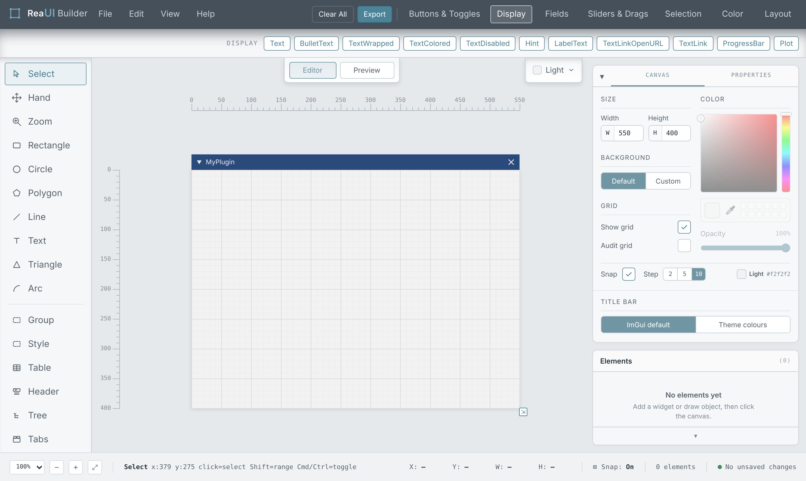</p>

> **Save the editable project.** Choose **File → Save Project** (`Cmd/Ctrl + S`) and keep the JSON file with your script. Browser recovery drafts are available through **File → Restore projects…**; they do not replace a project file.

---

<a name="manual-03-workspace"></a>

## 03. Workspace

In **Editor** mode, a gray name tag appears above each widget.

The **Table** name (`⊞ <name>`) and lock icon appear on an editor tab **above** the table box. Click this tab to select or drag the table. It does not appear in Preview or the export.

**Panel** shows a pale `☐ Panel` mark in its top-left corner. This editor aid reserves no space. Clicking within the top 24 px of the box selects the Panel, even over a child widget.

The top strip of **TabBar** is the actual tab row—the same one REAPER draws. Click an empty part of the strip to select the TabBar; click a tab's label to select that tab (see §7.5).

> **Layout in Editor mode.** Name tags and container strips help you edit the layout structure. They are editor aids and are not included in the exported interface.

<p align="center">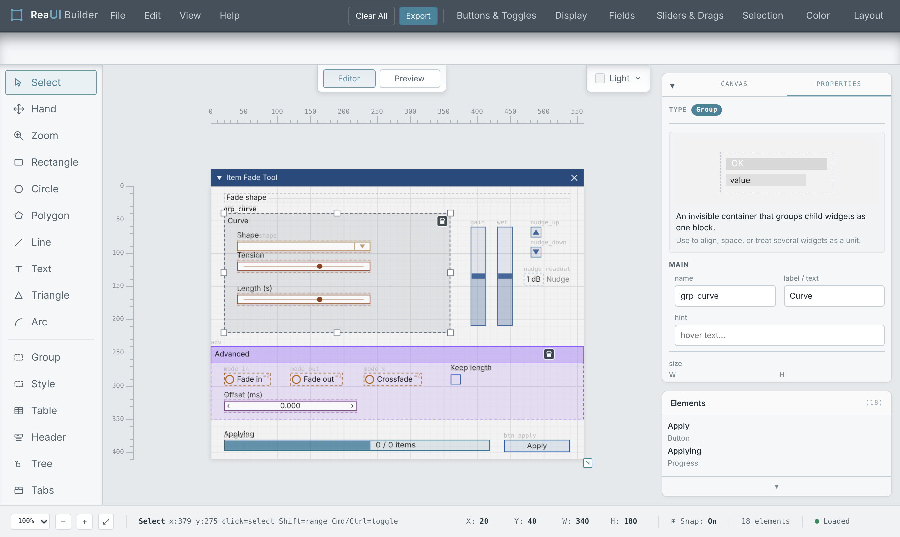</p>

<a name="manual-3-1-top-toolbar-and-menus"></a>

### 3.1 · Top toolbar and menus

The top toolbar contains four menus, global commands, and widget categories.

| Menu | Commands |
| --- | --- |
| **File** | New Project · Save Project · Save As… · Restore projects… · Load Project |
| **Edit** | Undo · Redo · Copy · Paste · Delete · Duplicate · Group selection · Ungroup selection · Select All · Deselect All · Clear All |
| **View** | Dark mode · Theme Studio… · Interface mode (Basic · Advanced) · Grid · Snap to grid · Reference grid in export · Hide widget names · Hide draw objects names · Widget footprints · Show hints · Panels · Zoom to fit · Actual size (100%) |
| **Help** | User Manual ↗ · Keyboard Shortcuts · Report a Bug… · About |

**Undo** and **Redo** are unavailable when there are no actions to undo or redo.

**Reference grid in export** adds a magenta measurement grid with 50 px spacing. Unlike the regular editor grid, it is included in the export. The same setting appears as **Audit grid** on the Canvas tab.

**Snap to grid** toggles grid snapping. Enabled options in the **View** menu are marked with a checkmark.

**Dark mode** switches the editor's own colors; it does not change the exported interface. **Theme Studio…** opens the window for the colors of the exported interface (§12, [Theme Studio](#manual-theme-studio)).

**Interface mode** switches between Basic and Advanced. The choice is remembered in this browser and is never stored in the project. See §3.7.

**Hide widget names** and **Hide draw objects names** independently hide editor name tags. They do not hide the visible text of the interface. **Panels** can show or hide Canvas, Properties, Elements, and Tools. Restore hidden panels through this menu. Panel visibility is remembered in this browser, separately from the project.

**Show hints** turns the hints in the right sidebar on or off (see §3.5). It is on by default and remembered in this browser.

**Clear All** removes every element from the canvas after you confirm the action.

**Export** opens a window containing the generated code.

**User Manual ↗** opens this guide in a new browser tab.

> **Report a Bug…** opens a dialog for sending a report by email. It shows the last 50 logged actions together with the build number and current window size, assembled into a read-only report you can review before sending. Add a description of what happened, optionally check **Include my layout** to attach the whole project, then click the email address to copy it and paste the report into your mail client. No data leaves the browser until you send it yourself.

The seven widget categories appear on the right side of the toolbar. Click a category to show its widgets. Click it again to close the panel.

<a name="manual-3-2-widget-panel"></a>

### 3.2 · Widget panel

The widget panel contains the full set of widgets, organized into seven categories.

To add a widget, open its category, select the widget, and click the canvas.

If a category is wider than the panel, use the mouse wheel to scroll it horizontally.

No category is open at startup. Click a category to open it and click it again to close it. When no category is open, the panel is empty; this is expected behavior.

<a name="manual-3-3-left-palette"></a>

### 3.3 · Left palette

The left palette provides permanent access to:

- The **Select**, **Hand**, and **Zoom** tools.
- Seven drawing tools.
- Shortcuts for six containers: Group, StyleRegion, Table, CollapsingHeader, TreeNode, and TabBar.

**Select** is the default tool. Builder returns to it automatically after you place an object.

Use **Hand** to pan the workspace. Hold `Space` before dragging for temporary Hand, then release it to return to your previous tool. Space does not start a second gesture while an object is already being moved, resized, or drawn.

With **Zoom**, click to zoom in around the clicked point; `Alt/Option + click` zooms out. `Esc` returns to Select.

Drawing tools are single-use by default: after you create a shape, Builder switches back to **Select**.

To draw several rectangles, circles, lines, triangles, or arcs, hold `Shift` while selecting the tool, then release it before drawing. The tool stays active until you choose another tool or press `Esc`. The status bar shows `[sticky]`. Polygon, Text, and widget placement return to Select after completion.

<a name="manual-3-4-canvas-area"></a>

### 3.4 · Canvas area

The center of the workspace shows the script window layout: the **MyPlugin** title, the interface area, and the surrounding workspace.

The layout area matches the exported content size. The title bar represents ImGui's native title bar, whose height is added in the exported code:

`OUTER_H = H + title bar height`

The canvas area also includes these controls and indicators:

- **Editor / Preview** — the display mode switch above the center of the canvas. See §13.
- **Theme** — the theme selector above the canvas on the right. See §12.
- **Rulers** — along the top and left edges, showing layout coordinates at the current zoom level.
- **Resize handle ⇲** — at the bottom-right corner of the layout. Drag it to resize the canvas. This is equivalent to changing `W` and `H` on the **Canvas** tab.
- **Preview banner** — appears in Preview mode when the layout contains widgets that Builder can only approximate.
- **Menu bar strip** — appears under the title bar when the project has a menu bar. Clicking it opens the Canvas tab at the **Menu bar** section and selects the menu under the pointer. See §11.
- **Preview size handle** — in Preview of a project with a resizable window, on the frame's right edge, bottom edge, and corner. Drag it to see the layout at another window size. See §13.
- **Constraint lines** — dashed lines from the selected object to the edges of its parent while the window is resizable. See §5.9.

New, Load, and **Actual size (100%)** center the layout in the canvas area.

<a name="manual-3-5-right-sidebar"></a>

### 3.5 · Right sidebar

The right sidebar has two panels: the **Canvas / Properties** tabs at the top and the **Elements** panel below them. Use the header arrow to collapse or expand the upper panel; its tab headings stay in place. Selecting an object, or choosing a widget or placement tool, switches the upper panel to **Properties** and expands it. Click **Canvas** to return to the layout settings. The arrow below Elements expands the list by reducing the upper panel’s height. View → Panels controls which panels are visible.

Earlier versions had a third tab, **Info**, and a separate **Selection** panel. Since version 1.7.0, Selection is the **Properties** tab and Info's preview card sits at the top of Properties; the project summary is no longer shown.

<a name="manual-info"></a>

#### Preview card

When a widget is selected, or its placement tool is active, the top of **Properties** shows a card with an approximation of its ImGui appearance and a brief description of its purpose.

Choosing a widget from the widget panel or left palette opens **Properties** automatically. It stays open after placement, updating to show the newly created object.

<a name="manual-elements"></a>

#### Elements

The **Elements** panel lists drawings, widgets, containers, and editor groups in a tree. Child widgets are indented beneath their containers. An empty project shows “No elements yet”.

- Click an object row to select that object. For a member of an editor group, this selects the individual member and shows its own properties.
- Click a group heading to select the whole group. **Select group** in Properties also returns from an individual member to the group.
- `Cmd/Ctrl + click` adds or removes individual rows; `Shift + click` selects a range of rows.
- With the list focused, `↑/↓` selects adjacent rows and `Home/End` selects the first or last row. Hold Shift to extend the selection. These keys navigate the list without moving objects.
- Press `Enter` to give the canvas focus while keeping the selection. Arrow keys then move the selected objects.

Drag rows to change stacking order: **higher in the list means closer to the front**. Reordering is limited to siblings with the same parent and the same layer. Drawings remain below widgets; a group moves as a block. Table’s structural cells cannot be reordered this way. Reordering supports Undo.

Right-click a row for object commands, including Rename, Copy, Cut, Delete, Group/Ungroup, and **Color → Select color / Surprise me**. A member row targets the member; a group heading targets the group.

<a name="manual-canvas"></a>

#### Canvas

The **Canvas** tab contains layout settings: window size, background mode, grid visibility, and grid spacing.

It also provides a background color picker with an eyedropper, recent swatches, and opacity control. The color value on the bottom line updates as you choose a color. In **Custom** mode, you can enter it directly. In **Default** mode, this line shows the name of the theme that supplies the canvas background.

To edit the window title, click the title on the canvas itself. See §11.

The tab also has a **Title bar** control for themed projects, a **Window** section that makes the exported window resizable, and a **Menu bar** section for building the window's menus. See [Title bar color](#manual-title-bar-color), [Window](#manual-window), and [Menu bar](#manual-menu-bar).

<a name="manual-selection"></a>

#### Properties

The **Properties** tab is the inspector. It uses the selected widget's contract to show only the properties supported by that type.

The available fields therefore change with the selection. Simple widgets have only a few basic properties; widgets with ranges, formatting, or additional flags have more extensive controls.

Inspector fields are organized into sections: **Main** for labels, names, values, and ranges; **Structure** for tabs and tables; **Appearance** for colors, rounding, and thickness; and **Advanced** for formats and flags. Geometry fields follow the property sections. For drawings, Primitive order precedes Size, and Position is the last property block before the constraints. **Constraints** (§5.9) come last, just before Delete. Empty sections are hidden.

Selecting multiple objects switches the inspector to batch editing. See §5.6.

Section 8 describes all inspector properties. Appendix B lists the properties available for each widget type.

<a name="manual-hints"></a>

**Hints.** Every field and button in Properties and on the Canvas tab has a hint. Rest the pointer on a field's name or control: after a short pause (about 0.7 s) a hint appears next to the pointer and explains what the setting does in REAPER and, where there is one, the ReaImGui call or flag it becomes, set in a monospace font. Moving to another control swaps the hint at once. When a field gets keyboard focus, its hint appears right away, below the field. Leaving the control, a click, scrolling, or `Esc` hides it. The hints also cover batch editing, the placement settings, the menu bar editor, and Basic mode. Turn them off with **View → Show hints**; the choice is remembered in this browser and is not stored in the project.

Editor hints are not the same as the **hint** field of a widget: that field sets the tooltip the user sees in REAPER (§8).

<a name="manual-3-6-status-bar"></a>

### 3.6 · Status bar

The status bar shows:

- The current zoom level and a button to fit the layout in the view.
- The active tool and a usage hint.
- The cursor coordinates.
- The current selection's `X`, `Y`, `W`, and `H`.
- Whether grid snapping is enabled.
- The element count.

This area also displays status messages.

When Builder rejects a placement, it briefly shows the reason in the status bar instead of opening a dialog. For example:

`blocked: overlaps existing widget`

or

`blocked: container too large for target`

<a name="manual-3-7-basic-mode"></a>

### 3.7 · Basic mode

Basic mode is a simpler view of the same editor. It suits small windows built from common controls. Choose it in the start dialog or through **View → Interface mode → Basic**.

| Area | In Basic mode |
| --- | --- |
| Left sidebar | **Add** lists eleven components: Button, Checkbox, Text, Slider, Text Input, Number Input, Dropdown, Progress, Panel, Tabs, and Separator. Choose one, then click or drag on the canvas to place it. **More components…** switches to Advanced. |
| Right sidebar | The **Canvas** and **Properties** tabs, with **Layers** (the Elements panel) below them. |
| Properties | Plain-language names: **Label**, **Number type** (Integer / Decimal), **Minimum**, **Maximum**, **Step**, **Progress text**. Each component shows only its common settings, plus size and position. An object with constraints shows one read-only line, such as “Pinned: right, bottom” or “Pinned: left+right, bottom”; with a fixed window it adds “(inactive while the window is fixed)”. |
| Canvas tab | The same layout as in Advanced. Audit grid, Title bar, Window, and Menu bar are hidden. A resizable window is shown as one read-only line, such as “Resizable window: 480–1100 × 300–800”. |
| Menus and toolbar | The widget categories, drawing tools, Clear All, editor grouping, and **View → Panels → Tools** are hidden. The rest of the View menu, including **Theme Studio…**, is the same as in Advanced. The Export window shows **Download Lua**, **Show code**, and **Close**; **Show code** reveals the code with **Copy code** and **Hide code**. |
| Theme selector | The list of themes with a one-line explanation. **+ New**, **Import**, **Edit…**, and **Theme Studio…** are hidden; open the Studio through **View → Theme Studio…**. |

Basic and Advanced are two views of one project. Switching never converts the project and never changes the exported Lua. Objects and settings that Basic does not offer stay in the project untouched. When you select such an object, Properties shows an **Advanced component** notice with **Edit in Advanced**; the Canvas tab shows a similar notice when the project uses hidden canvas settings, such as a menu bar, a resizable window, or the audit grid. **Edit in Advanced** switches modes and keeps the current selection.

---

<a name="manual-04-core-concepts"></a>

## 04. Core concepts

<a name="manual-4-1-widgets-and-drawings"></a>

### 4.1 · Widgets and drawings

Canvas objects fall into two categories: **widgets** and **drawings**. They differ in interactivity, nesting, overlap rules, drawing order, and export behavior.

|  | Widgets | Drawings |
| --- | --- | --- |
| **Definition** | ImGui controls and display elements: buttons, sliders, tables, text, and other widgets | Geometry in the window's draw list |
| **Interactivity** | Native controls can be interactive; display widgets are visual only | Non-interactive; used for decoration |
| **Export** | `ImGui_Button`, `ImGui_SliderDouble`, … | `DrawList_AddRect`, `AddCircle`, … |
| **Overlap** | Prevented by placement checks; see §4.7 for exceptions | Allowed; stacking order applies |
| **Nesting** | Supported inside containers | Not supported |
| **Drawing order** | Above drawings | Below all widgets |

Use drawings for visual elements without a dedicated ImGui widget, such as a meter housing, a section border, a scale arc, or a logo.

Use widgets for controls and display elements provided by ImGui.

<a name="manual-4-2-families-and-variants"></a>

### 4.2 · Families and variants

Builder's palette is organized by **family**, while the exported code uses specific **widget types**.

A family groups variants of the same control. For example:

- `Slider` → `SliderInt` / `SliderDouble` — default: Double
- `Drag` → `DragInt` / `DragDouble` — default: Double
- `Input` → `InputInt` / `InputDouble` — default: Double
- `VSlider` → `VSliderInt` / `VSliderDouble` — default: Double
- `DragRange` → `DragIntRange2` / `DragFloatRange2` — default: Double
- `ColorEdit` → `ColorEdit3` / `ColorEdit4` — default: RGB
- `ColorPicker` → `ColorPicker3` / `ColorPicker4` — default: RGB
- `Plot` → `PlotLines` / `PlotHistogram` — default: Lines

For families with multiple variants, a **variant** row appears at the top of the inspector.

Choose the variant before placement, while the placement tool is active. After placement, the row shows the current variant but cannot be edited. To use another variant, delete the widget and place it again.

Keep the palette's family name distinct from the concrete type used in code. For example, **Slider** is the family name in Builder, while **SliderDouble** identifies a specific widget type in the generated code.

Some palette labels are shorter than the contract names used in this guide: **Hint** = HelpMarker, **RadioButton** = RadioButtonEx, **Multiline** = InputTextMultiline, **Style** = StyleRegion, **Header** = CollapsingHeader, **Tree** = TreeNode, and **Tabs** = TabBar. **TextLink** and **TextLinkOpenURL** are two separate widgets; see §6.

<a name="manual-4-3-coordinates-and-snapping"></a>

### 4.3 · Coordinates and snapping

Each nested object's `x` and `y` coordinates are stored **relative to its parent**.

For example, a button near the top-left corner of a panel may store the coordinates `(4, 28)`, even though the panel's position puts the button at `(24, 278)` in the overall layout.

Moving the panel also moves the button. The button's own coordinates, `(4, 28)`, remain unchanged.

The inspector displays **absolute layout coordinates**. Builder converts them to the stored parent-relative coordinates automatically. The exporter reproduces this placement using absolute positions where suitable and a local origin inside runtime containers such as table cells.

<a name="manual-grid-snapping"></a>

#### Grid snapping

When snapping is enabled, coordinates are rounded to the selected grid interval.

Set the interval on the **Canvas** tab:

- 2 px
- 5 px
- 10 px — default

Snapping applies when placing, moving, and resizing objects.

Choose **View → Snap to grid** to turn snapping off. Its current state appears in the status bar.

> **Note: Grid spacing and major grid lines.** The selected interval controls snapping and the spacing of the thin grid lines. Thick lines always appear at 50 px intervals as a visual reference; objects do not snap to them independently. At low zoom levels, Builder may display a coarser grid, but snapping still uses the interval selected on the **Canvas** tab.

<a name="manual-4-4-sizing-contracts"></a>

### 4.4 · Sizing contracts

ImGui does not allow independent width and height settings for every widget type. Builder applies the same constraints on the canvas so the layout can be reproduced correctly in code.

There are four height modes:

| Mode | Behavior |
| --- | --- |
| `explicit-size` | The contract has an explicit layout box. Button, Panel, and similar controls pass dimensions to ImGui; some types use a derived height or a row-count conversion instead. |
| `native-fixed` | ImGui determines the height, usually one frame height, approximately 20 px. Most input widgets use this mode. |
| `native-content` | Content, such as text, determines the height. |
| `native-line` | Height matches a single separator line. |

For a widget with fixed height, only horizontal resize handles remain where width is editable, and **H** is read-only. Checkbox, ArrowButton, SmallButton, and RadioButtonEx have no resize handles; SmallButton and RadioButtonEx widths follow their labels. ColorPicker has horizontal handles only, with height derived from width and flags.

The inspector displays `↑ height fixed by ImGui` or `↑ size fixed by ImGui`, depending on the widget. You can still change the width where the widget contract allows it.

**ColorPicker.** A new picker is 200 px wide with **NoSidePrev** enabled; Builder reserves 246 px of height. H is read-only and changes with width and flags. Enabling the side preview adds 60 px to the reserved width while keeping the picker width unchanged. The export passes the picker width, not the full reserved width, to `SetNextItemWidth`.

**ListBox.** The exporter converts H to a visible-row count: `max(2, round(H / 18))`. H is not passed as a pixel height. TextWrapped also uses a layout box in Builder, while ImGui determines the height of its text.

**SmallButton and RadioButtonEx widths** are measured with ReaImGui's own text size. Builder measures them when the widget is created and when its label changes; an older project keeps its stored widths until a label is edited, so opening it does not resize its controls.

The contracts use four width modes:

- `explicit-size` — width is passed directly to the widget call.
- `next-item-width` — `SetNextItemWidth` is called before the widget.
- `content-or-widget-box` — the canvas box reserves space for the content; ImGui determines the actual size.
- `widget-box-preview` — the stored box reserves space in Builder; Checkbox and RadioButtonEx use native sizing in the exported interface.

<a name="manual-4-5-labels"></a>

### 4.5 · Labels

By default, ImGui renders a widget's label beside the control as part of the same call. With absolute positioning, this can place text outside the area reserved in Builder.

Builder primarily uses the two label placement methods below. Display widgets draw their text as content; LabelText places its label to the right of its value.

<a name="manual-inline-labels"></a>

#### Inline labels

Used by **Button, SmallButton, Selectable, RadioButtonEx,** and native container headers or tabs. **Group** has a separately drawn visible label; **StyleRegion** has no visible exported header.

The text is passed directly to the ImGui call and rendered as part of the widget.

<a name="manual-external-labels"></a>

#### External labels

Used by sliders, input fields, Combo, Checkbox, color controls, and some other widgets.

The widget itself receives a hidden ID, for example:

`"##Slider_4"`

The visible label is drawn separately through the draw list, above the widget's top edge. Builder shows it in the same position on the canvas.

An external label needs **12 px** of additional vertical space. This space is outside the widget's own bounds.

Leave room for this label as well as the control body. Footprint checks include the above-label area, so the available gap can be smaller than the distance between the two control boxes suggests.

<a name="manual-4-6-containers-and-nesting"></a>

### 4.6 · Containers and nesting

Builder supports seven container types:

- Panel
- Group
- StyleRegion
- CollapsingHeader
- TreeNode
- TabBar
- Table

Builder also uses **TabItem** and **TableCell**. These are created automatically and cannot be placed manually.

Nesting is determined by the positions of objects on the canvas.

Placing a widget inside a container's content area makes it a child of that container. Moving it outside returns it to the layout's top level or makes it a child of another suitable container.

There is no separate command for adding an object to a container. Moving a container can also capture eligible widgets fully enclosed by its content area. Click the lock badge to unlock the container for its next move: its existing children are left in place and capture is skipped. Hold **U before starting to drag a container** to leave its current children in place and skip capture during that move.

Do not confuse container nesting with **Edit → Group selection**: editor grouping is a selection and movement aid and does not create a parent container. See §5.7.

**Group, StyleRegion, CollapsingHeader, TreeNode,** and **TabBar** reserve a **24 px** strip at the top for a header or editor controls. Child coordinates include this space. Editor-only parts of the strip are not exported; ImGui draws native headers and tabs.

**Panel** uses its entire box; the `☐ Panel` mark reserves no space. The **Table** editor tab sits above the box and does not reduce the table’s content area. Table reserves only an 18 px column-header strip when **header row** is enabled. Automatically created TabItem and TableCell objects reserve no additional strip.

Resizing a container adjusts child positions toward its content area. Table cells and tab pages follow their parent’s size. Keep enough room for the contents: repositioning children does not reduce their dimensions, and the resize checks differ between canvas handles and inspector fields.

Containers can be nested. For example:

`TabBar → TabItem → Panel → Button`

The corresponding ImGui calls are nested in the same order in the exported code.

The inspector's **parent** row shows the selected widget's parent hierarchy.

<a name="manual-4-7-overlap-prevention"></a>

### 4.7 · Overlap prevention

Builder uses widget **footprints** to check placement and movement. A footprint can extend beyond the inspector’s W/H box: it includes external labels, LabelText’s right-hand label, natural text width, and the extra reservation used by ColorPicker. SmallButton and RadioButtonEx follow the width of their text instead of stretching or squeezing it to a stored width.

Choose **View → Widget footprints** to inspect this reserved space. A position that looks empty beside a small control may still belong to its label or native control area.

Inside a TabBar, overlap checks follow the active tab path. Widgets on inactive sibling tabs do not block placing, moving, resizing, drag previews, or paste validation at the same coordinates in the visible tab. Widgets on the same active tab still collide, and visible content from separate overlapping TabBars remains an obstacle.

- Placing a new widget in occupied space is rejected with a status message.
- Moving a widget may use a nearby free grid position.
- A move or resize that cannot satisfy the applicable layout checks is rejected or restored.
- Copying a selection seeks a shared displacement, preserving the relative positions of its members rather than spreading them independently.

Checks vary with the operation and nesting context; they are not a native ImGui collision test. Drawings may overlap freely. Use Preview and inspect the exported interface to verify tight layouts.

<a name="manual-4-8-object-names"></a>

### 4.8 · Object names

Every new object receives an automatically numbered name:

`Button_2`<br> `Slider_4`<br> `Panel_6`

The name appears on the **Elements** tab and is used to generate Lua code.

For example, `Slider_4` produces:

- The position entry `pos.SLIDER_4`.
- The state field `state.Slider_4_val`.
- The ImGui ID `"##Slider_4"`.

You can rename objects.

Use Latin letters, digits, and underscores (`_`). Other characters are replaced with `_` during export. The visible label is independent of this code identifier.

Use unique names wherever possible. If two names become identical after normalization, the preflight panel shows a warning. The exporter resolves duplicates consistently by adding suffixes such as `_2` and `_3`, keeping ImGui IDs unique.

---

<a name="manual-05-working-with-objects"></a>

## 05. Working with objects

<a name="manual-5-1-placing-widgets"></a>

### 5.1 · Placing widgets

Select a widget, then place it on the canvas using either method below.

**Click** to create a widget at the default size defined by its contract.

Movement of less than **5 screen pixels** counts as a click, even near a grid boundary.

**Click and drag** beyond that threshold to set the size during placement. On each axis, a drag extent of at least **10 layout px**, after snapping, replaces the default dimension. Smaller extents use the default. Fixed or derived dimensions follow the widget’s sizing rules.

For example, you can draw a Button at 200 × 70 px. Dragging a Slider can set its width to 300 px, but its height remains fixed.

After placement, Builder returns to **Select** and keeps the new widget selected, ready for editing in the inspector.

A new widget is always placed fully inside the export frame. When you click near an edge, Builder moves it inward so that the widget, including its external label, is exported. The same applies to widgets inserted through the canvas context menu.

<a name="manual-settings-before-placement"></a>

#### Settings before placement

While a placement tool is active, Properties shows the properties supported by that type. Set its variant, label, range, format, flags, value components, hint, bullet, or other available properties before placing it. Applicable placement settings are copied into the new widget; object names are assigned automatically.

For example, choose Slider → Double, set min/max to 0/100 and a format of `%.1f`, then click to create it with those settings. You can continue editing them after placement.

**Reset** restores the placement settings to their defaults. Click the active tool again to cancel it.

<a name="manual-placing-widgets-from-the-context-menu"></a>

#### Placing widgets from the context menu

You can also add widgets without opening the widget panel.

Right-click the canvas to open a context menu listing all widget types by category.

The widget you choose is placed at the right-click location.

This is useful when you already know the widget type you need and want to place it directly.

<a name="manual-5-2-selecting-objects"></a>

### 5.2 · Selecting objects

| Action | Result |
| --- | --- |
| **Click** | Select one object |
| **Shift + click** | Add objects that intersect the rectangular area between the anchor object and the clicked object |
| **Cmd/Ctrl + click** | Add an object to the selection or remove it |
| **Drag on empty canvas** | Draw a selection marquee |
| **Shift + marquee** | Add objects to the current selection |
| **Cmd/Ctrl + marquee** | Toggle the selection state of objects within the marquee |
| **Click an Elements row** | Select the corresponding object on the canvas |
| **Cmd/Ctrl + A** | Select all objects |
| **Esc** | Clear the selection or cancel the active tool |

Holding `Shift` temporarily activates **Select** while a drawing or widget placement tool is active, except during polygon creation.

This lets you change the selection without canceling the current tool.

A multiple selection has a dashed bounding box with resize handles, subject to the selected objects’ sizing rules.

For drawings, clicking tests the visible geometry: empty corners, the unfilled interior of an outline, and the gap of an arc pass the click to objects underneath. Thin strokes have a small screen-space click tolerance. Visible text accepts clicks; editor name tags do not enlarge the shape’s hit area. The selection outline follows the drawing’s shape. Marquee selection still uses object bounds. Select a fully invisible drawing through Elements.

An individual group member selected through Elements stays individually selected when you click or drag that selected shape on the canvas, including where other drawings overlap it. Clicking a different, unselected member selects its whole group. Several members selected through Elements move together in exactly that selection.

In a TabBar, a click on a tab's label selects that tab (its TabItem) and makes it active. A press on the label followed by a drag of 5 screen pixels or more moves the whole TabBar instead. A click on the empty part of the tab strip, on the TabBar's border, or on the tab body selects the TabBar or the widget under the pointer.

<a name="manual-5-3-moving-and-resizing"></a>

### 5.3 · Moving and resizing

Drag a selected object to move it.

Drag a selection handle to resize it.

Both operations use grid snapping when enabled.

The widget's contract determines which resize handles are available:

- Eight handles when both width and height can be changed freely.
- Two side handles when height is fixed but width is adjustable.
- No handles when ImGui determines the entire size.

For precise placement, use the inspector's **position** and **size** fields.

These fields use absolute layout coordinates and follow **Snap to grid**. Turn snapping off to enter coordinates in 1 px increments. Values are parsed as integers. The workspace extends beyond the exported frame; drawings can be moved into the surrounding space, including negative coordinates. Pan with Hand to reach them. Moving an object outside the artboard does not enlarge the exported window.

With the canvas focused, arrow keys move the selection by one grid interval, or by 1 px when snapping is off. Hold `Shift` to move it ten times as far. In Elements, press Enter first to transfer focus to the canvas.

A nudge that would move a widget out of its parent (Group, Panel, tab page, table cell, or another container) is refused with the status message `blocked: element must stay inside its parent`. A tab cannot be nudged: its geometry belongs to its TabBar. Arrow keys do nothing in Preview and while the start dialog is open.

A table cell cannot be moved, nudged, or resized on its own; its position and size come from its table, and its X, Y, W, and H fields are read-only. Move or resize the table, or a container around it, instead.

Hold **Shift while resizing drawings** to preserve proportions. A corner handle keeps the opposite corner fixed; a side handle keeps the opposite side and changes the other axis symmetrically. This also works for a selection containing only drawings. Widgets retain their own sizing contracts.

Resizing a drawing Text object also scales its font size, using the smaller of the width/height scale factors, with a minimum of 6 px. Letters are not stretched independently on each axis. Undo restores both the box and the font size.

<a name="manual-5-4-copying-duplicating-and-deleting"></a>

### 5.4 · Copying, duplicating, and deleting

<a name="manual-copy-paste"></a>

#### Copy / Paste

`Cmd/Ctrl + C` and `Cmd/Ctrl + V`

Copying a container includes its subtree. Pasting assigns fresh object and editor-group IDs, preserves copied nesting, and keeps relative positions—including line endpoints and polygon vertices. Builder starts with an offset and looks for a shared valid displacement when needed.

You can copy between projects or Builder tabs, including after closing the source tab. Keyboard shortcuts and menu commands use the same clipboard format. A local copy is also retained for reopening the same Builder file. Browser clipboard access can be restricted; if a menu command cannot access it, use the keyboard shortcut and follow the status message.

An existing parent can be reused only within the same source project. Pasting into another project does not attach objects to unrelated containers just because their IDs happen to match.

A table cell can be copied only together with its table. Copying a whole table, or a widget inside a cell, works as described above.

<a name="manual-duplicate"></a>

#### Duplicate

`Cmd/Ctrl + D`

Creates and places a copy in one step, equivalent to Copy followed by Paste.

<a name="manual-alt-drag"></a>

#### Alt + drag

Hold `Alt` as you start dragging to move a copy while leaving the original in place.

This also works with multiple selected objects.

If the copy cannot be placed, Builder refuses it and leaves the selection where it was; a refused Alt-drag never turns into an ordinary move.

<a name="manual-delete"></a>

#### Delete

`Del` or `Backspace`

Deleting a container with user content opens a choice:

| Choice | Result |
| --- | --- |
| Cancel | Keep the container and its contents. |
| Keep inner widgets | Remove the container and preserve its user content at its layout positions; internal tab/cell wrappers are removed as needed. |
| Delete with children | Remove the container and its content subtree. |

An empty container or ordinary object can be deleted directly. Use **Undo** to restore the deletion.

When you delete a tab that holds widgets and choose **Keep inner widgets**, its widgets move to the tab that remains open, at the same positions. Deleting the open tab switches the TabBar to another tab. The × button in the TabBar's **tabs** list deletes a tab together with its contents, without this choice.

<a name="manual-5-5-undo-history"></a>

### 5.5 · Undo history

Builder stores **50 history steps**.

Successive edits to the same property within **600 ms** are combined into one step. For example, several quick changes to `max` do not create a separate history entry for every intermediate value.

**Undo** restores both the objects and the selection that was active at that step.

Loading a project clears the history. You cannot undo changes made before the load.

<a name="manual-5-6-batch-editing"></a>

### 5.6 · Batch editing

When multiple objects are selected, the inspector shows their total count and a breakdown by type. It offers only properties shared by **all** selected objects. For example, a button and a checkbox share label, tooltip, and bullet properties.

If selected objects have different values for a property, its field shows **Mixed**. No object's value changes until you enter a new value.

The `ΔX / ΔY` fields move the entire selection by the specified offset, subject to workspace-boundary and overlap checks. The workspace extends beyond the exported layout, so a move can leave a widget outside the export frame. If both a container and its child are selected, the child moves with the container once.

Each batch edit is a single history step. One **Undo** restores the original values for every object in the selection.

---

<a name="manual-5-7-editor-groups"></a>

### 5.7 · Editor groups

Select two or more objects and choose **Edit → Group selection** (`Cmd/Ctrl + G`). A group can contain drawings and widgets. Name it in Properties or through Rename on its Elements heading. `Cmd/Ctrl + Shift + G` ungroups the selection.

Editor groups make selection and movement convenient. They are saved in the project, copied with their members, and included in Undo/Redo. They do **not** add `BeginGroup` to Lua, change container parents, or allow a drawing to move above the widget layer. Use the **Group widget** in the Layout category when you need an exported ImGui group.

Click the group heading to work on the whole group. Click a member row in Elements to edit just that member; **Select group** returns to the whole group. Grouping a selection that includes existing groups combines their full membership.

Right-click within a multiple selection, including a gap inside its bounding box, to open commands for that selection. **Color → Select color** applies a chosen color; **Surprise me** chooses a color. The result depends on the selected object type; widget colors use the appropriate control style slots, including tab colors.

> **Color ▸ Select color, in detail.** On a widget, this recolors its buttons, fields, headers, and similar surfaces. **On a container** (Group, Panel, TabBar, CollapsingHeader, TreeNode, Tab, Table, StyleRegion), it recolors the container **and everything inside it**. Hovered and pressed states are derived automatically — slightly lighter on a dark color, slightly darker on a light one. Marks that must stay legible (check marks, slider handles, progress fill, the active tab) keep the theme's own color when it reads clearly against the chosen color, and otherwise switch to a strong shade of the chosen color. **Editor shows only the frame in the chosen color; Preview shows the full result as REAPER draws it**, including recolored contents. On ColorEdit, ColorPicker, ColorButton, and TextColored, Select color also sets the widget's color value; on TreeNode it also sets the header text color.


<a name="manual-5-8-editing-text-on-the-canvas"></a>

### 5.8 · Editing text on the canvas

In Advanced mode, with the Select tool, double-click a Text drawing, a rectangle, or a circle in Editor mode to type its text directly on the canvas. The field opens over the shape, in the shape's font size and alignment. A new Text drawing opens in this mode with its default text selected, so you can start typing at once.

- `Enter` starts a new line. Click outside the field or press `Esc` to apply the text.
- The whole edit is one Undo step. Applying unchanged text adds no step.
- Zooming and panning keep the field open over the shape.
- Undo, Redo, Delete, switching to Preview, choosing another tool, or opening another editor applies the text first, then acts. Undo right after an edit therefore undoes the whole edit.
- While the field is open, keys belong to it: Delete, the arrow keys, and `Cmd/Ctrl + A`, `D`, `G`, or `Z` do not affect the canvas. `Cmd/Ctrl + S` applies the text and saves the project.
- A rectangle or circle label stays centered vertically; a label taller than its shape scrolls inside the field.

The same text can also be edited in the **label / text** field of Properties, which is multi-line for these three drawing types (§8). Widget labels are edited in Properties only. Double-click does nothing in Preview or in Basic mode.

<a name="manual-5-9-constraints"></a>

### 5.9 · Constraints

**Constraints** decide where an object goes, and whether it changes size, when the user resizes the exported window. They take effect only when **Resizable window** is on in the Canvas tab (§11, [Window](#manual-window)). While the window is fixed, constraints stay in the project but do nothing: Properties shows them greyed, with the note “Constraints apply when the window is resizable” and a **Make the window resizable** button.

<p align="center">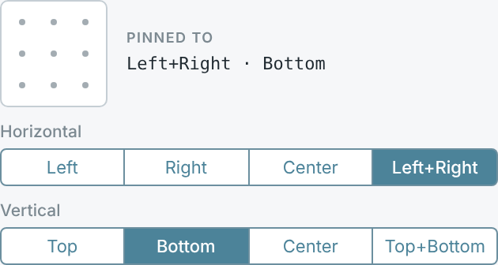</p>

The **Constraints** section is the last block of Properties:

| Control | Effect |
| --- | --- |
| Preset grid (3 × 3) | Sets both axes at once. A corner pins the object to those two edges of its parent; the middle of an edge pins to that edge and centers on the other axis; the center cell centers it both ways. **Pinned to** shows the result. The grid has no stretch presets: set stretching in the rows below. With a stretched axis no cell is highlighted, and **Pinned to** reads Left+Right or Top+Bottom. |
| **Horizontal: Left** | Keeps the distance to the parent's left edge. The default. |
| **Horizontal: Right** | Keeps the distance to the parent's right edge: the object moves right when the window gets wider. |
| **Horizontal: Center** | Keeps the object centered: it moves half as far as the right edge. |
| **Vertical: Top** | Keeps the distance to the parent's top edge. The default. |
| **Vertical: Bottom** | Keeps the distance to the parent's bottom edge: the object moves down when the window gets taller. |
| **Vertical: Center** | Keeps the object centered vertically: it moves half as far as the bottom edge. |
| **Horizontal: Left+Right** | Keeps both distances, to the parent's left and right edges: the object gets wider and narrower with the parent. |
| **Vertical: Top+Bottom** | Keeps both distances, to the parent's top and bottom edges: the object gets taller and shorter with the parent. |

The **parent** is the container the object is in, or the window for a top-level object. Everything inside a container moves with it, so pinning a Panel, Group, StyleRegion, TabBar, or Table to the right moves its whole contents. When a container stretches, its contents follow their own constraints inside it: an object with the defaults keeps its left and top distances, one pinned right moves with the container's right edge, a centered one stays centered, and a stretched one changes size with the container. The tabs of a stretched TabBar take its new width. Tabs and table cells have no constraints; their TabBar or Table places them. Drawings have constraints like widgets; a line or polygon moves with all its points.

**Which objects stretch.** Stretching needs a size that Builder sets, not ImGui or the content.

- **Left+Right:** Button, InvisibleButton, Selectable, ColorButton; the text and number fields; Combo and ListBox; sliders and drags, including their multi-component and range variants, SliderAngle, and VSlider; ProgressBar; ColorEdit; PlotLines and PlotHistogram; Separator and SeparatorText; LabelText, BulletText, TextWrapped, TextLink, and TextLinkOpenURL; the containers Panel, Group, StyleRegion, TreeNode, and TabBar.
- **Top+Bottom:** Button, InvisibleButton, Selectable, ColorButton, ListBox, InputTextMultiline, ProgressBar, VSlider, PlotLines, PlotHistogram, Panel, Group, StyleRegion, and TabBar.
- **Drawings:** rectangles and Text stretch on both axes; circles, arcs, lines, polygons, and triangles only move.

Checkbox, Text, SmallButton, and other widgets sized by ImGui or by their text cannot stretch; on the vertical axis neither can sliders, single-line fields, headers, or TextWrapped. ColorPicker and Table cannot stretch either, and CollapsingHeader takes its width from its parent. For them the button stays greyed, and its hint says why. A ListBox that stretches vertically shows more rows. A stretched rectangle label or Text wraps again as its box changes.

**On the canvas.** While the window is resizable, the selected object shows its constraints. A dashed line runs from each edge the object keeps its distance to, to the same edge of the parent, and ends in a short bar. A stretched axis shows both lines, to the left and right edges or to the top and bottom edges. For **Center**, a light dashed guide runs along the parent's center line, with a small diamond where the object's center sits. With a fixed window, an object that has constraints shows them greyed. The lines are an editing aid; they are not exported.

<p align="center">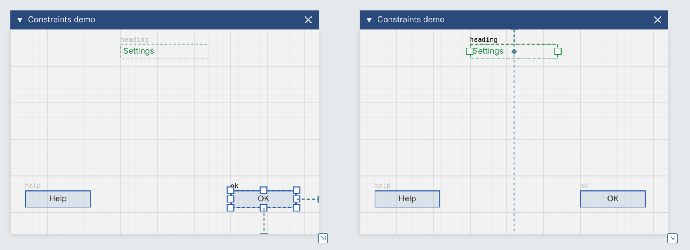</p>

**Editing.** Every change is one Undo step; choosing the default (Left or Top) removes the setting from the project. Copy, paste, and duplicate keep constraints. With several objects selected, batch editing shows a **Constraints** group: it applies to every selected object that accepts constraints and says how many it skips, for example “Applies to 2 of 3 selected · 1 skipped (TabItem)”. Different values show **Mixed**. **Left+Right** and **Top+Bottom** apply only to the selected objects that can stretch; the status bar names the skipped types, for example “Left+Right: applied to 2, 1 skipped (Checkbox)”.

To check a layout, switch to Preview and drag the frame (§13), then open Export: Preflight checks the whole size range (§14), including stretched objects that get too small. Basic mode shows an object's constraints as one read-only line.

---

<a name="manual-06-widget-catalog"></a>

## 06. Widget catalog

This catalog lists the **45 widget families** in the toolbar categories. For base dimensions and sizing modes, see [Appendix A](#manual-appendix-a-widget-contracts).

**Buttons & Toggles**

| Family | Purpose |
| --- | --- |
| `Button` | A button that triggers an action when clicked. *Use for commands such as render, apply, reset, or running a script step.* |
| `SmallButton` | A button with reduced padding and the same behavior as Button. *Use for secondary actions or compact layouts.* |
| `InvisibleButton` | A clickable area that draws nothing. *Use to make a custom-drawn area, such as an icon or part of a drawing, clickable.* |
| `Checkbox` | A Boolean control with a checkmark and an external label above it. *Use for on/off settings such as enable, mute, loop, or bypass.* |
| `CheckboxFlags` | A checkbox that toggles one bit of an integer shared by its flag group. *Use for option sets stored as flags; each checkbox in a group owns one bit.* |
| `RadioButtonEx` | A radio button that belongs to a mutually exclusive group; only one option in the group is active. *Use to choose a mode from a short, fixed list.* |
| `ArrowButton` | A square button with an arrow. *Use for steppers, counters, and expand/collapse controls.* |

**Display**

| Family | Purpose |
| --- | --- |
| `Text` | A static, single-line label. *Use for field headings and short status messages.* |
| `BulletText` | A line of text preceded by a bullet. *Use for simple lists.* |
| `TextWrapped` | Text that wraps to the available width. *Use for longer descriptions and help text.* |
| `TextColored` | Text in a specified color. *Use for warnings, status messages, and category labels.* |
| `TextDisabled` | Text in the disabled style. *Use for hints, placeholders, and labels for unavailable options.* |
| `LabelText` | A read-only value on the left and its label on the right. *Use for named values such as tempo or status.* |
| `TextLinkOpenURL` | An underlined link that opens a URL in the browser. *Use for documentation, website, and support links.* |
| `TextLink` | An underlined text link that reports a click to your code. *Use for inline actions such as “Show details”.* |
| `ProgressBar` | A horizontal progress indicator from 0 to 100%. *Use to show progress during rendering, scanning, or other lengthy operations.* |
| `Plot` | A small graph of a number series, drawn as lines or as a histogram. *Use for meters, envelopes, or value history.* |

**Sliders & Drags**

| Family | Purpose |
| --- | --- |
| `Slider` | A horizontal track and thumb for a single numeric value. *Use for bounded continuous parameters such as gain, mix, or threshold.* |
| `VSlider` | A vertical slider for a single numeric value. *Use for faders and level controls.* |
| `SliderAngle` | A slider for entering an angle in degrees. *Use for rotation, panning, and phase.* |
| `Drag` | A numeric field adjusted by dragging horizontally. *Use for fine adjustments and values without fixed bounds.* |
| `DragRange` | Two linked Drag fields that define a lower and upper bound. *Use for ranges such as low/high cutoff or interval start and end.* |
| `SliderN` | Multiple sliders forming one multicomponent value. *Use for vectors or color channels edited together.* |
| `DragN` | Multiple Drag fields forming one multicomponent value. *Use for coordinates and vectors such as X/Y/Z.* |

**Fields**

| Family | Purpose |
| --- | --- |
| `Input` | A numeric input field with step buttons. *Use to enter exact integer or decimal values.* |
| `InputText` | A single-line text input. *Use for names, paths, and other short text.* |
| `InputTextWithHint` | A single-line input with placeholder text displayed while the field is empty. *Use to provide a brief example or explain the expected input.* |
| `InputTextMultiline` | A multiline text input. *Use for notes, descriptions, or pasted blocks of text.* |
| `InputN` | Multiple numeric input fields in one widget. *Use to enter exact multicomponent values.* |

**Selection**

| Family | Purpose |
| --- | --- |
| `Combo` | A drop-down list that displays the selected item. *Use to choose one value from a long list when space is limited.* |
| `ListBox` | A scrollable list with several visible rows. *Use when the available options should remain visible.* |
| `Selectable` | A selectable, full-width row. *Use for lists, menus, and selectable items.* |

**Color**

| Family | Purpose |
| --- | --- |
| `ColorEdit` | A compact color editor with channel fields and a swatch. *Use for editing color directly in the layout.* |
| `ColorPicker` | A full color picker with a saturation area and hue bar. *Use for choosing colors visually.* |
| `ColorButton` | A button displaying a single color swatch. *Use as a color indicator or to open a color editor.* |

**Layout**

| Family | Purpose |
| --- | --- |
| `SeparatorText` | A separator line with a label near the left edge. *Use to title a section.* |
| `Separator` | A horizontal separator line. *Use to divide layout sections.* |
| `HelpMarker` | A “(?)” marker with a tooltip on hover. *Use to explain a nearby control without expanding the layout.* |
| `Panel` | A bordered, scrollable region containing other widgets. *Use for sidebars, settings blocks, and widget groups.* |
| `Group` | A borderless exported group with an optional visible label. *Use when several widgets should form one ImGui group.* |
| `StyleRegion` | An invisible region with style overrides for colors, rounding, alignment, and fonts. *Use to style a group of widgets independently of the rest of the layout.* |
| `CollapsingHeader` | A full-width header that collapses its contents. *Use for optional or advanced settings.* |
| `TreeNode` | An expandable node with indented children. *Use for hierarchies such as folders, tracks, or nested settings.* |
| `TabBar` | A tab strip that switches between content pages. *Use to organize a panel into pages such as Main / FX / MIDI.* |
| `Table` | A grid of rows and columns containing other widgets. *Use for aligned layouts, matrices, and row-based data.* |

<a name="manual-catalog-notes"></a>

### Catalog notes

**Slider, Drag, and Input.** Slider has a track and range bounds; Drag adjusts values by horizontal dragging; Input supports direct numeric entry. Their inspector fields differ: Slider exposes bounds and flags, Drag adds speed, and scalar Input exposes step settings. SliderAngle and N-suffix families have their own field sets; see Appendix B.

**Families with an N suffix** (SliderN, DragN, InputN) export a `reaper.new_array` with the number of elements specified in **array size**, controlled through a single call. Standard families instead use **value components**, from 1 to 4, to generate calls such as `SliderDouble2` or `DragInt3` with separate scalar state fields.

**HelpMarker.** Exports a disabled `(?)` symbol. The tooltip text comes from **tooltip**, not from the label.

**Combo and ListBox.** The export includes five placeholder items: `item_0…item_4` and `Item 1…Item 5`, respectively. Item lists cannot be edited in this release; replace them in the generated code.

**TextColored.** The initial color defaults to black. Preview and Lua use the chosen text color; Editor uses neutral selection/diagnostic styling rather than treating the text color as a frame color.

**RadioButtonEx.** Buttons with the same **group** value share a state field. Each button has its own **radio value**. This makes the options mutually exclusive in the exported interface.

**InvisibleButton.** Exports `if reaper.ImGui_InvisibleButton(...) then -- TODO: <name> pressed end`. Width and height are its own; it has no label. The Editor shows a dashed box with the type name; Preview shows nothing, as REAPER does. A tooltip (**hint**) works as on any button.

**CheckboxFlags.** All checkboxes with the same **flag group** write one integer, `state.flagGroups.<group>_val`; **bit (0–30)** chooses the bit this checkbox toggles (the value `1<<bit`). A new, pasted, or duplicated CheckboxFlags takes the lowest bit still free in its group. Export preflight warns when two checkboxes in one group share a bit.

**TextLink.** Exports `if reaper.ImGui_TextLink(...) then -- TODO: <name> clicked end`. Unlike TextLinkOpenURL, it opens nothing itself.

**Plot.** PlotLines and PlotHistogram have their own width and height. **values** takes 1–64 comma-separated numbers; **scale min** and **scale max** set the bottom and top of the graph (empty = taken from the data); **overlay** draws text over the plot. The export declares `state.<name>_values` as a `reaper.new_array` with a `-- TODO: fill … with your data` marker. Without your own values, a fixed sample series is shown.

---

<a name="manual-07-containers"></a>

## 07. Containers

See [§4.6](#manual-4-6-containers-and-nesting) for position-based nesting, the content areas used by each container type, child adjustment during resizing, and the choice of retaining or deleting content when a filled container is removed. The sections below describe the differences between container types.

<a name="manual-7-1-panel"></a>

### 7.1 · Panel

Panel is an ImGui child window: a bordered region that can scroll when needed. Use it for sidebars, settings blocks, and groups of widgets with a visible boundary.

- **border.** Shows a border; enabled by default. When disabled, the region has no visible border but still clips and scrolls its contents.
- **h-scroll.** Enables a horizontal scrollbar. Without it, content wider than the panel is clipped.

```lua
reaper.ImGui_BeginChild(ctx, "##Panel_6", 220, 140, reaper.ImGui_ChildFlags_Borders(), 0)
  -- Child widgets; set SetCursorScreenPos for each one
reaper.ImGui_EndChild(ctx)
```

A manually assigned Panel color is used as its child-window background; otherwise, a non-Default theme supplies the background color. Builder pushes the color before `BeginChild` and pops it immediately after that call, before emitting the panel contents. This sets the panel background while allowing nested panels to apply their own color. There is no separate background-color field in the Panel inspector.

<a name="manual-7-2-group"></a>

### 7.2 · Group

Group has no border or background. It exports `BeginGroup` / `EndGroup`, with a visible label drawn above its child area when the label is nonempty. ImGui treats the enclosed widgets as a group.

Use this container when you need an exported group; use **Edit → Group selection** for an editor-only group. Use Panel if the block needs a border, clipping, or scrolling.

Preview currently represents Group with a hatched placeholder; this fill is an editing aid and is not exported.

<a name="manual-7-3-styleregion"></a>

### 7.3 · StyleRegion

StyleRegion applies style overrides to its child widgets without affecting the rest of the layout. Use it to style a region with shared overrides. For a quick color change to selected objects, the object context menu also provides Color commands — on a container this recolors everything inside it (see §5.7).

> The StyleRegion inspector provides a checkbox for each override. An unchecked property is inherited unchanged. For example, a region can override only the button color while inheriting every other style setting.

<p align="center">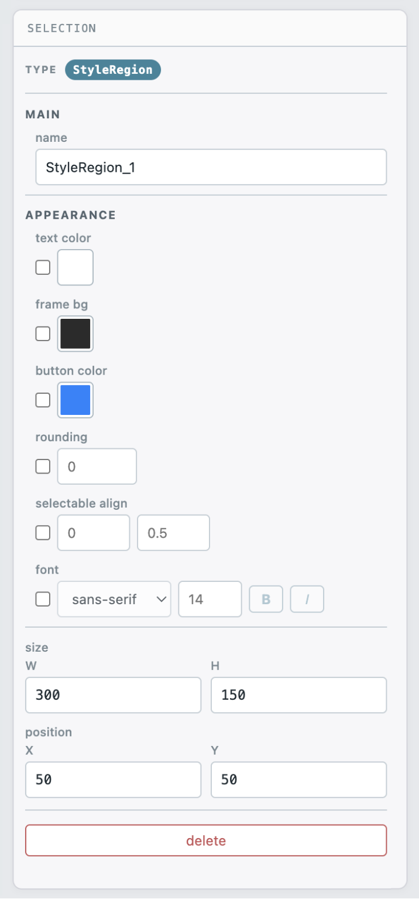</p>

| Override | Export |
| --- | --- |
| text color | `PushStyleColor(Col_Text)` |
| frame bg | `PushStyleColor(Col_FrameBg)` |
| button color | `PushStyleColor(Col_Button)` |
| rounding | `PushStyleVar(StyleVar_FrameRounding)` |
| selectable align | `PushStyleVar(StyleVar_SelectableTextAlign, x, y)`, with both values from 0 to 1 |
| font | `CreateFont(family, flags)` at startup, followed by `PushFont(ctx, font, size)` around the child widgets |

The **font** override offers five generic families — sans-serif, serif, monospace, cursive, and fantasy — plus independent Bold and Italic toggles and a size from 6 to 72 px. Builder creates each unique family and style combination with one `CreateFont` call and attaches the font to the context before the first frame. It calls `PushFont` after applying the style overrides and the matching `PopFont` before removing them. The font therefore applies only to widgets inside the StyleRegion.

> **Note.** In Preview, StyleRegion applies supported color, rounding, and font overrides to its children. Its text-color override also reaches external labels and draw-list Text, Separator, SeparatorText, LabelText, and BulletText: Builder resolves their colors when generating Lua. An `Aa` marker in the editor header indicates a font override.

**disabled (BeginDisabled)** wraps the region's children in `BeginDisabled` / `EndDisabled`: in REAPER they are drawn dimmed and ignore input. Preview dims them the same way, and the Editor marks the region with a ⊘ badge. Text and lines that Builder draws itself (draw-list Text, separators, external labels, Group labels) are dimmed too: inside the region their colors go through `ImGui_GetColorEx`.

<a name="manual-7-4-collapsingheader-and-treenode"></a>

### 7.4 · CollapsingHeader and TreeNode

Both containers can collapse their contents in the running interface. CollapsingHeader uses a full-width bar; TreeNode uses an indented node with an arrow. Both export with `TreeNodeFlags_DefaultOpen`, so they start expanded.

TreeNode has a **hdr color** setting. **default** chooses black or white text for contrast with the canvas; **custom** uses the selected color. The exporter applies this color to the node label in both modes.

Both containers are always shown expanded in Builder.

**bullet instead of arrow** replaces the disclosure arrow with a bullet using ReaImGui’s `TreeNodeFlags_Bullet`. The node can still expand and collapse; this does not turn it into a leaf. It is a native tree/header flag, distinct from the decorative prefix bullet offered on some leaf widgets.

TreeNode also has **tree lines**: guide lines from the node to its children. **None** draws no lines (default); **Full** draws a line to each child, with the vertical line running to the end of the node's contents (`TreeNodeFlags_DrawLinesFull`); **To nodes** stops the vertical line at the last child node (`TreeNodeFlags_DrawLinesToNodes`). The lines appear on the canvas and in Preview.

<a name="manual-7-5-tabbar"></a>

### 7.5 · TabBar

> Select the **Tabs** container header to access its **tabs** list. Edit names in the rows, use × to delete a page and its contents, or add a new page. The × control cannot remove the last remaining page.

A new TabBar starts with two tabs. Click a tab on the canvas to switch pages. Only the active page's contents are displayed, handled, and considered by widget overlap checks. Widgets placed on a page belong to its TabItem.

In the export, `BeginTabItem` / `EndTabItem` pairs are nested inside `BeginTabBar` / `EndTabBar`, with each page's widgets inside the corresponding tab item.

The tab bar is enclosed in a transparent child region using its layout width and height, with zero padding and no scrolling. This bounds the native tab underline to the Tabs area instead of extending it to the right edge of the parent window. Content is clipped to the region. The selected, ordinary, and hovered tab colors follow the active theme; a manual Tabs color is also exported.

**Selecting a tab.** Click a tab's label on the canvas to select that tab and edit or delete it in Properties. Dragging from the label still moves the whole TabBar. Clicking a row in the **tabs** list also selects that tab.

**Tab button.** **tab button** adds a tab that acts as a button, such as “+”, at one end of the strip: **None** (default), **Leading** (left end), or **Trailing** (right end). **button label** sets its text, “+” by default; the field is greyed while the setting is None. The export uses `TabItemButton` with `TabItemFlags_Leading` or `_Trailing` and a `-- TODO: <name> tab button pressed` marker. The tab button cannot be selected as a page.

<a name="manual-7-6-table"></a>

### 7.6 · Table

> The Table inspector provides row and column counts, a label, width mode, and angled-header toggle for each column, individual row heights, a header-row checkbox, four table flags, an overall sizing policy, and scrolling options.

<p align="center">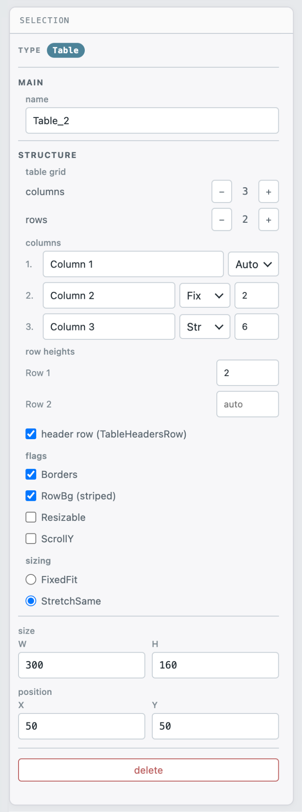</p>

Table is a grid of cells, each a container. Row and column counts range from 1 to 16; a new table starts with 3 × 3 cells. When shrinking removes populated cells, the confirmation offers **OK** to delete their contents or **Cancel** to keep those widgets at the top level. Cancel keeps the contents; it does not cancel the table resize.

| Setting | Description |
| --- | --- |
| columns / rows | From 1 to 16 per axis. Growing creates cells; shrinking removes cells and asks how to handle their contents. |
| Column width | Three modes are available. **Auto** sets no width flag. **Fix** sets `WidthFixed` with a width in pixels. **Str** sets `WidthStretch` with a weighting factor. |
| Row height | Requests a row height in pixels. Unspecified rows share remaining space. Oversized requests are reduced to fit the body; if every row is set, the last receives any remainder. The resolved height is a minimum for `TableNextRow`. |
| header row | Adds a `TableHeadersRow` call and reserves an 18 px strip for column labels on the canvas. |
| Borders | Cell borders. |
| RowBg | Alternating row backgrounds. |
| Resizable | Allows users to resize columns in the running interface. |
| ScrollY | Enables vertical scrolling. The table height is passed to ImGui only when ScrollY is enabled. |
| sizing | Sizing policy for columns set to **Auto**: `SizingFixedFit` or `SizingStretchSame`. |
| ∠ (angled header) | Per column. Shows that column's label slanted in an extra header row: `TableColumnFlags_AngledHeader` plus a `TableAngledHeadersRow` call. Available only with **header row**; the toggles are kept while the header row is off and export only while it is on. |
| freeze header row | Keeps the header row in view while the rows scroll: `TableSetupScrollFreeze(ctx, 0, 1)`. Needs **header row** and ScrollY. With angled headers, the freeze covers both header rows. |
| scroll rows | From 0 to 500, with ScrollY only. Adds that many uniform rows after the authored ones, in a `for` loop with a `-- TODO: … fill with your data` marker. The Editor shows a “+N rows” badge on the table. |

When **header row** is enabled, Builder subtracts the 18 px column-header strip from the table height before resolving row heights. The Table editor tab is outside the box and is not part of this calculation. Cells are emitted row by row. Children keep their local placement within the cell; the exporter rebases their positions on the cell’s actual runtime cursor origin and obtains the current draw list. Labels and other draw-list content therefore use the table’s current clipping and scrolling context. This preserves designed offsets while allowing the native table to scroll and its columns to resize; it is not automatic flow layout.

> **Note.** Placement in a cell keeps the drop position where possible, clamps it to the cell’s interior with a 4 px inset, and reduces overflowing dimensions if needed. It does not center the widget. If the widget’s center misses the cells but its box intersects the table, placement moves it beyond the nearest table edge.

**Row heights at runtime.** A ScrollY table with a header row, and any table with angled headers, sizes its body rows in REAPER from ReaImGui's own metrics: the export adds a helper function once, before `draw()`. Every other table uses the row heights resolved in Builder. Preview keeps Table schematic; the angled labels and a scrollbar lane over the table's full height are drawn on top of the placeholder.

---

<a name="manual-08-inspector-reference"></a>

## 08. Inspector reference

> The inspector shows the widget type, variant selector, name, label, contract-specific properties, position and size, and a delete button.

<p align="center">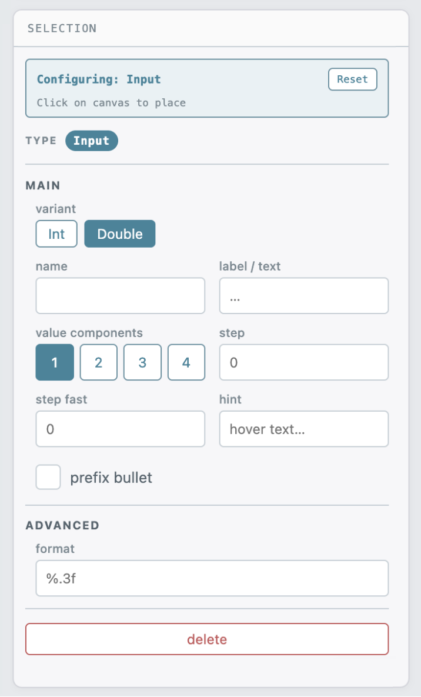</p>

**Identification**

| Field | Description |
| --- | --- |
| variant | The selected type within a family: Int / Double, RGB / RGBA, or Lines / Histogram. Choose it before placement; for an existing widget, this field is read-only. |
| name | Object identifier. Determines Lua variable names and the ImGui ID. Use a unique name containing only `[A-Za-z0-9_]`. |
| parent | The widget's container hierarchy. Read-only. |
| label / text | Visible text. For Text-family widgets, this is the content itself; for other widgets, it is the label above or inside the control. For a Text drawing, rectangle, or circle the field is multi-line: `Enter` types a new line, and the field grows up to six lines. These three can also be edited on the canvas (§5.8). |
| hint | InputTextWithHint only. The field is labeled **placeholder**; its text appears when the input is empty. |
| value | LabelText only. The read-only value displayed on the left; the label appears on the right. |
| url | TextLinkOpenURL only. The URL opened by the exported link. An empty URL exports `https://example.com`. |
| flag group / bit (0–30) | CheckboxFlags only. The shared integer and the bit this checkbox toggles. See §6. |

**Numeric properties**

| Field | Description |
| --- | --- |
| value components | From 1 to 4. Generates a multicomponent call such as `SliderDouble3`, with a separate state field for each component. |
| array size | N-suffix families only. The size of the `reaper.new_array`, from 2 to 64. |
| min / max | Range bounds. Empty fields use the defaults for the widget type. |
| speed | Drag families only. The change in value per pixel of mouse movement. |
| step / step fast | Scalar InputInt/InputDouble. Explicit step sizes for the step controls. InputInt with 2–4 components omits these arguments in export. |
| format | A printf-style format, such as `%.2f` or `%d dB`. Also controls how the value appears in the widget. |
| format min / max | DragRange only. Separate formats for the lower and upper bounds, such as `Min: %d` and `Max: %d`. |
| numeric flags | Clamp, Log, NoInput, Wrap. See [§9](#manual-09-flags). |

Empty numeric fields use the type’s defaults; clearing a field removes its explicit override. Slider/Drag integer ranges default to 0–100 and double ranges to 0–1. Drag speed defaults to **1**, including when a custom format is present. Enter explicit values when your control needs a different range, step, speed, or format.

**Appearance and behavior**

| Field | Description |
| --- | --- |
| tooltip | The field is labeled **hint**. It adds `SetItemTooltip` for supported widgets. Text, Separator, SeparatorText, LabelText, BulletText, TextWrapped, StyleRegion, Table, and TableCell do not offer it. Panel, Group, CollapsingHeader, TreeNode, TabBar, and TabItem export the hint for the container’s native item. |
| bullet | **prefix bullet** draws a decorative dot to the left of supported leaf widgets. **bullet instead of arrow** on TreeNode and CollapsingHeader sets the native tree flag. See the bullet guide below. |
| color | Initial color for TextColored, ColorEdit3/4, ColorPicker3/4, and ColorButton. Available for a single object and applicable batch selections. |
| alpha | From 0 to 255, for RGBA variants, ColorButton, and TextColored. For ColorEdit4 and ColorPicker4, the exporter uses this alpha only when the object also has an explicit color. |
| text tone | TextWrapped only: Auto, Dark, or Light. Auto follows the resolved theme/style text color; explicit tones help control contrast. |
| direction | ArrowButton only. Arrow direction: Left, Right, Up, or Down. |
| overlay | ProgressBar only. Text over the bar. An empty field exports an empty overlay string, so no automatic percentage is requested. |
| indeterminate | ProgressBar only. Displays an animation instead of a progress value. |
| group / radio value | RadioButtonEx only. The shared state variable and this button's value. |
| hdr color | TreeNode only. The node label color: default or custom. |
| border / h-scroll | Panel only. Border and horizontal scrolling. |
| highlight | Selectable only. Draws the row as hovered (`SelectableFlags_Highlight`). |
| tree lines | TreeNode only. None, Full, or To nodes. See §7.4. |
| tab button / button label | TabBar only. A Leading or Trailing button tab and its text. See §7.5. |
| disabled (BeginDisabled) | StyleRegion only. Dims the region's children and blocks their input. See §7.3. |
| values / scale min / scale max | Plot only. The data series and the vertical range. See §6. |
| EEL2 callback | Text input widgets only. See below. |

**Bullet guide**

Prefix bullet is a Builder decoration, not a universal widget option in ReaImGui. On supported leaf widgets, it is drawn in Editor, Preview, and Lua at **8 px to the left** of the widget’s start. It uses the resolved theme/StyleRegion color and does not move the control or its label. Leave room to its left: a parent’s clip boundary can cut the dot off.

| Use case | Control |
| --- | --- |
| A dot before a supported leaf control | **prefix bullet**; the exact type list is in Appendix B. |
| A bullet in place of a tree/header disclosure arrow | **bullet instead of arrow** on TreeNode or CollapsingHeader; expansion still works. |
| An ordinary line of bulleted text | **BulletText** widget. |
| Panel, Group, StyleRegion, TabBar, TabItem, Table, TableCell | No bullet control. Old stored bullet values on these types are ignored. |

ColorButton, Selectable, TextWrapped, Text, Separator, SeparatorText, LabelText, and BulletText do not offer an additional prefix bullet. BulletText already supplies its own marker.

**Geometry**

The **position** (X, Y) and **size** (W, H) fields use integer layout pixels and follow Snap to grid. Fixed dimensions are read-only. ColorPicker’s H is calculated from its picker width and flags.

Drawings also have a **primitive order** row with back, backward, forward, and front buttons. These change the order within the drawing layer only; drawings always remain below widgets.

**Constraints** follow the geometry fields for every type except TabItem and TableCell. See §5.9.

**EEL2 callbacks**

> The text input inspector shows basic flags first, followed by callback events and an EEL2 code field.

Select a placed text input and enter EEL2 code in **EEL2 callback**. If no callback event is selected, entering the first nonempty callback automatically enables **OnEdit**. Choose the required events in the flags section; OnTab and OnUp/Down are available only for single-line inputs. The generated script compiles and attaches the callback at startup. The hint below the field warns when code has no selected event. Callback flags without nonempty callback code are an export-preflight error; supply code or turn those events off.

**Hints**

Every inspector field and button has a hint that explains the setting and names its ReaImGui call or flag, for example `SliderFlags_AlwaysClamp` on **Clamp**. See [Hints](#manual-hints) in §3.5 for when they appear and how to turn them off.

---

<a name="manual-09-flags"></a>

## 09. Flags

<a name="manual-numeric-flags"></a>

### Numeric flags

These flags apply to Slider, VSlider, Drag, DragRange, SliderN, and DragN. The export combines them using bitwise OR.

**Wrap** is exported for Drag controls only. The SliderN inspector also allows it to be toggled, but the exporter removes it from SliderN calls.

| Option | ImGui flag | Effect |
| --- | --- | --- |
| Clamp | `SliderFlags_AlwaysClamp` | Clamps manually entered values to the range as well as values set by dragging. |
| Log | `SliderFlags_Logarithmic` | Uses a logarithmic response. Useful for frequency and volume controls. |
| NoInput | `SliderFlags_NoInput` | Disables direct value entry through Ctrl + click. |
| Wrap | `SliderFlags_WrapAround` | Drag families only. Wraps the value when it passes a range boundary. |

<a name="manual-text-input-flags"></a>

### Text input flags

| Section | Button | ImGui flag | Applies to |
| --- | --- | --- | --- |
| basic | `ReadOnly` | `InputTextFlags_ReadOnly` | `InputText`, `InputTextWithHint`, `InputTextMultiline` |
| basic | `Pass` | `InputTextFlags_Password` | `InputText`, `InputTextWithHint` |
| basic | `Dec` | `InputTextFlags_CharsDecimal` | `InputText`, `InputTextWithHint` |
| basic | `Hex` | `InputTextFlags_CharsHexadecimal` | `InputText`, `InputTextWithHint` |
| basic | `Enter` | `InputTextFlags_EnterReturnsTrue` | `InputText`, `InputTextWithHint`, `InputTextMultiline` |
| basic | `Tab` | `InputTextFlags_AllowTabInput` | `InputTextMultiline` |
| basic | `Ctrl+Enter` | `InputTextFlags_CtrlEnterForNewLine` | `InputTextMultiline` |
| callback | `OnEdit` | `InputTextFlags_CallbackEdit` | `InputText`, `InputTextWithHint`, `InputTextMultiline` |
| callback | `Always` | `InputTextFlags_CallbackAlways` | `InputText`, `InputTextWithHint`, `InputTextMultiline` |
| callback | `CharFilter` | `InputTextFlags_CallbackCharFilter` | `InputText`, `InputTextWithHint`, `InputTextMultiline` |
| callback | `OnTab` | `InputTextFlags_CallbackCompletion` | `InputText`, `InputTextWithHint` |
| callback | `OnUp/Down` | `InputTextFlags_CallbackHistory` | `InputText`, `InputTextWithHint` |

<a name="manual-color-flags"></a>

### Color flags

> The color flags inspector places independent toggles at the top, followed by four single-choice groups: display, data type, input, and picker style. Alpha-channel options appear last.

<p align="center">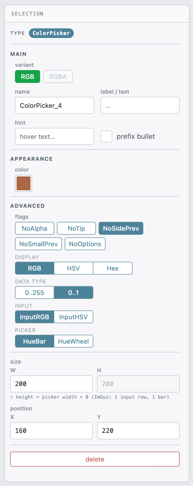</p>

> **Note.** Display, data type, input, and picker options appear as segmented single-choice controls. Selecting an option clears the other flags in that group; clicking the active option clears it.

| Section | Button | ImGui flag | Applies to |
| --- | --- | --- | --- |
| basic | `NoAlpha` | `ColorEditFlags_NoAlpha` | `ColorEdit3`, `ColorEdit4`, `ColorPicker3`, `ColorPicker4`, `ColorButton` |
| basic | `NoPicker` | `ColorEditFlags_NoPicker` | `ColorEdit3`, `ColorEdit4` |
| basic | `NoInputs` | `ColorEditFlags_NoInputs` | `ColorEdit3`, `ColorEdit4` |
| basic | `NoTip` | `ColorEditFlags_NoTooltip` | `ColorEdit3`, `ColorEdit4`, `ColorPicker3`, `ColorPicker4`, `ColorButton` |
| basic | `NoLabel` | `ColorEditFlags_NoLabel` | `ColorEdit3`, `ColorEdit4` |
| basic | `NoSidePrev` | `ColorEditFlags_NoSidePreview` | `ColorPicker3`, `ColorPicker4` |
| basic | `NoSmallPrev` | `ColorEditFlags_NoSmallPreview` | `ColorEdit3`, `ColorEdit4`, `ColorPicker3`, `ColorPicker4` |
| basic | `NoOptions` | `ColorEditFlags_NoOptions` | `ColorEdit3`, `ColorEdit4`, `ColorPicker3`, `ColorPicker4` |
| basic | `NoDragDrop` | `ColorEditFlags_NoDragDrop` | `ColorEdit3`, `ColorEdit4`, `ColorButton` |
| basic | `NoBorder` | `ColorEditFlags_NoBorder` | `ColorButton` |
| display | `RGB` | `ColorEditFlags_DisplayRGB` | `ColorEdit3`, `ColorEdit4`, `ColorPicker3`, `ColorPicker4` |
| display | `HSV` | `ColorEditFlags_DisplayHSV` | `ColorEdit3`, `ColorEdit4`, `ColorPicker3`, `ColorPicker4` |
| display | `Hex` | `ColorEditFlags_DisplayHex` | `ColorEdit3`, `ColorEdit4`, `ColorPicker3`, `ColorPicker4` |
| data type | `0..255` | `ColorEditFlags_Uint8` | `ColorEdit3`, `ColorEdit4`, `ColorPicker3`, `ColorPicker4` |
| data type | `0..1` | `ColorEditFlags_Float` | `ColorEdit3`, `ColorEdit4`, `ColorPicker3`, `ColorPicker4` |
| input | `InputRGB` | `ColorEditFlags_InputRGB` | `ColorEdit3`, `ColorEdit4`, `ColorPicker3`, `ColorPicker4` |
| input | `InputHSV` | `ColorEditFlags_InputHSV` | `ColorEdit3`, `ColorEdit4`, `ColorPicker3`, `ColorPicker4` |
| picker | `HueBar` | `ColorEditFlags_PickerHueBar` | `ColorEdit3`, `ColorEdit4`, `ColorPicker3`, `ColorPicker4` |
| picker | `HueWheel` | `ColorEditFlags_PickerHueWheel` | `ColorEdit3`, `ColorEdit4`, `ColorPicker3`, `ColorPicker4` |
| alpha | `AlphaBar` | `ColorEditFlags_AlphaBar` | `ColorEdit4`, `ColorPicker4` |
| alpha | `HalfPrev` | `ColorEditFlags_AlphaPreviewHalf` | `ColorEdit4`, `ColorPicker4`, `ColorButton` |
| alpha | `NoBg` | `ColorEditFlags_AlphaNoBg` | `ColorEdit4`, `ColorPicker4`, `ColorButton` |
| alpha | `Opaque` | `ColorEditFlags_AlphaOpaque` | `ColorEdit4`, `ColorPicker4`, `ColorButton` |

---

<a name="manual-10-drawing-primitives"></a>

## 10. Drawing primitives

> Drawings on the canvas include rectangles, circles, triangles, lines, text, and arcs. All primitives export as draw list calls and appear below the widget layer.

<p align="center">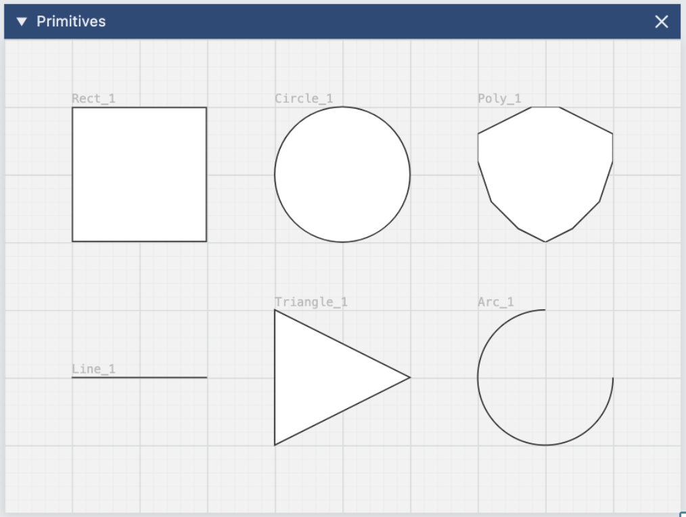</p>

To draw a shape, select its tool from the palette and drag on the canvas. With the Rectangle or Circle tool, a click without dragging places a default-sized shape at the click point: 170 × 50 for a rectangle, 80 × 80 for a circle. For a polygon, click to place each vertex instead. Close it by clicking the first point again, double-clicking, or pressing `Enter`. Press `Esc` to cancel an unfinished polygon. A new Text drawing opens for typing right away (§5.8).

| Primitive | Properties | Export |
| --- | --- | --- |
| Rectangle | fill, stroke, rounding, thickness, opacity, label | `AddRectFilled` and `AddRect` |
| Circle | fill, stroke, thickness, opacity, label | `AddCircle(Filled)`; `AddEllipse(Filled)` when W ≠ H |
| Triangle | fill, stroke, thickness, orient (four directions) | `AddTriangle(Filled)` |
| Line | stroke, thickness | `AddLine` |
| Polygon | fill, stroke, thickness, list of points | `PathFillConvex` for convex polygons; triangulation with `AddTriangleFilled` for concave polygons |
| Arc | `ring`: stroke, thickness, start and end angles; `pie`: the same properties plus fill | `PathArcTo` and `PathStroke`; `pie` fills with `PathFillConvex` up to 180° and `PathFillConcave` above; a full turn uses `AddCircle(Filled)` |
| Text | text, color, size, horizontal and vertical alignment | `AddTextEx` with explicit font size; text measurement for alignment |

> The arc inspector uses angles in degrees following ImGui conventions: 0° points right, and angles increase clockwise. A 270° sweep starting at 135° gives a conventional rotary knob scale.

**Arc angles in the export.** The arc always runs clockwise from Start to End, in REAPER and in Preview. Angles that cross 0° and negative angles follow this rule: 300° → 60° is a 120° wedge, and 0° → −90° is 270°. A full turn, pie or ring, is drawn as a plain circle without a radial seam. An arc whose start and end angles are equal draws nothing; it stays selectable in the Editor. Saved angles are never rewritten.

<p align="center">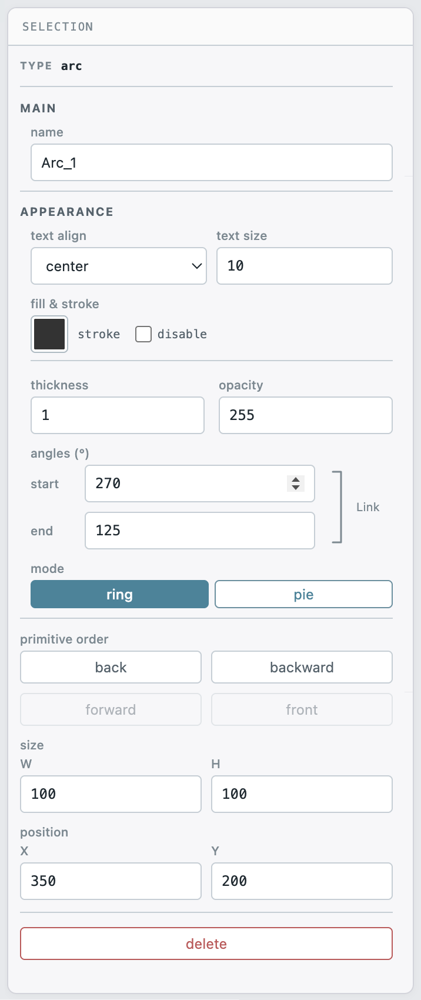</p>

Exported drawings are clipped to the layout. A drawing is included if any part of it intersects the layout: for example, a rectangle extending past an edge is exported, and ImGui clips the portion outside. Widgets follow a stricter rule: a widget must be entirely inside the frame to be exported.

**Drawing text size and color.** The **text size** value is exported explicitly. Resizing the object scales the font as described in §5.3. New drawing text follows the project’s resolved text color automatically; choosing a color in the picker fixes a manual color. The canvas and Lua use the same choice. Text is not squeezed to fit an arbitrary width.

**Text layout at runtime.** Rectangle and circle labels and Text drawings are laid out by ReaImGui in REAPER, not baked into the script: the export adds a small helper function once. A Text drawing wraps inside its box and may run below it; the box is a layout hint, not a clip. A rectangle or circle label that needs more lines than fit ends its last visible line with “…”. Line breaks can differ from Preview by a word, since REAPER lays the text out itself. Preview and the Editor measure text with a proportional font at ReaImGui's own size; on macOS they measure it the way ReaImGui measures its system font.

**Rectangle and circle labels.** Rectangles and circles have a **label / text** field, with text align and text size, like Text. The label is centered vertically in the shape. Double-click the shape to edit the label on the canvas (§5.8).

**Linked arc angles.** Enable **Link angles** to preserve the sweep: changing Start by an amount changes End by the same amount, and vice versa. The arc updates during input. This setting is saved and also works in batch editing of arcs. It links angles, not fill and stroke colors.

<a name="manual-fill-stroke-and-linked-colors"></a>

### Fill and stroke

Each available fill/stroke row has its own **disable** checkbox. Select it to turn that component off without losing its color. The controls are independent: a shape may have a fill, an outline, both, or neither.

Stroke can also be disabled for Line and ring-mode Arc. A fully disabled or transparent drawing remains in the project; select it through Elements. Fill and stroke colors are edited independently; version 1.10.0 has no color-link control.

If an opacity field is left empty, leaving the field restores its previous value. This also applies to batch editing.

ImGui fills convex paths directly. Builder triangulates a non-convex polygon for export using multiple `AddTriangleFilled` calls; its outline remains a single closed path. A filled polygon must not cross, touch, or turn back on itself: ImGui would fill a different shape than the canvas shows, so Preflight reports **Polygon outline crosses itself** as an error. Move a point, split the shape into separate polygons, or disable its fill to export only the outline.

---

<a name="manual-11-canvas-and-project-settings"></a>

## 11. Canvas and project settings

<a name="manual-window-title"></a>

### Window title

The title used when the layout opens in REAPER appears in the blue header above the canvas. Click it to edit. Press `Enter` to apply the title or `Esc` to cancel. `Cmd/Ctrl + S` applies the title and saves the project; with `Shift` it opens Save As.

The title is used in the generated script (`CreateContext` and `ImGui_Begin`), saved in the project file, and used as the download filename: *Track Tools* → `Track_Tools.lua`. Apostrophes are escaped so they do not break the script.

<a name="manual-title-bar-color"></a>

### Title bar color

With a theme other than Default, the **Title bar** control on the Canvas tab chooses how the exported window's title bar looks: **ImGui default** keeps ImGui's own colors (the default), and **Theme colours** applies the active theme's title colors (`Col_TitleBg` / `Col_TitleBgActive`). The choice is saved with the project. With the Default theme, the control is greyed and has no effect.


<a name="manual-window"></a>

### Window

The **Window** section of the Canvas tab makes the exported window resizable.

<p align="center">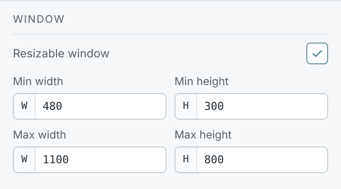</p>

| Control | Effect |
| --- | --- |
| **Resizable window** | Off by default: the window has the canvas size and cannot be resized, as in earlier versions. On: the user can resize the window in REAPER, and objects follow their constraints (§5.9). |
| **Min width / Min height** | The smallest content size, from 64 px up to the canvas width or height. Empty: the canvas size, so the window cannot get smaller than the design. |
| **Max width / Max height** | The largest content size, at least the canvas width or height. Empty: no limit. |

The sizes are content sizes, like W and H: the title bar and menu bar are not included. While you type, a value that cannot be used turns the field's border red. When you apply it, the field returns to its previous value and the status bar says why, for example `blocked: Min width must be a whole number from 64 to the canvas width (550)`. Entering the default value or clearing a field removes that limit. The fields are greyed while **Resizable window** is off. Every change is one Undo step. When a canvas size change makes a limit impossible, that limit is removed in the same step.

The exported window opens at the design size the first time and afterwards at the size the user left it (§14, [Resizable window in code](#manual-resizable-window-in-code)). Projects without **Resizable window** export exactly as in version 1.7.0.

<a name="manual-menu-bar"></a>

### Menu bar

The **Menu bar** section of the Canvas tab builds the exported window's menu bar. Click **+ Add menu** to add a top-level menu. Select a menu or entry in the tree to edit it, then use the buttons below the fields:

| Button | Result |
| --- | --- |
| **+ Item** | A plain item, after the selected entry or inside the selected menu (`MenuItem`). |
| **+ Check** | An item with a check mark that toggles when clicked. |
| **+ Separator** | A dividing line. |
| **+ Submenu** | A nested menu. Menus nest at most four levels deep, counting the top-level menu. |
| **↑ Up** / **↓ Down** | Move the entry within its menu. |
| **Delete** / **Delete menu** | Delete the entry; deleting a menu also deletes everything in it. |

Each entry has a **Label** (up to 64 characters), a **Name**, a display-only **Shortcut**, and **Enabled**; a check item also has **Initially checked**. The bar holds at most 200 entries. Every edit is one undo step.

**Name** is the entry's identifier in the export and shares a name space with widget names. It may use letters of any script, digits, and underscores, but cannot start with a digit or contain spaces or `#`; the export maps it to a safe, unique Lua identifier, as it does for widget names. A new, pasted, or duplicated widget skips any name a menu entry already uses. A project whose menu entry shares a name with another object opens with the entry renamed (`mb_file` → `mb_file_2`); the load message lists every rename. Code outside Builder that used the old generated name is not updated.

In the export, an item's click is a `-- TODO: <name> clicked` marker in `draw()`, like a button's. A check item keeps its state in `state.<name>_checked`, initialized from **Initially checked**. **Shortcut** is shown next to the item; ImGui does not act on it. Opening menus, hovering, and toggling check marks are ImGui's own behavior and need no code.

The menu bar is window structure, not a canvas object. It never moves a widget, and the canvas size keeps meaning content size: the exported window grows by one ReaImGui frame height to make room for the bar. The Editor shows the bar as a strip above the canvas and, for the menu selected in the Canvas tab, a picture of its open dropdown. This picture is an editing aid; it is not saved or exported. The bar starts 8 px in, like a normal ImGui window. Export preflight reports menus that run past the canvas width (“Menus past the right edge are cut off in REAPER”); export stays enabled.

Right-click context menus and popups are not part of this feature.

<a name="manual-size"></a>

### Size

The Canvas tab's W and H fields set the window's content size. They are exported as `W, H`. Press `Enter` or leave the field to apply a change. Dragging the ⇲ handle has the same effect. With a resizable window, this is the design size: the size the window opens at the first time and the size at which every object sits exactly where you placed it.

<a name="manual-background"></a>

### Background

- **Default.** The canvas follows the active theme, while the export retains ImGui's native window background. If the selected theme is not Default, Builder also applies its background color to the canvas child window through `PushStyleColor`.
- **Custom.** Choose a color and opacity in the Canvas picker. Opacity blends the color toward white; the export writes the resulting opaque color as `Col_WindowBg`. It does not make the REAPER window transparent.

<a name="manual-color-picker"></a>

### Color picker

Color swatches for drawings, supported widget colors, StyleRegion overrides, and batch editing open Builder’s popover picker. It normally opens to the right and upward; near a window edge it moves left or downward. The Canvas tab has its own embedded background picker.

The popover has a saturation/brightness square, hue bar, **HEX** field, and recent swatches. The screen eyedropper appears only if the browser supports it. The HEX field is focused on opening and accepts `#RRGGBB` and `#RGB`. Color changes apply live. `Enter` closes the picker; `Esc` closes it and restores focus without reverting changes. Undo grouping follows the edited field’s history behavior.

Recent swatches are shared across all color fields and retained until the page is reloaded.

<a name="manual-grid"></a>

### Grid

**Show grid** controls the fine grid. Its visibility is stored separately for Editor and Preview modes. **Step** sets the spacing to 2, 5, or 10 px and also controls the snapping interval. Step is greyed only when both the grid and snapping are off.

<a name="manual-audit-grid"></a>

### Audit grid

*View → Reference grid in export* enables a magenta measurement grid with 50 px spacing. Unlike the regular grid, the audit grid is exported: the generated code draws the same grid in the REAPER window. Use it to compare coordinates between Builder and REAPER. Disable it before releasing your script.

<a name="manual-zoom-and-pan"></a>

### Zoom and pan

Zoom ranges from **50% to 250%**. Choose a preset in the status bar, use `Cmd/Ctrl` + mouse wheel to zoom around the pointer, or click ⤢ to fit the layout in the view. The Zoom tool provides click to enlarge and Alt/Option + click to reduce. Pan with Hand or hold Space before dragging. The surrounding workspace expands to accommodate drawings moved beyond it. Zoom and pan affect the view only; object coordinates do not change.

---

<a name="manual-12-themes"></a>

## 12. Themes

> The theme selector lists the built-in themes and your themes, with **+ New**, **Import**, **Edit…**, and **Theme Studio…** below. The active theme is saved with the project.

<p align="center">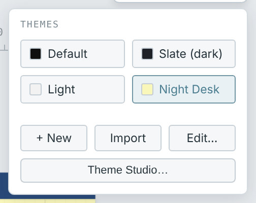</p>

A theme defines fifteen color values: thirteen ImGui style colors, a child-window background, and a color for labels drawn through the draw list. Three themes are included: **Default** (no theme color overrides), **Slate (dark)**, and **Light**. A new project starts with **Light** while the editor is light and with **Default** while it is dark.

Themes affect both Preview mode and the export. For a theme other than Default, the export applies its colors with `PushStyleColor` immediately after opening the canvas child window and removes them before closing it.

Under Slate and Light, CollapsingHeader, TreeNode, and Selectable headers are a translucent band in the theme's accent color, so what lies under a header shows through. Themed exports also push PlotLines, PlotLinesHovered, and TreeLines colors; TreeLines equals the theme's Border color. The Default theme pushes nothing.

> With Slate selected, Preview approximates how the layout will appear in REAPER using that palette.

<p align="center">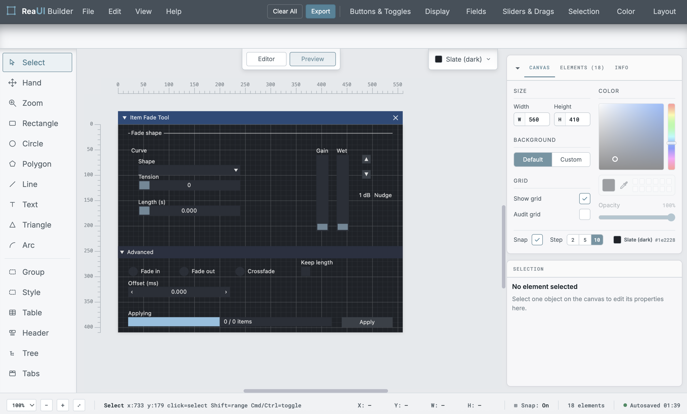</p>

The selector shows the built-in themes, your saved themes marked **In theme menu** in Theme Studio, the active theme, and themes that came with the open project. Click a theme to apply it. **+ New** and **Edit…** open Theme Studio on its Edit tab: **+ New** starts a new theme from the active one, and **Edit…** edits the active theme (for a built-in theme, a copy of it). **Import** adds a theme from a file (see [Theme files](#manual-theme-files)). **Theme Studio…** opens the Studio.

<a name="manual-theme-studio"></a>

### Theme Studio

**Theme Studio** is the window for the colors of the exported interface. It does not change the editor's own look. Open it through **View → Theme Studio…** or from the theme selector.

<p align="center">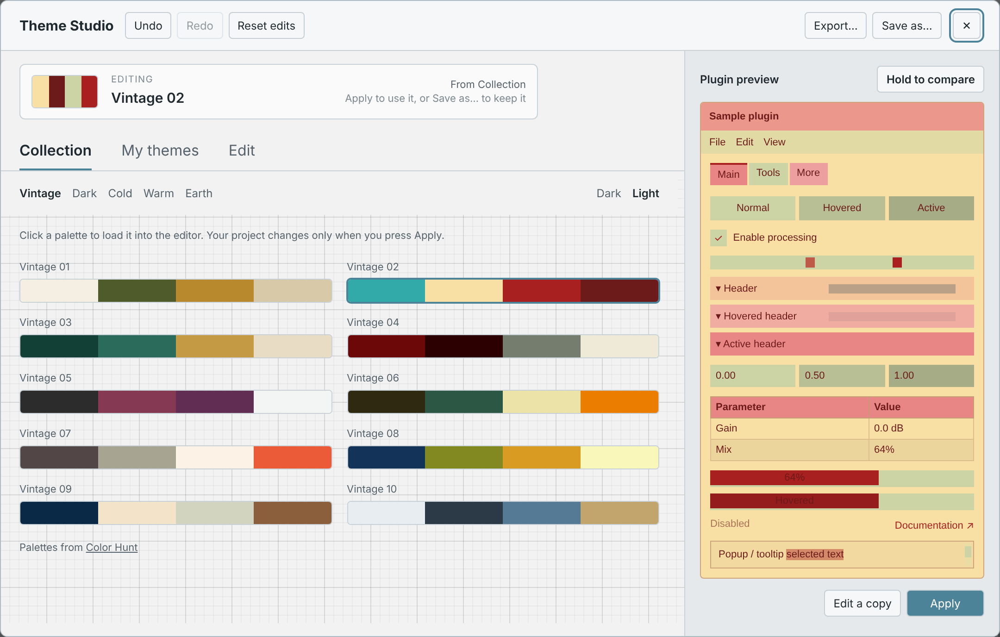</p>

At the top left, the **Editing** card names the theme you are working on: a strip of its four main colors, its name (click it to rename), and a status line such as *From Collection*, *Built-in*, *My theme · in use*, or *This project only*, with a short hint. Below the card are three tabs.

| Tab | Contents |
| --- | --- |
| **Collection** | Fifty ready-made palettes in five groups: Vintage, Dark, Cold, Warm, and Earth (from Color Hunt). Click a palette to load it into the editor. **Dark** / **Light** chooses whether the palette's darkest or lightest color becomes the background. The project does not change until you press **Apply**. The Studio opens on this tab. |
| **My themes** | The built-in themes, your saved themes, and themes from the open project. Click a theme to select it. **+ New** starts a new theme; **Import…** adds one from a file. **Active** marks the project's theme. |
| **Edit** | The colors of the selected theme; see below. |

On the right, **Plugin preview** shows a sample window in the theme: title bar, menu bar, tabs, buttons, a check box, a slider, headers, fields, a table, progress bars, a link, and a popup. Pointing at a color row on the Edit tab highlights where that color is used. Hold **Hold to compare** to see the colors the theme had when you opened or last saved it.

The buttons under the preview act on the selected theme. **Apply** puts it into the project and closes the Studio. **Edit** (your own themes) or **Edit a copy** (built-in themes and palettes) opens the Edit tab. A saved theme also has **Show in theme menu** / **In theme menu**, which decides whether the theme selector lists it, and **Delete** (hidden while the open project carries its own copy of that theme). A theme that came with the project has **Remove from project**.

<p align="center">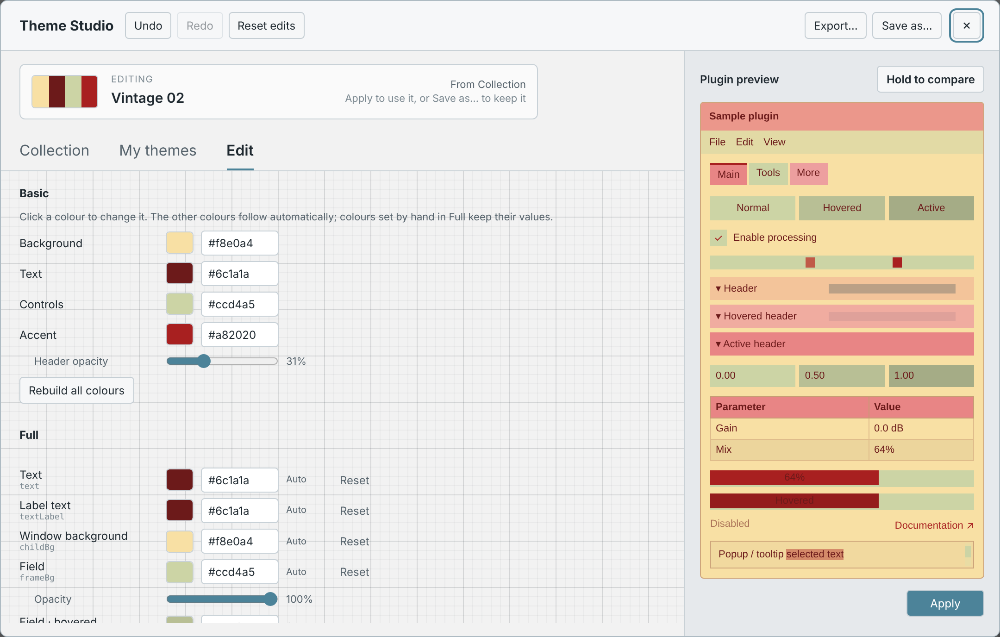</p>

**Edit tab.** **Basic** holds the four main colors: **Background**, **Text**, **Controls**, and **Accent**. Click a swatch or type a hex value. The other colors follow automatically: hovered and active states are derived from the control color, lighter on dark backgrounds and darker on light ones; header colors blend the background and accent; the accent also colors check marks and the active slider grab. **Header opacity** makes headers translucent. **Rebuild all colours** replaces every color set by hand with the generated one.

**Full** lists all fifteen colors, each with its channel name (`frameBg`, `childBg`, …) in small type. A row shows **Auto** for a generated color or **Manual** for one set by hand; **Reset** returns it to the generated value. A color set by hand keeps its value when you change the main colors. Fields, buttons, headers, check marks, and slider grabs have an **Opacity** slider. **Automatically generated colours**, at the end, lists the further ImGui colors that the export calculates from the theme (popups, borders, scroll bars, tables, title bar, menu bar, plots, and tabs) with the rule for each. They cannot be edited separately.

The title row of the Studio holds:

| Button | Result |
| --- | --- |
| **Undo** / **Redo** | Step through the edits made in the Studio. `Cmd/Ctrl + Z` and `Cmd/Ctrl + Shift + Z` work too. |
| **Reset edits** | Returns the theme to the colors it had when you opened or last saved it. Undo brings the edits back. |
| **Export…** | Writes the theme to a file; see [Theme files](#manual-theme-files). |
| **Save as…** | Saves the theme as a new theme in My themes. If an identical theme is already saved, Builder asks before making another copy. The project keeps its theme; press **Apply** to use the new one. |
| **Save** | Writes the edits to this theme in My themes. If the project uses this theme, the project takes the edits too, as one Undo step; a project's own copy of one of My themes is saved as a new theme instead, and the project keeps its copy. Save never switches the project to another theme: that is what **Apply** does. Built-in themes and Collection palettes have no Save: keep them with Save as…. |

A name that is already taken gets a suffix: `_1`, `_2`, and so on.

**Apply and the project.**

| Selected theme | After Apply |
| --- | --- |
| A saved or built-in theme, unchanged | Becomes the project's theme. |
| A built-in theme with edits | A new theme for this project, named “*name* (edited)”. |
| A Collection palette or a new theme | A new theme for this project, under its name. |
| One of My themes, with edits | The project gets its own copy with the edits. My themes keeps the saved version until you press **Save**. |
| A theme that came with the project | Updated in place. |

A theme made by Apply belongs to the project: it is saved in the project file, has a dashed outline in the theme selector, and is listed under **From this project** on the My themes tab. It leaves these lists when you start a new project or open another one. Save it to keep it in My themes. Apply is one step in the main Undo history.

Closing the Studio (✕, `Esc`, or a click outside it) while the theme has unsaved changes — edits, a new theme, or a palette loaded from Collection — asks whether to keep them: **Save theme**, **Discard changes**, or **Cancel**. Selecting another theme on the My themes tab asks the same. Editor shortcuts do nothing while the Studio is open.

<a name="manual-custom-themes"></a>

### Custom themes

- Custom themes are stored in the browser's localStorage and are available only in that browser on that computer.
- The active custom theme’s definition is included in the project file. Loading that project makes the theme available for the current session; it does not automatically save it to the browser’s permanent theme library.
- Built-in themes cannot be changed or deleted. Editing one in Theme Studio makes a new theme.
- **Theme alpha.** A custom theme can make frames, buttons, headers, check marks, and slider grabs translucent: use **Header opacity** in Basic and the **Opacity** sliders in Full.
- Opening a project never overwrites a theme in your library that has the same ID. The project's theme is used for that session only and has a dashed outline in the theme panel.

<a name="manual-theme-files"></a>

### Theme files

A custom theme can be saved to its own file and shared.

- **Export…** in Theme Studio writes `<id>.reaui-theme.json` with the colors the Studio shows. It does not save the theme.
- **Import** in the theme panel and **Import…** on the My themes tab add a theme from a `.reaui-theme.json` file. Import never overwrites a theme you already have: an identical theme is recognized, and a clashing ID or name gets a suffix. Anything in the file that Builder cannot use is listed and skipped. Importing does not change the active theme. If the browser cannot store the theme, nothing is imported.

Project files that carry theme alpha open in older builds with opaque headers. A custom theme made in version 1.0.70 keeps its look until it is saved again in Theme Studio.

---

<a name="manual-13-preview-mode"></a>

## 13. Preview mode

> Preview hides name tags, container editor strips, and selection controls. It approximates the widgets' ImGui appearance using the active theme.

Use the Editor / Preview switch above the canvas. Preview prevents direct canvas dragging, resizing, and placement, but it does not lock the project: inspector edits and editing commands remain active. Widgets are drawn as visual approximations; clicking them selects them rather than operating the exported control. Switch tabs in Editor mode.

Some widgets appear as labeled, hatched placeholders: **Group**, **Table**, and **ColorPicker3/4**. **TextWrapped** renders wrapped text, including long strings without spaces, with its text tone and applicable style/font settings. A banner appears at the bottom when the canvas contains these widgets.

**Preview limitations:**

- ColorEdit and other native controls may not reflect every flag or interaction. Preview approximates the layout; it does not run ReaImGui or execute Lua.
- StyleRegion’s text-color override applies to external labels in both Preview and export. Other properties may be represented schematically.
- ProgressBar uses a fixed fill of about 45% and does not show the exported animation. Numeric controls also display representative values.
- The **overlay** text appears on the canvas in both Editor and Preview.
- Preview is view-only: arrow keys do not move the selection.
- Text uses a proportional font at ReaImGui's own size, so line breaks are close to REAPER's; see §10.
- InvisibleButton draws nothing. A disabled StyleRegion dims its children.

<a name="manual-preview-at-another-window-size"></a>

### Preview at another window size

When the window is resizable, Preview shows a handle on the frame's right edge, bottom edge, and bottom-right corner. Drag it to see the layout at another window size: pinned objects move and stretched objects change size as they will in REAPER, and a **W × H** badge shows the content size while you drag. The size stays between Min and Max; without a Max, you can drag up to 2000 px beyond the design size. Double-click the handle to return to the design size.

<p align="center">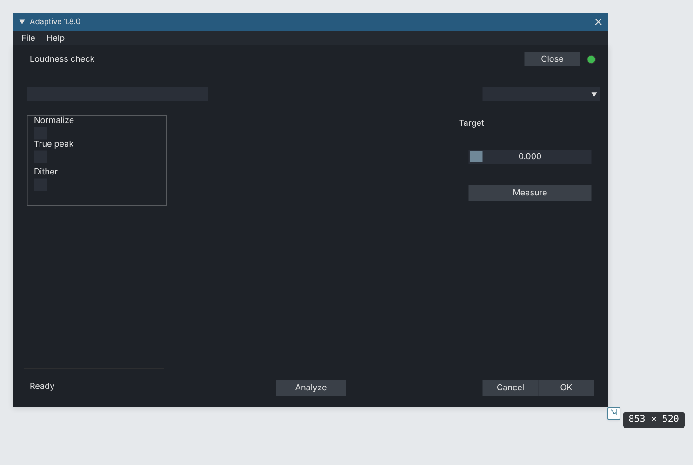</p>

The preview size is a view setting only: it is not saved, adds no Undo step, and does not change the project. It resets when you leave Preview or open another project. With a fixed window, the handle is not shown.

---

<a name="manual-14-exporting"></a>

## 14. Exporting

<a name="manual-export-preflight"></a>

### Export preflight

The preflight panel at the top of the *Export* window runs whenever you open the window. It reports findings at three levels.

- **Error.** Preflight has found a condition that blocks export, such as invalid IDs, parent relationships, geometry (including a filled polygon whose outline crosses itself), widget types, invalid supported numeric fields, or callback events without code. The *copy* and *download* buttons remain disabled until these errors are resolved. Preflight validates project data; it does not execute Lua or validate every native argument. See §17 for the remaining numeric format and range limits.
- **Warning.** Export remains available, but a setting or omission needs attention. Examples include objects outside the layout, children of omitted containers, clipped drawings, colliding names, duplicate radio values, an empty TabBar, or missing table cells.
- **Size range.** With a resizable window, Preflight checks every size from Min to Max (without a Max, up to 8192 px beyond the design size). **Overlaps X when the window is N px wide or narrower** reports two widgets that do not touch at the design size but run into each other at some size. When a pinned object passes through another while the window grows, the range is given as **from A to B px**. **Leaves <container / the window> when …** reports a widget that fits its container or the window at the design size but leaves it at some size. The sizes are exact content sizes, like Min and Max in the Window section. These are warnings; drawings are not checked.
- **Too small at the minimum window size.** A stretched widget, rectangle, or Text that would get smaller than its minimum at Min width or Min height is an **error**, and export is blocked. The minimum is 10 px, or the container's own minimum size for a container; only the axes that stretch and can shrink (Min below the design size) are checked. Tabs and table cells are covered by their TabBar or Table. The finding gives both sizes, for example “Stretched with the window, it is 6 × 20 px at 480 × 300, below its minimum of 10 × 10 px”. Raise Min width / Min height, or make the object larger at the design size.
- **Information.** A single summary line reports how many elements have no visible label. Further information lines report rectangle or circle labels that will be cut with “…” in REAPER and a menu bar wider than the canvas. They do not disable export.

The panel header reports how many objects will be **omitted** and how many will be exported out of the total. Review this summary to identify omissions that would not be apparent from the code alone.

Click a finding to select the corresponding object on the canvas. Builder opens the tabs that hold it and scrolls it to the middle of the canvas view (in Preview, where Preview draws it).

> The Export window's ReaImGui tab contains the generated script: context creation, position and state tables, a drawing function, and a defer loop. Click **copy** to copy the code to the clipboard.

<a name="manual-generated-file-structure"></a>

### Generated file structure

The generated code follows a consistent structure:

1. **Header comments.** Canvas dimensions and positioning rules.
2. **Context and dimensions.** The `CreateContext` call and `W, H` and `OUTER_H` values. `OUTER_H` adds the title bar height so the content area matches the layout dimensions. With a menu bar, `OUTER_H` also adds one frame height for the bar. With a resizable window, also the limits `MIN_W, MIN_H, MAX_W, MAX_H` and the start size; see [Resizable window in code](#manual-resizable-window-in-code).
3. **Position table.** Widget X/Y coordinates and widths are listed in `local pos = { … }` near the top. The exporter also embeds coordinates and sizes directly in many draw-list and widget calls. For consistent layout changes, edit the Builder project and export again.
4. **State table.** `local state = { radioGroups = {} }` holds interactive values, a separate namespace for shared radio groups, and `reaper.new_array` arrays for N-suffix families. Keeping values in tables avoids a top-level local variable for every widget.
5. **Fonts and EEL2 callbacks.** Created and attached once, before the loop, if a StyleRegion or input field uses them.
6. **The `draw()` function.** Sets the layout style, opens the window and canvas child, obtains the current child’s draw list and coordinate origin, applies the theme, draws primitives, and emits widgets in tree order. Nested child windows and table cells establish their own drawing context where needed.
7. **The `defer` loop.**

<a name="manual-positioning-in-code"></a>

### Positioning in code

A typical leaf widget uses a position-table entry:

```lua
reaper.ImGui_SetCursorScreenPos(ctx,
  ox + pos.SLIDER_2.x, oy + pos.SLIDER_2.y)
reaper.ImGui_SetNextItemWidth(ctx, pos.SLIDER_2.w)
```

The origin and draw list must belong to the active drawing region. The root canvas obtains them after opening its child window; nested regions and table cells use their current runtime context. This keeps widget bodies, external labels, and draw-list content aligned while respecting clipping and scrolling.

Coordinates and dimensions also occur directly in drawing and widget calls. Editing a position-table entry alone is not a complete layout edit; update the project and export again when possible.

Zero layout padding and spacing are intentional. If you add ordinary flow-layout widgets in Lua, choose suitable spacing or continue setting positions explicitly.

<a name="manual-resizable-window-in-code"></a>

### Resizable window in code

With **Resizable window** on, the export adds a few lines; everything else stays as described above. For a 420 × 280 layout with Min 360 × 240, no Max, and an OK button pinned right and bottom:

```lua
local W, H = 420, 280
local MIN_W, MIN_H, MAX_W, MAX_H = 360, 240, 0, 0
local SIZE_SECTION, SIZE_KEY = 'ReaUI Builder', 'Constraints demo window size'
-- … START_W, START_H: the saved size, clamped to the limits

  reaper.ImGui_SetNextWindowSize(ctx, START_W, START_H + _chrome, reaper.ImGui_Cond_Once())
  reaper.ImGui_SetNextWindowSizeConstraints(ctx, MIN_W, MIN_H + _chrome,
    MAX_W > 0 and MAX_W or _flt_max, MAX_H > 0 and MAX_H + _chrome or _flt_max)
  …
    local CW, CH = reaper.ImGui_GetContentRegionAvail(ctx)
    CW, CH = math.floor(CW), math.floor(CH)
    local dW, dH = CW - W, CH - H
    …
    pos.OK.x = 300 + dW
    pos.OK.y = 220 + dH
    local canvas_visible = reaper.ImGui_BeginChild(ctx, '##Canvas', CW, CH, 0)
```

- `MAX_W` or `MAX_H` of 0 means no limit. `_chrome` is the title bar plus the menu bar, so the limits stay content sizes.
- Every frame, `CW, CH` is the live content size and `dW, dH` its difference from the design size. Before drawing, the export updates the `pos` entries of pinned and stretched objects, and of everything inside pinned or stretched containers. A centered object moves by half the difference, rounded half up: `math.floor(dW * 0.5 + 0.5)`. Line and polygon points move the same way.
- A stretched object also gets its size: `pos.SEARCH.w = 300 + dW`, `pos.NOTES.h = 80 + dH`. Everything that depends on that size — child-window sizes, item widths, ListBox rows, tab widths — is computed from `pos` in the same frame.
- When a rectangle label or a Text drawing stretches, the text helper keeps one wrapped layout per object, so dragging the window does not fill memory. Without such text, the helper is the same as in fixed-window exports.
- The canvas child takes the live size, `CW × CH`.
- An InvisibleButton gets at least 1 px on each axis (`math.max(pos.HIT.w, 1)`): ImGui does not accept a zero size, and a window docked in REAPER can be smaller than Min.

**The window remembers its size.** The size is stored in REAPER's ExtState, section `ReaUI Builder`, key `<window title> window size`, as `WxH`; characters other than Latin letters, digits, spaces, `.`, `_`, and `-` become `_` in the key. It is written when the size has changed and the mouse button is up, so a drag writes once. The first run opens at the design size; later runs open at the stored size, kept within Min and Max. Scripts with the same window title share the stored size. To forget it, delete the key, for example with `reaper.DeleteExtState('ReaUI Builder', 'Constraints demo window size', true)`.

<a name="manual-what-is-included"></a>

### What is included

- A widget is exported only if its full footprint lies inside the layout bounds. A widget extending past an edge is omitted. With a resizable window this is judged at the design size: a widget that leaves the window at a smaller size is still exported, clipped by the canvas, and Preflight reports it.
- A drawing is exported if it intersects the layout area.
- The audit grid is exported when enabled.
- The menu bar is exported when the project has one.

ListBox items are written with `\0` escapes instead of invisible NUL characters, so the script survives copy-paste and version control. Text from a hand-edited project that holds other control characters is written as Lua escapes too.

---

<a name="manual-15-saving-and-loading"></a>

## 15. Saving and loading

The **JSON project** preserves the editable layout. Lua is an output format and cannot be imported back into Builder.

| Command | Behavior |
| --- | --- |
| **Save Project** · `Cmd/Ctrl + S` | Saves to the selected project file. The first save asks for a location where direct file access is available. |
| **Save As…** · `Cmd/Ctrl + Shift + S` | Chooses a new project filename/location. |
| **Load Project** | Opens a JSON project. With supported direct file access, later Save writes back to that file during the current session. |
| **New Project** | Starts an empty 550 × 400 layout with the default title, background, and theme (Light while the editor is light, Default while it is dark), a fixed window, and no menu bar. Grid and snapping settings are kept. |
| **Restore projects…** | Opens the list of recoverable drafts from closed sessions. |

**Save Project** and **Save As…** first apply a value you are still typing in a canvas or Properties field, as leaving the field would; the focus stays in the field.

Direct writing uses the browser’s file-access support and permissions. After a file is chosen, repeated Save reuses it in the current session, although the browser may still ask for write permission. The browser controls the appearance and wording of these system prompts.

If direct file access is unavailable, Builder downloads a JSON copy. It cannot overwrite the original file through that fallback or confirm that a download completed. Use the status message to distinguish a direct save from a downloaded copy.

Canceling Save As or encountering a write error keeps the open project and its recovery data. Changes made while a save is in progress remain unsaved if they were not part of the written snapshot.

Before New, Load, or Restore replaces a dirty project, Builder offers **Save project**, **Don’t save**, or **Cancel**. A canceled or failed load does not replace the current layout. Incoming project data is validated before replacement; invalid IDs, references, or other malformed data are rejected. Older project data is normalized into the current structure on a successful load. Loading clears Undo history.

Project files include the objects and their nesting, editor groups and names, layer order, linked arc angles, widget settings, constraints, title, dimensions, the resizable window and its limits, background, active theme and its custom definition, title bar choice, menu bar, audit grid, snapping, and grid step. The interface mode is not stored in the project. Zoom, undo history, Editor/Preview mode, the Preview window size, ordinary-grid visibility, panel visibility, and the Show hints setting are not portable project settings.

The resizable window (`windowResize`) and constraints (`pinH`, `pinV`) are written only when they differ from the defaults. Builds before 1.8.0 open such a project as a fixed-window project. Version 1.8.0 opens a project with stretching without the stretch constraints. On loading, Builder removes stretch constraints from objects that cannot stretch (§5.9), unknown constraint values, constraints on tabs and table cells, and window limits that are not whole numbers or are out of range, and lists each kind once in the load message.

<a name="manual-autosave-and-recovery"></a>

### Autosave and recovery

Builder keeps recovery drafts in this browser’s storage. Use **File → Restore projects…** to inspect and restore drafts from closed sessions. Projects still open in another active tab are excluded from the list.

On the first launch, the start dialog also offers **Restore unsaved project…** when a draft from an earlier session exists. Later launches open an empty project; restore drafts through **File → Restore projects…**.

A successful direct save clears the completed draft. If the project changes while the save is in progress, the newer edits remain in a draft. The download fallback retains recovery data because the browser does not tell Builder whether the download was completed or canceled. After restoring a draft, save it as a project file.

When leaving with unsaved changes, the browser may show its standard leave-page confirmation. Its availability and text depend on the browser. This is separate from Builder’s Save/Discard/Cancel dialog.

Recovery drafts and custom themes are stored by the browser and can be lost when site data is cleared. Storage behavior for local files also varies between browsers. Keep a JSON project as your durable, portable copy.

---

<a name="manual-16-keyboard-and-mouse-reference"></a>

## 16. Keyboard and mouse reference

Use Cmd on macOS and Ctrl on Windows/Linux unless an action names another modifier.

| Action | Result |
| --- | --- |
| `Cmd/Ctrl + S` | Save Project |
| `Cmd/Ctrl + Shift + S` | Save As |
| `Cmd/Ctrl + C` / `V` | Copy / paste selected objects and included container subtrees |
| `Cmd/Ctrl + D` | Duplicate |
| `Cmd/Ctrl + G` | Group selection in the editor |
| `Cmd/Ctrl + Shift + G` | Ungroup selection |
| `Cmd/Ctrl + Z` | Undo |
| `Cmd/Ctrl + Shift + Z` or `Cmd/Ctrl + Y` | Redo |
| `Cmd/Ctrl + A` | Select all objects |
| `Del` / `Backspace` | Delete; filled containers offer content choices |
| Arrow keys with canvas focused | Move by one grid step, or 1 px with snapping off |
| `Shift + arrow keys` with canvas focused | Move by ten increments |
| Click a tab's label on the canvas | Select that tab; drag from the label to move the TabBar |
| `↑/↓`, `Home/End` in Elements | Navigate rows; Shift extends the row selection |
| `Enter` in Elements | Give the canvas focus, preserving selection and view |
| `Shift + click` on canvas | Extend selection across the anchor-to-click area |
| `Shift + click` in Elements | Select a range of rows |
| `Cmd/Ctrl + click` | Add an object to selection or remove it |
| Drag on empty canvas | Marquee selection; Shift adds, Cmd/Ctrl toggles |
| `Alt/Option + drag` an object | Drag a copy |
| `Shift + resize` drawings | Preserve aspect ratio; also works with draw-only selections |
| Double-click a Text, rectangle, or circle | Edit its text on the canvas (Advanced, Editor mode) |
| `Cmd/Ctrl + S` while editing a canvas text or the window title | Apply the text and save; `Shift` opens Save As |
| Double-click the Preview size handle | Return to the design size |
| Hold `U` before dragging a container | Leave current children in place and skip capture |
| `Space + drag` | Temporary Hand; start Space before the gesture |
| `Cmd/Ctrl + mouse wheel` | Zoom around the pointer |
| Zoom tool: click / `Alt/Option + click` | Zoom in / out around that point |
| Right-click empty canvas | Widget placement menu |
| Right-click an object/selection or Elements row | Object commands |
| `Shift + click` Rectangle, Circle, Line, Triangle, or Arc tool | Keep the tool active for repeated drawing |
| Polygon: `Enter`, double-click, or click first point | Close the polygon |
| `Esc` | Cancel the current tool/polygon, clear selection, or close the active dialog/menu |
| `Cmd/Ctrl + Z` / `Cmd/Ctrl + Shift + Z` in Theme Studio | Undo / redo the edits in the Studio |
| `Esc` in Theme Studio | Close the Studio; with the colour popover open, close the popover; in a hex field, first cancel the value being typed |

Text fields keep their normal typing, clipboard, and navigation behavior. Save/Save As remain available while editing a field. In Elements, arrow keys navigate until focus returns to the canvas. See Help → Keyboard Shortcuts for the built-in reference.

---

<a name="manual-17-release-limitations"></a>

## 17. Release limitations

The following limitations apply to version **1.10.0**.

- **Editing Combo and ListBox items.** The export contains five placeholder items. Replace their strings in Lua; the selection state and widget calls are already generated.
- **Free rotation for drawings.** Arc supports angles and Triangle supports orientation, but there is no general rotation handle or property.
- **Context menus and popups.** Builder builds the window's menu bar only; right-click context menus and popups are not built.
- **Stretching.** Table, ColorPicker, and widgets sized by ImGui or by their text do not stretch; circles, arcs, lines, polygons, and triangles only move. There is no “scale” constraint.
- **Theme Studio.** Edits are shown in the Studio's own preview; the canvas shows a theme after **Apply**. Collection palettes are a fixed set.
- Preview does not execute ReaImGui. Group, Table, and ColorPicker remain schematic; native fonts, interaction, and some flags require checking in REAPER. Basic mode offers eleven common components; use Advanced for everything else.
- Widgets outside the export frame are omitted. Omitting a container also omits its contents. Drawings that intersect the frame are exported with clipping; inspect the preflight findings.
- Body dimensions do not always describe a widget’s full footprint. External labels, natural text, and picker reservations need space. Prefix bullets can be clipped at a parent’s left edge.
- StyleRegion, Table, and TableCell do not support **hint** because they do not submit a single native item to which a tooltip can be attached. Use a supported widget or HelpMarker for hover help.
- SliderN can show Wrap in its numeric flags, but Wrap is removed from Slider export; use it on Drag controls.
- For ColorEdit4/ColorPicker4, explicitly set a color as well as alpha if you need a specific initial transparency.
- Numeric format strings and extreme Double-slider bounds are not fully checked against native API requirements. Use a single compatible numeric conversion (for example, `%d` for Int or `%.2f` for Double) and ranges appropriate for the parameter. A clean preflight is not proof that every format or extreme bound is valid in ReaImGui.
- Drawings stay below widgets. Reordering within a layer does not override native child-window clipping or create a global overlay.
- Browser file-access and clipboard permissions affect saving and copying. Recovery and custom themes are browser storage, not substitutes for a portable project file.
- The Lua filename is derived from the window title; unsupported filename characters become underscores, with `MyPlugin.lua` as a fallback.

---

<a name="manual-appendix-a-widget-contracts"></a>

## Appendix A · Widget contracts

The table lists all 55 contract types, including the automatically managed TabItem and TableCell. Sizes are base contract values before placement snapping and type-specific adjustments. **H** marks a fixed height; **D** marks a height derived from width and flags. SmallButton and RadioButtonEx widths follow their labels; Checkbox and ArrowButton cannot be resized. Content-sized widths in this table are starting values, not fixed text limits.

| Type | Family · variant | Size | Width | Height | Description |
| --- | --- | --- | --- | --- | --- |
| `Button` | `Button` | 100×20 | `explicit-size` | `explicit-size` | A button that triggers an action when clicked. |
| `SmallButton` | `SmallButton` | 50×20 **H** | `explicit-size` | `native-fixed` | A button with reduced padding and the same behavior as Button. |
| `InvisibleButton` | `InvisibleButton` | 100×40 | `explicit-size` | `explicit-size` | A clickable area that draws nothing. |
| `ArrowButton` | `ArrowButton` | 17×17 **H** | `explicit-size` | `explicit-size` | A square button with an arrow. |
| `Checkbox` | `Checkbox` | 20×20 **H** | `widget-box-preview` | `native-fixed` | A Boolean control with a checkmark and an external label above it. *Use for on/off settings such as enable, mute, loop, or bypass.* |
| `CheckboxFlags` | `CheckboxFlags` | 20×20 **H** | `widget-box-preview` | `native-fixed` | A checkbox that toggles one bit of an integer shared by its flag group. |
| `RadioButtonEx` | `RadioButtonEx` | 20×20 **H** | `widget-box-preview` | `native-fixed` | A radio button that belongs to a mutually exclusive group; only one option in the group is active. |
| `Selectable` | `Selectable` | 140×20 | `explicit-size` | `explicit-size` | A selectable, full-width row. |
| `Text` | `Text` | 120×20 **H** | `content-or-widget-box` | `native-content` | A static, single-line label. |
| `TextColored` | `TextColored` | 120×20 **H** | `content-or-widget-box` | `native-content` | Text in a specified color. |
| `TextDisabled` | `TextDisabled` | 120×20 **H** | `content-or-widget-box` | `native-content` | Text in the disabled style. |
| `TextWrapped` | `TextWrapped` | 200×60 | `explicit-size` | `explicit-size` | Text that wraps to the available width. |
| `BulletText` | `BulletText` | 160×14 **H** | `explicit-size` | `native-line` | A line of text preceded by a bullet. |
| `LabelText` | `LabelText` | 140×20 **H** | `next-item-width` | `native-fixed` | A read-only value on the left and its label on the right. *Use for named values such as tempo or status.* |
| `TextLinkOpenURL` | `TextLinkOpenURL` | 120×14 **H** | `explicit-size` | `native-line` | An underlined link that opens a URL in the browser. |
| `TextLink` | `TextLink` | 120×14 **H** | `explicit-size` | `native-line` | An underlined text link that reports a click. |
| `SeparatorText` | `SeparatorText` | 200×14 **H** | `explicit-size` | `native-line` | A separator line with a label near the left edge. *Use to title a section.* |
| `Separator` | `Separator` | 200×10 **H** | `explicit-size` | `native-line` | A horizontal separator line. |
| `HelpMarker` | `HelpMarker` | 24×20 **H** | `content-or-widget-box` | `native-content` | A “(?)” marker with a tooltip on hover. |
| `ProgressBar` | `ProgressBar` | 120×20 | `explicit-size` | `explicit-size` | A horizontal progress indicator from 0 to 100%. |
| `PlotLines` | `Plot` · `Lines` | 200×60 | `explicit-size` | `explicit-size` | A graph of a number series drawn as lines. |
| `PlotHistogram` | `Plot` · `Histogram` | 200×60 | `explicit-size` | `explicit-size` | A graph of a number series drawn as bars. |
| `SliderInt` | `Slider` · `Int` | 120×20 **H** | `next-item-width` | `native-fixed` | A horizontal track and thumb for a single numeric value. |
| `SliderDouble` | `Slider` · `Double` | 120×20 **H** | `next-item-width` | `native-fixed` | A horizontal track and thumb for a single numeric value. |
| `SliderDoubleN` | `SliderN` | 160×20 **H** | `next-item-width` | `native-fixed` | Multiple sliders forming one multicomponent value. |
| `VSliderInt` | `VSlider` · `Int` | 18×160 | `explicit-size` | `explicit-size` | A vertical slider for a single numeric value. |
| `VSliderDouble` | `VSlider` · `Double` | 18×160 | `explicit-size` | `explicit-size` | A vertical slider for a single numeric value. |
| `SliderAngle` | `SliderAngle` | 140×20 **H** | `next-item-width` | `native-fixed` | A slider for entering an angle in degrees. |
| `DragInt` | `Drag` · `Int` | 120×20 **H** | `next-item-width` | `native-fixed` | A numeric field adjusted by dragging horizontally. |
| `DragDouble` | `Drag` · `Double` | 120×20 **H** | `next-item-width` | `native-fixed` | A numeric field adjusted by dragging horizontally. |
| `DragDoubleN` | `DragN` | 160×20 **H** | `next-item-width` | `native-fixed` | Multiple Drag fields forming one multicomponent value. |
| `DragIntRange2` | `DragRange` · `Int` | 160×20 **H** | `next-item-width` | `native-fixed` | Two linked Drag fields that define a lower and upper bound. |
| `DragFloatRange2` | `DragRange` · `Double` | 160×20 **H** | `next-item-width` | `native-fixed` | Two linked Drag fields that define a lower and upper bound. |
| `InputInt` | `Input` · `Int` | 80×20 **H** | `next-item-width` | `native-fixed` | A numeric input field with step buttons. |
| `InputDouble` | `Input` · `Double` | 80×20 **H** | `next-item-width` | `native-fixed` | A numeric input field with step buttons. |
| `InputDoubleN` | `InputN` | 160×20 **H** | `next-item-width` | `native-fixed` | Multiple numeric input fields in one widget. |
| `InputText` | `InputText` | 120×20 **H** | `next-item-width` | `native-fixed` | A single-line text input. |
| `InputTextWithHint` | `InputTextWithHint` | 140×20 **H** | `next-item-width` | `native-fixed` | A single-line input with placeholder text while empty. |
| `InputTextMultiline` | `InputTextMultiline` | 200×80 | `next-item-width` | `explicit-size` | A multiline text input. |
| `Combo` | `Combo` | 100×20 **H** | `next-item-width` | `native-fixed` | A drop-down list that displays the selected item. |
| `ListBox` | `ListBox` | 160×80 | `next-item-width` | `explicit-size` | A scrollable list with several visible rows. |
| `ColorEdit3` | `ColorEdit` · `RGB` | 160×20 **H** | `next-item-width` | `native-fixed` | A compact color editor with channel fields and a swatch. |
| `ColorEdit4` | `ColorEdit` · `RGBA` | 160×20 **H** | `next-item-width` | `native-fixed` | A compact color editor with channel fields and a swatch. |
| `ColorPicker3` | `ColorPicker` · `RGB` | 200×246 **D** | `next-item-width` | `explicit-size` | A full color picker with a saturation area and hue bar. |
| `ColorPicker4` | `ColorPicker` · `RGBA` | 200×246 **D** | `next-item-width` | `explicit-size` | A full color picker with a saturation area and hue bar. |
| `ColorButton` | `ColorButton` | 40×20 | `explicit-size` | `explicit-size` | A button displaying a single color swatch. |
| `Panel` | `Panel` | 220×140 | `explicit-size` | `explicit-size` | A bordered, scrollable region containing other widgets. |
| `Group` | `Group` | 200×120 | `explicit-size` | `explicit-size` | A borderless container that groups child widgets; a nonempty label is drawn separately. |
| `StyleRegion` | `StyleRegion` | 200×120 | `explicit-size` | `explicit-size` | An invisible region with style overrides for colors, rounding, alignment, and fonts. |
| `CollapsingHeader` | `CollapsingHeader` | 200×120 | `explicit-size` | `explicit-size` | A full-width header that collapses its contents. |
| `TreeNode` | `TreeNode` | 200×120 | `explicit-size` | `explicit-size` | An expandable node with indented children. |
| `TabBar` | `TabBar` | 280×180 | `explicit-size` | `explicit-size` | A tab strip that switches between content pages. |
| `TabItem` | `TabItem` | 280×156 | `explicit-size` | `explicit-size` | A tab page managed by TabBar; not placed independently. |
| `Table` | `Table` | 320×200 | `explicit-size` | `explicit-size` | A grid of rows and columns containing other widgets. |
| `TableCell` | `TableCell` | 100×50 | `explicit-size` | `explicit-size` | A cell managed by Table; its size follows the resolved row and column. |

---

<a name="manual-appendix-b-inspector-matrix"></a>

## Appendix B · Inspector matrix

This table lists the fields available for each of the **55 types** in version 1.10.0. Names match the inspector: **hint** is a hover tooltip, while **placeholder** belongs to InputTextWithHint. The standard **name** field and conditional **parent** row are not repeated. Choose a variant before placement; fixed size axes remain read-only.

Every type except TabItem and TableCell also has **constraints** (§5.9); they are not repeated in the rows. TabItem and TableCell are structural types managed by their parent. Their fields describe the internal type; edit tab and table structure through TabBar/Table. Shared rows for a multiple selection can be narrower than this single-type list. Panel, Group, CollapsingHeader, TreeNode, TabBar, and TabItem support **hint**; StyleRegion, Table, and TableCell do not.

| Type | Inspector rows |
| --- | --- |
| `Button` | label / text, hint, prefix bullet, size, position |
| `SmallButton` | label / text, hint, prefix bullet, size, position |
| `InvisibleButton` | hint, prefix bullet, size, position |
| `ArrowButton` | direction, hint, prefix bullet, size, position |
| `Checkbox` | label / text, hint, prefix bullet, size, position |
| `CheckboxFlags` | label / text, flag group, bit (0–30), hint, prefix bullet, size, position |
| `RadioButtonEx` | label / text, hint, prefix bullet, group, radio value, size, position |
| `Selectable` | label / text, hint, highlight, size, position |
| `Text` | label / text, size, position |
| `TextColored` | label / text, hint, prefix bullet, color, alpha, size, position |
| `TextDisabled` | label / text, hint, prefix bullet, size, position |
| `TextWrapped` | label / text, text tone, size, position |
| `BulletText` | label / text, size, position |
| `LabelText` | label / text, value, size, position |
| `TextLinkOpenURL` | label / text, url, hint, prefix bullet, size, position |
| `TextLink` | label / text, hint, prefix bullet, size, position |
| `SeparatorText` | label / text, size, position |
| `Separator` | size, position |
| `HelpMarker` | hint, prefix bullet, size, position |
| `ProgressBar` | label / text, hint, prefix bullet, overlay, indeterminate, size, position |
| `PlotLines` | variant (placement only), label / text, values, scale min, scale max, hint, overlay, prefix bullet, size, position |
| `PlotHistogram` | variant (placement only), label / text, values, scale min, scale max, hint, overlay, prefix bullet, size, position |
| `SliderInt` | variant (placement only), label / text, value components, min, max, format, numeric flags, hint, prefix bullet, size, position |
| `SliderDouble` | variant (placement only), label / text, value components, min, max, format, numeric flags, hint, prefix bullet, size, position |
| `SliderDoubleN` | label / text, array size, min, max, format, numeric flags, hint, prefix bullet, size, position |
| `VSliderInt` | variant (placement only), label / text, min, max, format, numeric flags, hint, prefix bullet, size, position |
| `VSliderDouble` | variant (placement only), label / text, min, max, format, numeric flags, hint, prefix bullet, size, position |
| `SliderAngle` | label / text, hint, prefix bullet, size, position |
| `DragInt` | variant (placement only), label / text, value components, min, max, speed, format, numeric flags, hint, prefix bullet, size, position |
| `DragDouble` | variant (placement only), label / text, value components, min, max, speed, format, numeric flags, hint, prefix bullet, size, position |
| `DragDoubleN` | label / text, array size, min, max, speed, format, numeric flags, hint, prefix bullet, size, position |
| `DragIntRange2` | variant (placement only), label / text, min, max, speed, format min, format max, numeric flags, hint, prefix bullet, size, position |
| `DragFloatRange2` | variant (placement only), label / text, min, max, speed, format min, format max, numeric flags, hint, prefix bullet, size, position |
| `InputInt` | variant (placement only), label / text, value components, step, step fast, hint, prefix bullet, size, position |
| `InputDouble` | variant (placement only), label / text, value components, step, step fast, format, hint, prefix bullet, size, position |
| `InputDoubleN` | label / text, array size, hint, prefix bullet, size, position |
| `InputText` | label / text, hint, prefix bullet, input flags, EEL2 callback, size, position |
| `InputTextWithHint` | label / text, placeholder, hint, prefix bullet, input flags, EEL2 callback, size, position |
| `InputTextMultiline` | label / text, hint, prefix bullet, input flags, EEL2 callback, size, position |
| `Combo` | label / text, hint, prefix bullet, size, position |
| `ListBox` | label / text, hint, prefix bullet, size, position |
| `ColorEdit3` | variant (placement only), label / text, hint, prefix bullet, color, color flags, size, position |
| `ColorEdit4` | variant (placement only), label / text, hint, prefix bullet, color, alpha, color flags, size, position |
| `ColorPicker3` | variant (placement only), label / text, hint, prefix bullet, color, color flags, size, position |
| `ColorPicker4` | variant (placement only), label / text, hint, prefix bullet, color, alpha, color flags, size, position |
| `ColorButton` | hint, color, alpha, color flags, size, position |
| `Panel` | hint, border, h-scroll, size, position |
| `Group` | label / text, hint, size, position |
| `StyleRegion` | text color, frame bg, button color, rounding, selectable align, font, disabled (BeginDisabled), size, position |
| `CollapsingHeader` | label / text, hint, bullet instead of arrow, size, position |
| `TreeNode` | label / text, hint, bullet instead of arrow, hdr color, tree lines, size, position |
| `TabBar` | tabs, hint, tab button, button label, size, position |
| `TabItem` | label / text, hint, size, position |
| `Table` | table grid / columns (with angled header) / row heights / table flags / freeze header row / scroll rows, size, position |
| `TableCell` | label / text, size, position |

---

<a name="manual-appendix-c-generated-file-structure"></a>

## Appendix C · Reading the generated file

These excerpts come from a version 1.10.0 export of a **600 × 400** layout with Button_1 (“Play”) at (40, 60) and Slider_2 (“Gain”) at (40, 130). They show the position and state structure but do not form a complete runnable script. Use Export to generate the complete file.

```lua
-- Positions
local pos = {
  BUTTON_1 = { x=40, y=60, w=100 },
  SLIDER_2 = { x=40, y=130, w=120 },
}

local state = { radioGroups = {} }
-- Widget state
state.Slider_2_val = 0.0
```

The drawing function opens the canvas child before obtaining its draw list and origin. Widget emission then uses those values:

```lua
    -- Button_1 [Button]
    reaper.ImGui_SetCursorScreenPos(ctx, ox + pos.BUTTON_1.x, oy + pos.BUTTON_1.y)
    if reaper.ImGui_Button(ctx, "Play##Button_1", 100, 20) then
      -- TODO: Button_1 pressed
    end

    -- Slider_2 [SliderDouble]
    reaper.ImGui_SetCursorScreenPos(ctx, ox + pos.SLIDER_2.x, oy + pos.SLIDER_2.y)
    reaper.ImGui_SetNextItemWidth(ctx, pos.SLIDER_2.w)
    do
      local _label = "Gain"
      if _label ~= "" then
        local _tw, _th = reaper.ImGui_CalcTextSize(ctx, _label)
        reaper.ImGui_DrawList_AddText(dl, ox+40, oy+128-_th, 0x000000FF, _label)
      end
      local _rv
      _rv, state.Slider_2_val = reaper.ImGui_SliderDouble(ctx, "##Slider_2", state.Slider_2_val, 0.0, 1.0)
    end
```

For each interactive control, add your application behavior where the generated code marks a TODO. State such as `state.Slider_2_val` persists between frames. Radio groups live under `state.radioGroups`, separately from ordinary widget state.

The full export also contains context creation, window dimensions, applicable colors/fonts/callbacks, the main drawing function, and a `reaper.defer` loop. Nested containers establish their corresponding ImGui scopes. Do not move a draw-list call across a child-window boundary without using the appropriate draw list and origin.

For layout revisions, edit the JSON project and export again: some dimensions and drawing coordinates appear inline, as well as in `pos`.

---

*ReaUI Builder — User Guide for Version 1.10.0. Updated 8 October 2026.*
